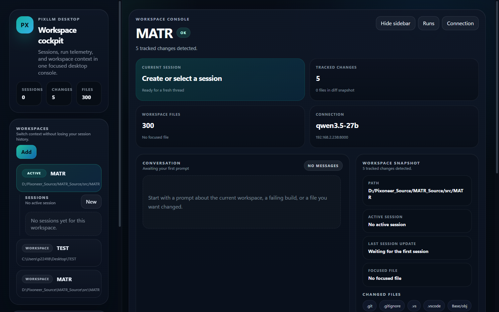
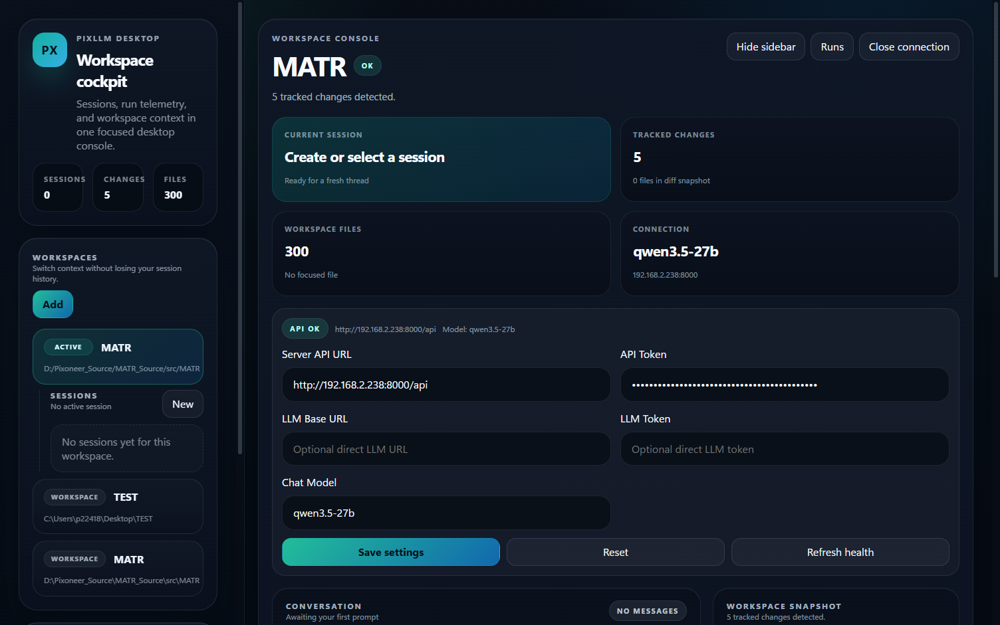
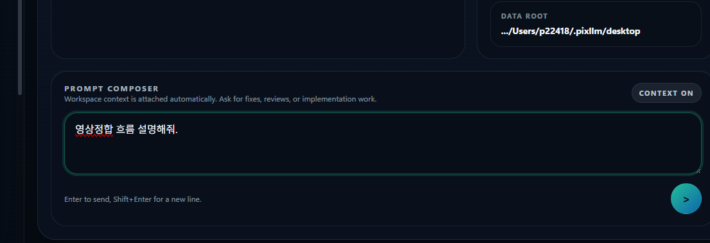
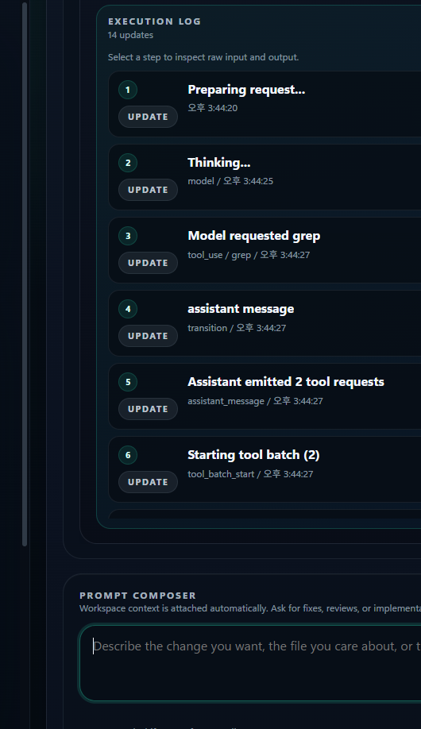
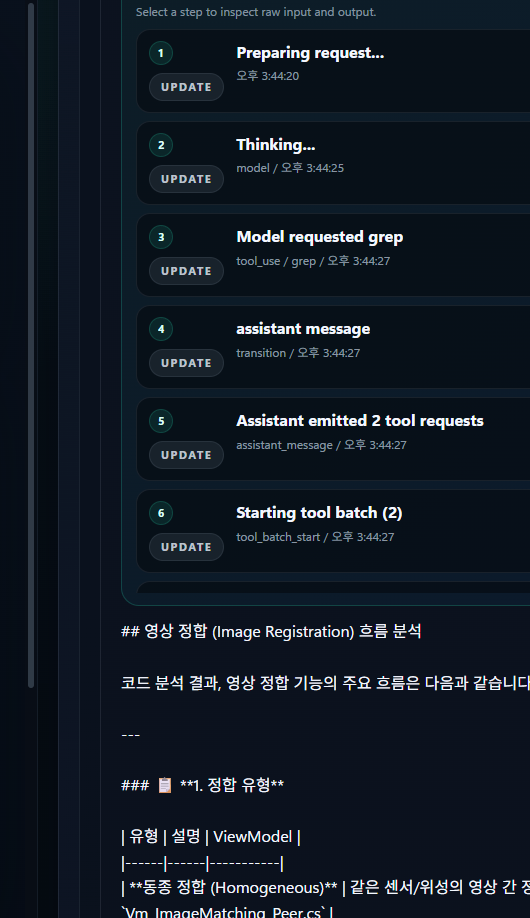

# PIXLLM

PIXLLM은 로컬 코드베이스를 기준으로 질문하고, 실행 로그와 최종 응답을 한 화면에서 확인하는 데스크톱 워크벤치입니다.

단순히 답만 보여주는 것이 아니라, 어떤 파일과 워크스페이스를 기준으로 응답했는지, 중간에 무엇을 확인했는지까지 사용자 입장에서 바로 따라갈 수 있게 구성되어 있습니다.

## 메인 화면



왼쪽에는 워크스페이스와 세션, 가운데에는 대화와 실행 흐름, 오른쪽에는 연결 상태와 워크스페이스 요약이 배치됩니다.

## 운용 화면

아래 캡처는 `MATR` 워크스페이스에서 `영상정합 흐름 설명해줘.`를 실제로 실행한 화면입니다.

### 1. 연결과 모델 설정

백엔드 API URL, 토큰, 직접 연결할 LLM 주소, 사용할 채팅 모델을 같은 화면에서 바로 설정할 수 있습니다.



### 2. 질문 입력

질문은 하단 `Prompt Composer`에서 바로 입력합니다. 워크스페이스 문맥은 자동으로 붙습니다.



### 3. 생각하는 과정과 실행 로그

응답을 만드는 동안 모델 상태와 도구 호출 흐름이 `Execution Log`에 순서대로 쌓입니다.



### 4. 최종 응답 확인

완료되면 같은 대화 영역에서 최종 답변을 바로 확인할 수 있습니다.



## 이런 식으로 사용합니다

1. 백엔드를 띄웁니다.
2. 데스크톱 앱을 실행합니다.
3. 분석할 워크스페이스를 선택합니다.
4. 기능 설명, 오류 추적, 파일 변경 요청 같은 질문을 입력합니다.
5. 실행 로그를 보면서 중간 과정을 확인하고 최종 응답을 읽습니다.

예를 들면 이런 질문이 잘 맞습니다.

- `이 오류 메시지가 어디서 만들어지는지 찾아줘`
- `이 화면의 submit 이후 흐름을 추적해줘`
- `이 기능을 수정하려면 어떤 파일을 먼저 봐야 하는지 알려줘`
- `이 저장소에서 API 호출 경로를 정리해줘`

## 빠른 시작

### 백엔드 실행

```bash
cd backend
cp .env.compose.example .env
docker compose up -d --build
```

헬스 체크:

```bash
curl http://127.0.0.1:8000/api/v1/health
```

### 데스크톱 실행

```bash
cd desktop
npm install
npm run dev
```

### 포터블 빌드

```bash
cd desktop
npm install
npm run dist:portable
```

생성 파일:

- `desktop/release/PIXLLM Desktop-0.1.0-portable.exe`

## 저장소 구조

- `desktop/`: Electron 기반 데스크톱 앱
- `backend/`: FastAPI 기반 API와 검색, 실행 오케스트레이션
- `docs/`: 참고 문서와 이미지 자산

자주 보게 되는 파일은 아래와 같습니다.

- `desktop/src/renderer/App.svelte`
- `desktop/src/main/`
- `backend/app/`
- `backend/.profiles/rag_config.yaml`

## 검증 명령

```bash
cd desktop
npm run check
npm run build
```
