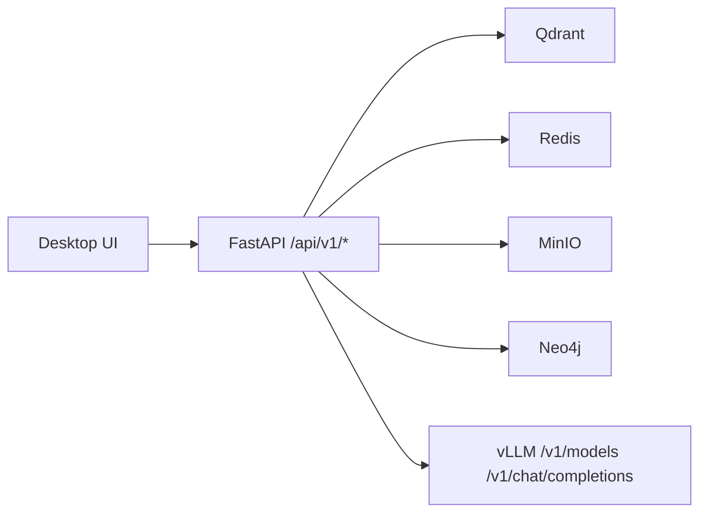

# 시스템 상세 아키텍처 설계

> 현재 기준: `desktop/` UI + `backend/` API + 데이터 서비스 + 외부 vLLM

## 운영 토폴로지

- `192.168.2.238`
  - `pixllm-agent` (FastAPI)
  - `pixllm-qdrant`
  - `pixllm-redis`
  - `pixllm-minio`
  - `pixllm-neo4j`
- `192.168.2.212`
  - vLLM OpenAI 호환 서버
- 사용자 UI
  - Electron + Svelte 기반 `desktop/`

## 핵심 구성

| 구성 | 구현 | 역할 |
|---|---|---|
| UI | Electron + Svelte | 대화, 워크스페이스, 실행 상태 조회 |
| API | FastAPI | 채팅, 검색, import, pipeline, run 관리 |
| 문서 검색 | Qdrant `documents` | 문서 임베딩 검색 |
| 메타데이터 | Redis | 세션, job, 파일/문서 상태 |
| 원본 저장 | MinIO | import 원본 보관 |
| 그래프 저장 | Neo4j | 선택적 확장 영역 |
| 모델 서버 | vLLM | 모델 목록, chat completion |

## 요청 처리 흐름

1. 사용자는 `desktop/` UI에서 질문을 보낸다.
2. 데스크톱은 `/api/v1/chat` 또는 `/api/v1/chat/stream`을 호출한다.
3. 백엔드는 intent 분류와 runtime routing을 수행한다.
4. 문서 질문은 Qdrant, 코드 질문은 import/workspace 경로 기반 도구를 우선 사용한다.
5. 백엔드는 vLLM으로 최종 답변을 생성한다.
6. evidence gate / source guard를 거쳐 응답을 반환한다.

## 설계 원칙

- 웹 프런트엔드는 제거되었고, 현재 상호작용 표면은 데스크톱 UI 하나만 유지한다.
- import된 코드/문서는 백엔드가 직접 관리하고, UI는 백엔드 API만 통해 접근한다.
- 데스크톱은 로컬 워크스페이스 컨텍스트를 읽을 수 있지만, 기준 진실 소스는 백엔드 run/job 상태다.
