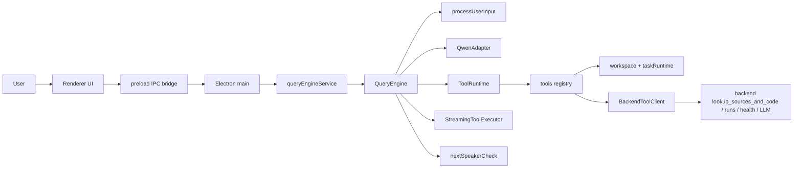

# 시스템 상세 아키텍처 설계

기준일: 2026-04-06

이 문서는 현재 코드 기준의 PIXLLM 아키텍처를 설명한다. 목표 아키텍처나 과거 구조 설명이 아니라, 지금 저장소에서 실제로 동작하는 기본 경로를 정리한다.

## 1. 현재 시스템 정의

현재 PIXLLM의 중심은 `desktop`이다.

- renderer가 사용자 입력, 세션, 실행 로그 UI를 담당한다.
- preload bridge가 Electron IPC surface를 제공한다.
- main process에서 `queryEngineService.cjs`가 `QueryEngine.cjs`를 세션별로 관리한다.
- `QueryEngine.cjs`가 모델 호출, transcript 유지, compaction, continuation, recovery를 담당한다.
- `QwenAdapter.cjs`가 Qwen textual tool protocol을 파싱하고 model-friendly transcript로 flattening한다.
- `processUserInput.cjs`가 intent, language profile, symbol hint, 초기 tool scope를 만든다.
- `ToolRuntime.cjs`가 pre-loop request context, grounded path, permission gate, tool batch 실행을 담당한다.
- `StreamingToolExecutor.cjs`가 스트리밍 중 parse 가능한 tool call의 선실행과 drain/recovery를 담당한다.
- `tools.cjs`와 `tools/*` 모듈이 로컬 tool registry를 구성한다.
- `workspace.cjs`와 `tasks/taskRuntime.cjs`가 파일, 검색, shell, build, background task 실행을 담당한다.

backend는 보조 서비스다.

- `/api/v1/health`
- `/api/v1/runs` 및 approvals
- `/api/v1/tool-api/orchestrate/lookup_sources_and_code`
- OpenAI-compatible direct/proxy LLM endpoint

즉 현재 구조는 `desktop single loop + backend evidence/control plane`이다.

## 2. 현재 전체 흐름

## 3. 주요 컴포넌트

| 컴포넌트 | 현재 역할 |
|---|---|
| renderer | 채팅, 세션, runs inspector, approvals, artifacts UI |
| preload | desktop surface 노출 |
| `queryEngineService.cjs` | 엔진 생성, 스트림 시작/취소, 질문 응답 |
| `QueryEngine.cjs` | 메인 agent loop, transcript, compaction, grounding retry, cancel/error recovery |
| `query.cjs` | block helper와 Qwen adapter facade |
| `QwenAdapter.cjs` | Qwen textual tool-call parsing, limited recovery, transcript flattening |
| `processUserInput.cjs` | intent, evidence mode, directive, explicit path, initial tool scope 계산 |
| `nextSpeakerCheck.cjs` | prose-only 응답 뒤 continuation 여부 판정 |
| `ToolRuntime.cjs` | tool authorization, active tool 집합, tool batch 실행, synthetic recovery |
| `StreamingToolExecutor.cjs` | 스트리밍 중 parse 가능한 tool call 선실행, claim, drain |
| `useCanUseTool.cjs` | deny-by-default 중앙 permission gate |
| `tools/*` | 개별 tool 구현 |
| `BackendToolClient.cjs` | backend evidence 수집 API 호출 |
| `taskRuntime.cjs` | background command/task 상태 저장과 capture 관리 |

## 4. 현재 처리 순서

1. renderer가 `agentChatStreamStart`로 요청을 보낸다.
2. main process가 세션별 `QueryEngine`을 가져오거나 생성한다.
3. `processUserInput`이 요청의 intent, language profile, evidence preference, explicit path, 초기 tool allowlist를 계산한다.
4. `processUserInput`이 필요할 때 `symbolHints`를 request context에 포함한다.
5. `QueryEngine`이 system prompt, project context, transcript를 조합해 모델을 호출한다.
6. `QwenAdapter`가 텍스트 delta와 tool intent를 같이 파싱한다.
7. `StreamingToolExecutor`가 parse 가능한 concurrency-safe tool call은 즉시 실행 시작한다.
8. turn 종료 시 `ToolRuntime`이 tool batch를 확정하고, prefetched result를 claim하거나 synthetic result를 복구한다.
9. tool result는 transcript에 textual `<tool_response>` 기반 block으로 기록된다.
10. grounded evidence가 충분하면 최종 answer를 만든다.
11. prose-only 응답이지만 model이 더 이어가야 할 가능성이 있으면 `nextSpeakerCheck`가 `Please continue.`를 주입한다.
12. ungrounded source mention이 발견되면 추가 turn으로 재시도한다.

## 5. 현재 모델 계약

현재 desktop runtime은 Qwen 중심이다.

- 기본 tool protocol은 native OpenAI `tool_calls`가 아니라 textual `<tool_call>...</tool_call>`이다.
- tool result는 user message 안의 `<tool_response>...</tool_response>` block으로 되돌린다.
- native `tool_calls`는 tolerated fallback이지 주 경로가 아니다.
- `reasoning_content`와 `reasoning`도 같이 수집해서 tool intent 복구에 사용한다.

현재 backend 기본 모델 설정은 공식 `Qwen/Qwen3.5-27B`다. desktop alias는 계속 `qwen3.5-27b`를 쓴다.

## 6. backend의 위치

backend는 현재 두 번째 agent loop가 아니다.

- desktop이 생각하고, tool을 고르고, 최종 답을 생성한다.
- backend는 evidence와 운영 API를 제공한다.
- `company_reference_search`는 backend의 `lookup_sources_and_code` 결과를 읽기 전용 evidence로 가져온다.
- backend에서 찾은 path는 grounded source로는 인정되지만, 곧바로 local `read/edit/write` 대상으로 승격되지는 않는다.

## 7. 현재 보안/정합성 장치

- tool 입력 schema 검증
- workspace-relative path 강제
- deny-by-default tool policy
- unknown path read/write/edit 차단
- read-before-edit / read-before-overwrite
- execution intent 또는 충분한 context 없는 shell/build 차단
- stale-read 방어와 full-read content hash fallback
- repeated batch/no-progress/ungrounded answer 재시도
- interrupted streaming tool call의 synthetic recovery
- message compaction 뒤에도 첫 substantive user query 보존
- flattened payload에 user query가 없으면 fallback `User request:` 메시지 재주입

## 8. 현재 구조에 없는 것

- MCP/open-world 기본 통합
- remote bridge session
- multi-agent 기본 경로
- backend가 최종 답변을 생성하는 이중 agent loop
- claude-code식 same-stream tool_result 재주입

현재 PIXLLM을 설명하는 가장 정확한 문장은 `Qwen-first desktop single agent loop를 중심으로 한 grounded coding assistant`다.
