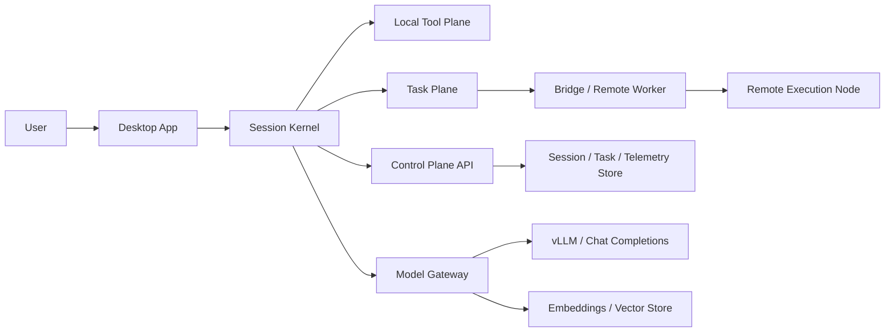

# 시스템 상세 아키텍처 설계

> 목표 기준: `desktop/` 실행면 + 세션 커널 + 도구/태스크 런타임 + 브리지/원격 실행 + 기존 모델/데이터 평면

## 1. 시스템 재정의

PIXLLM은 더 이상 `질문 -> intent -> backend RAG -> answer`를 중심으로 설명하지 않습니다.

새 기준에서 1급 개념은 아래입니다.

- `session`: 사용자와 런타임의 지속 맥락
- `turn`: 단일 요청과 응답 단위
- `task`: 장시간 실행 단위
- `artifact`: diff, 로그, 테스트 결과, 계획서 같은 산출물
- `approval`: 위험 작업에 대한 인간 승인
- `agent`: 도구를 사용할 수 있는 실행 주체

모델은 그대로 둡니다.

- LLM 서빙은 기존 `vLLM` 축을 유지합니다.
- 임베딩과 벡터 저장소도 기존 축을 유지합니다.
- 바뀌는 것은 모델이 아니라 운영 개념과 실행 구조입니다.

## 2. 목표 운영 토폴로지

- 로컬 실행 노드
  - Electron renderer
  - Electron main/runtime
  - session kernel
  - tool/task runner
  - 로컬 캐시와 세션 저장소
- 중앙 제어 노드
  - session/task metadata API
  - approval/event/telemetry 저장
  - bridge registry
- 모델/데이터 노드
  - vLLM
  - embeddings/vector store
  - document/reference storage
- 선택적 원격 작업 노드
  - isolated workspace 또는 worktree
  - remote bridge worker

## 3. 핵심 계층

| 계층 | 핵심 개념 | 역할 |
|---|---|---|
| Interaction Plane | session, turn, approval inbox | 사용자가 작업을 시작하고 결과를 읽는 표면 |
| Session Kernel | context builder, minimal router, query engine | 한 턴의 실행을 조정하는 중심 커널 |
| Tool Plane | file, shell, grep, edit, web, MCP | 실제 증거 수집과 조작 실행 |
| Task Plane | long-running task, artifact, retry, resume | 긴 작업을 분리하고 추적 |
| Team Plane | teammate, ownership, parallel execution | 병렬 하위 작업 분해와 통합 |
| Bridge Plane | remote session, work polling, ingress | 원격 환경과 격리 실행 연결 |
| Plugin/Skill Plane | command, skill, plugin, hook | 기능 확장과 사용자 맞춤 조합 |
| Model/Data Plane | vLLM, embeddings, vector/doc store | 생성과 검색을 담당하는 기존 축 |

## 4. 요청 처리 기본 흐름

1. 사용자가 세션 안에서 요청을 보냅니다.
2. session kernel이 시스템 컨텍스트, 사용자 메모리, 워크스페이스 상태, 이전 턴을 조립합니다.
3. minimal router가 이 요청이 `즉답`, `tool loop`, `task`, `team`, `remote` 중 어디로 가야 하는지 결정합니다.
4. query engine이 필요한 도구를 반복 호출하며 증거를 쌓습니다.
5. 긴 실행이나 파일 변경, 테스트, 병렬 분해가 필요하면 task plane 또는 team plane으로 승격합니다.
6. 원격 환경이 필요하면 bridge plane이 세션을 외부 작업 노드에 연결합니다.
7. 최종 답변은 기존 모델 평면에서 생성하되, 증거와 산출물에 묶여 반환됩니다.
8. 결과와 이벤트는 session/task 저장소와 telemetry 저장소에 기록됩니다.

## 5. 설계 원칙

- `tool-first`: 질문 의미론보다 실제 근거 수집을 우선합니다.
- `session-first`: 단일 요청이 아니라 세션 상태를 기본 단위로 봅니다.
- `task separation`: 긴 작업은 채팅 메시지 안에 숨기지 않고 task로 분리합니다.
- `explicit approval`: 편집, 명령 실행, 원격 실행은 승인과 정책을 거칩니다.
- `extensibility`: 기능 추가는 가능하면 plugin, skill, command, MCP 형태로 넣습니다.
- `single-agent default`: 기본은 단일 커널이 처리하고, 병렬 분해가 필요한 경우에만 team을 씁니다.
- `model unchanged`: 모델 평면은 유지하고, 모델 위 운영 개념만 바꿉니다.

## 6. 기존 개념에서 제거되는 것

- 세밀한 `intent taxonomy`를 주 실행 축으로 두는 설계
- 백엔드가 모든 질문을 일괄 오케스트레이션하는 설계
- 웹 프런트엔드를 기준으로 보는 제품 개념
- 문서/벡터 검색을 항상 첫 단계로 가정하는 라우팅
- `질문 문구`만으로 실행 모드를 크게 바꾸는 규칙

## 7. 새 기준에서 백엔드의 역할

새 구조에서 백엔드는 여전히 중요하지만 역할이 달라집니다.

- 모델/데이터 평면 게이트웨이
- session/task/event 저장
- bridge/remote 환경 등록과 work dispatch
- 승인, telemetry, artifact metadata 저장

즉 백엔드는 여전히 필요하지만, 더 이상 "모든 지능이 한곳에 몰린 단일 RAG 서버"로 설명하지 않습니다.

## 8. 새 기준에서 데스크톱의 역할

데스크톱은 단순 채팅 클라이언트가 아니라 주 실행면입니다.

- 세션 시작과 재개
- 로컬 워크스페이스 컨텍스트 수집
- 도구 실행과 결과 표시
- task, artifact, approval, team 상태 시각화
- bridge 연결과 원격 작업 모니터링

PIXLLM의 큰 구조는 이제 `데스크톱에서 실행되는 세션 커널이 도구, 태스크, 팀, 브리지를 조합하고, 모델 평면은 그 아래에서 생성과 검색을 담당하는 구조`로 이해하는 것이 가장 정확합니다.
