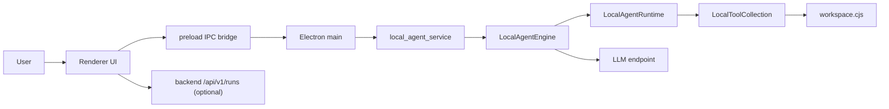

# 시스템 상세 아키텍처 설계

기준일: 2026-04-01

이 문서는 현재 코드에 구현된 PIXLLM의 실제 아키텍처를 설명합니다. 목표 설계나 장기 계획이 아니라, 지금 동작하는 경로를 기준으로 정리합니다.

## 1. 현재 시스템 정의

현재 PIXLLM의 중심은 `desktop` 로컬 에이전트 루프입니다.

- Electron renderer가 UI와 상태 표시를 담당합니다
- preload IPC가 renderer와 main process를 연결합니다
- Electron main이 데스크톱 브리지와 워크스페이스/세션 API를 제공합니다
- `local_agent_service.cjs`가 스트림 요청을 시작하고 이벤트를 방출합니다
- `LocalAgentEngine`이 한 턴의 모델 호출, 파싱, 반복, 종료를 담당합니다
- `LocalAgentRuntime`이 request context, tool policy, grounded path, tool batch 실행을 담당합니다
- `createLocalToolCollection`이 로컬 도구를 등록하고 실행합니다
- `workspace.cjs`가 파일/검색/LSP 유사 조회/셸/빌드를 실행합니다

백엔드는 현재 로컬 채팅 루프의 직접 오케스트레이터가 아닙니다.

- LLM endpoint
- `/api/v1/health`
- `/api/v1/runs` 및 approval 관련 API
- `/api/v1/tool-api`

즉, 현재 구조는 `desktop local agent + optional backend services`에 가깝습니다.

## 2. 현재 토폴로지

## 3. 현재 핵심 컴포넌트

| 컴포넌트 | 현재 역할 |
|---|---|
| Renderer | 세션 UI, 스트림 이벤트 표시, 질문 입력 |
| preload bridge | renderer가 호출할 IPC 메서드 노출 |
| Electron main | 세션, 설정, 워크스페이스, 로컬 에이전트 스트림 시작/취소 |
| `LocalAgentService` | `request_start`, `tool_use`, `done` 같은 이벤트 방출 |
| `LocalAgentEngine` | 턴 루프, 모델 호출, 메시지 압축, 반복 제어 |
| `LocalAgentRuntime` | pre-loop context, tool permission, grounding, tool batch 실행 |
| `LocalToolCollection` | 도구 registry, 입력 정규화, permission gate |
| `workspace.cjs` | 실제 파일/검색/셸/빌드 실행 |
| backend runs API | 운영 상태 조회와 approval 처리용 별도 표면 |

## 4. 현재 턴 처리 흐름

1. renderer가 `agentChatStreamStart`로 요청을 시작합니다.
2. main process가 `local_agent_service`를 통해 `LocalAgentEngine.run()`을 호출합니다.
3. 런타임이 request context를 만듭니다.
   - 사용자 프롬프트
   - selected file
   - 사용자 요청에 직접 등장한 경로
   - change / execution / analysis intent
4. 엔진이 모델을 호출합니다.
5. 응답을 assistant text와 `tool_use` 블록으로 파싱합니다.
6. tool call이 있으면 런타임이 permission과 경로 정책을 검사합니다.
7. 허용된 도구를 실행하고 `tool_result`를 transcript에 추가합니다.
8. 충분한 증거가 쌓이면 최종 답변을 생성합니다.
9. 최종 답변은 grounded path 검사 후에만 종료됩니다.

## 5. 현재 구현된 안전장치

- tool 입력 schema 정규화
- workspace-relative path 검증
- request context 기반 explicit path 허용
- unknown path read/write/edit 차단
- read-before-edit / read-before-overwrite 정책
- execution intent 없는 shell/build 차단
- repeated tool batch 방지
- interrupted tool result 기록
- grounded final answer 재시도
- message/tool_result budget compaction

## 6. 현재 구현과 목표 설계의 차이

현재 local agent 경로에는 아직 없는 것:

- MCP/open-world tool integration
- plugin/skill/tool registry 통합
- team worker 기반 병렬 에이전트 실행
- remote bridge / remote session 실행
- streaming 중 즉시 tool execution
- desktop local runtime과 backend tool runtime의 단일화

따라서 현재 PIXLLM은 `세션 커널 + 팀/브리지/플러그인 생태계` 전체가 완성된 구조라기보다, `강화된 단일 로컬 에이전트 런타임`으로 이해하는 것이 정확합니다.
