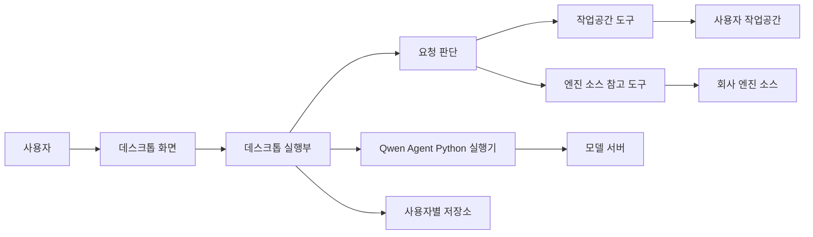
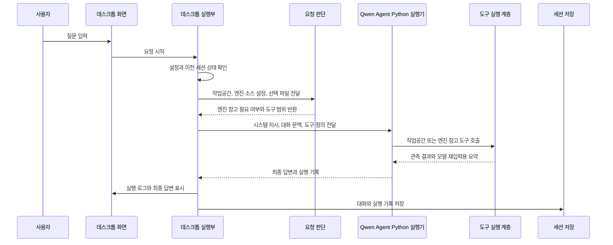
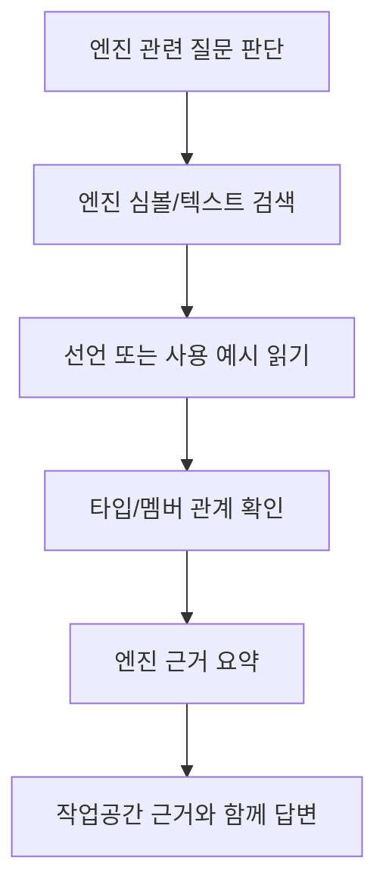

# 시스템 전체 흐름 설계

## 1. 제품 구조

PIXLLM은 로컬 모드 하나로 동작한다. 사용자는 로컬 작업공간을 선택하고 질문한다. 모델은 작업공간을 1차 근거로 삼고, 엔진 코드 설명이나 활용법이 필요할 때만 회사 엔진 소스를 참고한다.

| 구성 | 책임 |
| --- | --- |
| 데스크톱 화면 | 작업공간 선택, 질문 입력, 답변 표시, 실행 로그 표시 |
| 데스크톱 실행부 | 요청 판단, 세션 복원, 도구 범위 구성, 결과 조립 |
| Qwen Agent Python 실행기 | 모델 서버 호출과 도구 호출 루프 실행 |
| 작업공간 도구 | 사용자의 로컬 코드 검색, 읽기, 수정 |
| 엔진 소스 참고 도구 | 회사 엔진 소스의 선언, 사용 예시, 타입 관계 조회 |
| 사용자별 저장소 | 설정, 세션, 실행 상태, 수정 차이 저장 |

## 2. 구현 축

전체 구현은 네 축으로 나눈다.

| 축 | 쓰는 기술 | 구현 내용 |
| --- | --- | --- |
| 화면 | Svelte | 작업공간 선택, 질문 입력, 세션 목록, 실행 로그, 엔진 참고 상태 표시 |
| 데스크톱 실행 | Electron/Node.js | 요청 판단, 도구 레지스트리, 세션 저장, 로컬 파일 접근 |
| 모델 연결 | Qwen Agent Python 실행기 | OpenAI 호환 모델 서버 호출, 도구 호출 생성 |
| 엔진 참고 | Python 색인 + JSON 조회 | 엔진 원본 소스에서 선언, 사용처, 타입 관계 조회 |

Qwen Agent Python 실행기는 데스크톱 실행부가 별도로 실행하는 Python 프로세스다. 데스크톱 실행부와 표준 입력/출력 및 로컬 HTTP JSON 도구 연결부로 통신한다. 도구 실행 계층은 작업공간 도구와 엔진 참고 도구를 같은 방식으로 실행하고, 결과를 실행 로그와 모델 재입력용 요약으로 나눈다.

## 3. 단일 실행 모드

사용자에게 노출되는 실행 모드는 로컬 모드 하나다. 요청 판단은 실행 모드를 바꾸지 않고, 엔진 소스를 참고할 필요가 있는지만 정한다.

| 질문 성격 | 실행 모드 | 열리는 도구 |
| --- | --- | --- |
| 작업공간 구조 설명 | 로컬 모드 | 작업공간 검색/읽기 |
| 작업공간 파일 수정 | 로컬 모드 | 작업공간 읽기/수정 |
| 엔진 API 사용법 질문 | 로컬 모드 | 작업공간 도구 + 엔진 소스 참고 도구 |
| 선택된 코드가 엔진 API를 쓰는 흐름 질문 | 로컬 모드 | 작업공간 검색 + 엔진 사용처/선언 조회 |
| 엔진 타입 관계 설명 | 로컬 모드 | 엔진 타입 관계/소스 읽기 |

## 4. 전체 요청 흐름

## 5. 작업공간 도구 흐름

작업공간 도구는 사용자가 실제로 다루는 코드에 접근한다.

| 도구 | 역할 |
| --- | --- |
| 파일 목록 | 작업공간 구조 확인 |
| 파일 패턴 찾기 | 경로 패턴 기반 후보 찾기 |
| 텍스트 검색 | 문자열과 주변 줄 찾기 |
| 파일 읽기 | 필요한 범위의 파일 내용 읽기 |
| 심볼 조회 | 함수, 클래스, 참조 후보 찾기 |
| 파일 수정 | 정확 문자열 치환 방식의 수정 |

## 6. 엔진 소스 참고 흐름

엔진 소스 참고 도구는 사용자의 작업공간과 역할이 다르다. 모델이 엔진 API의 의미, 사용법, 타입 관계, 실제 사용 예시를 확인해야 할 때 보조 근거로 사용한다.

| 엔진 참고 근거 | 설명 |
| --- | --- |
| 선언 | 실제 타입, 함수, 멤버의 정의 |
| 사용 예시 | 엔진 내부 또는 샘플 코드의 실제 호출 위치 |
| 타입 관계 | 상속, 멤버, 입출력 타입 연결 |
| 주변 소스 | 설명에 필요한 파일 범위 |

## 7. 화면으로 돌아오는 값

모든 요청은 같은 형태로 화면에 돌아온다.

| 결과 | 설명 |
| --- | --- |
| 최종 답변 | 대화 영역에 표시할 모델 답변 |
| 실행 추적 | 도구 이름, 입력, 관측 결과 |
| 작업공간 근거 | 사용자의 코드에서 확인한 파일과 범위 |
| 엔진 근거 | 회사 엔진 소스에서 확인한 선언과 사용 예시 |
| 수정 차이 | 파일 수정이 발생한 경우의 줄 단위 차이 |
| 종료 사유 | 완료, 취소, 오류 중 하나 |

## 8. 문서 AI/RAG 범위

본 설계의 실행 흐름은 로컬 작업공간과 회사 엔진 소스 근거만 사용한다.

초기 문서에는 문서 AI와 RAG 경로도 있었다. 문서 AI는 사내 문서나 업로드 문서를 찾아 답변하는 별도 지식 질의 흐름이고, RAG는 문서 벡터 검색과 키워드 검색 결과를 모델에 넣어 답하는 구조였다. 본 설계에서는 문서 AI/RAG 경로를 사용자 실행 흐름에 두지 않는다. 사용자의 실제 대상은 로컬 작업공간이며, 보조 근거는 회사 엔진 소스로 한정한다.

## 9. 초기 문서에서 바뀐 점

초기 `시스템 상세 아키텍처 설계`는 웹 기반 지식 플랫폼, 하드웨어 구성, 모델 선정, 문서 검색, 그래프 확장을 함께 설명했다.

본 문서는 그 범위를 로컬 데스크톱 작업 흐름으로 수정했다.

| 초기 문서 내용 | 본 문서에서의 수정 |
| --- | --- |
| 웹 화면과 백엔드 채팅 API가 중심 | 데스크톱 화면과 로컬 요청 실행 엔진이 중심 |
| 문서 AI가 사내 문서 질의를 담당 | 본 설계는 문서 AI 경로를 포함하지 않음 |
| RAG가 문서 벡터 검색 결과를 모델에 전달 | 로컬 작업공간 근거와 엔진 소스 근거를 모델에 전달 |
| Agentic RAG/GraphRAG 확장을 계획 | 로컬 도구 호출 루프와 엔진 타입/사용처 조회로 축소 |
| 문서 벡터 검색과 그래프 검색을 주요 경로로 설명 | 작업공간 도구와 엔진 소스 참고 도구를 주요 경로로 설명 |
| 여러 실행 경로가 병렬로 존재 | 사용자 입장에서는 로컬 모드 하나로 정리 |
| 회사 엔진 소스는 별도 백엔드 직접 답변 경로에서 조회 | 로컬 모드 내부의 엔진 참고 근거로 통합 |
| 인프라와 모델 배치까지 포함 | 본 문서는 질문 실행과 근거 기록에 집중 |
