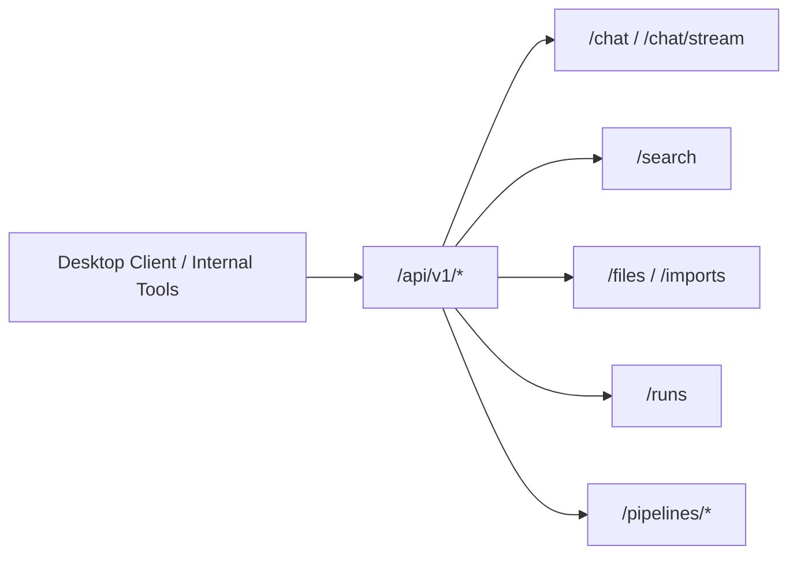

# API 인터페이스 설계

> 목적: 현재 FastAPI 백엔드와 데스크톱 클라이언트 사이의 계약을 정리

## 기본 원칙

- Base path: `/api/v1`
- 기본 응답 형식: `{ ok, data, error }`
- 스트리밍 응답: `text/event-stream`
- 기본 클라이언트: `desktop/`
- 보조 클라이언트: 내부 스크립트 / 테스트 코드

## 주요 엔드포인트

### Chat

- `POST /api/v1/chat`
- `POST /api/v1/chat/stream`
- `POST /api/v1/chat/intent/verify`

### Search / Retrieval

- `POST /api/v1/search`
- `GET /api/v1/models`

### Files / Imports

- `GET /api/v1/files`
- `POST /api/v1/files`
- `GET /api/v1/imports`
- `POST /api/v1/imports/repo`
- `POST /api/v1/imports/local-folder/stage`
- `POST /api/v1/imports/local-folder/finalize`

### Runs / Pipelines

- `GET /api/v1/runs`
- `GET /api/v1/runs/{run_id}`
- `POST /api/v1/pipelines/*`

## 인증 헤더

- `Authorization: Bearer <token>`
- `x-api-token: <token>`

`/api/v1/health`는 예외적으로 인증 없이 열려 있을 수 있다.
