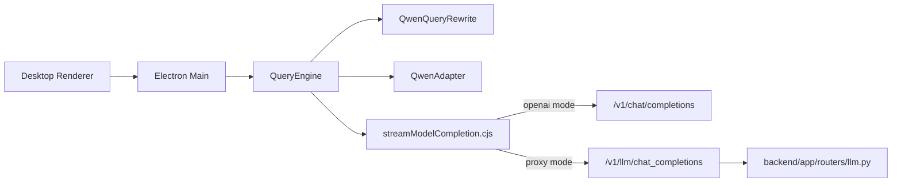

# LLM 서빙 상세 설계

기준일: 2026-04-06

목적: 현재 PIXLLM desktop runtime이 Qwen 계열 모델을 어떻게 호출하고, 그 출력을 어떻게 tool loop에 연결하는지 정리한다.

## 1. 현재 구조

현재 모델 호출의 진입점은 `QueryEngine.cjs`, `QwenAdapter.cjs`, `QwenQueryRewrite.cjs`, `services/model/streamModelCompletion.cjs`다.

호출 모드는 두 가지다.

- OpenAI-compatible direct call
- backend proxy call

## 2. mode 결정

`streamModelCompletion.cjs`는 base URL을 보고 transport 모드를 고른다.

- base URL이 `/api`로 끝나면 `proxy`
- 아니면 `openai`

primary/fallback base URL과 token도 같이 지원한다.

## 3. 현재 기본 모델 전제

현재 backend 기본 설정은 공식 `Qwen/Qwen3.5-27B`다.

- desktop alias: `qwen3.5-27b`
- direct/proxy surface는 OpenAI-compatible일 수 있음
- application-level transcript contract는 Qwen textual tool protocol이 기본

즉 현재 LLM serving은 `OpenAI-compatible transport + Qwen-first transcript contract`로 설명하는 것이 정확하다.

## 4. 요청 payload

공통 핵심 필드:

- `model`
- `messages`
- `max_tokens`
- `temperature`
- `stop`

Qwen일 때는 추가 body가 붙는다.

- `chat_template_kwargs.enable_thinking`
- `top_k`

rewrite helper와 next-speaker checker는 별도의 짧은 JSON-only completion을 사용한다.

response format 차이:

- proxy mode: 문자열 `response_format`
- openai mode: OpenAI 형식의 `response_format`

## 5. transcript flattening

현재 `messages`는 native tool transcript가 아니라 Qwen textual protocol로 flattening된다.

- assistant tool call:
  - `<tool_call>...</tool_call>`
- user/tool result:
  - `<tool_response>...</tool_response>`

tool catalog는 system prompt 안에 function schema JSON 문자열로 노출한다. 즉 tool schema는 OpenAI-style로 설명하지만, invocation transport는 textual block이다.

## 6. parser와 반환 구조

`QwenAdapter`가 현재 처리하는 입력:

- assistant plain text
- `<tool_call>` block
- malformed JSON-like tool call
- XML-style function/tool block
- `reasoning_content` / `reasoning`
- shell-like search/read plan
- native `tool_calls` fallback

현재 query loop가 받는 핵심 구조:

- `text`
- `reasoning_content`
- `tool_calls`
- `finish_reason`
- `usage`

streaming일 때도 최종적으로는 이 구조로 수렴한다. 다만 tool intent 회수는 `QwenAdapter`가 textual output까지 같이 본다.

## 7. streaming 처리

현재 streaming 동작:

1. SSE 또는 OpenAI stream에서 text delta를 누적한다.
2. `reasoning_content` 또는 `reasoning` delta도 같이 누적한다.
3. token은 즉시 UI로 전달한다.
4. `QwenAdapter`가 aggregated text에서 parse 가능한 textual tool call을 추출한다.
5. `StreamingToolExecutor`가 parse 가능한 concurrency-safe tool call은 미리 실행 시작한다.
6. turn 종료 시 `ToolRuntime`이 prefetched execution을 claim하거나 synthetic result로 복구한다.

중요:

- 현재는 same-stream tool result reinjection이 아니다.
- 즉 claude-code처럼 같은 생성 스트림 안에서 완료된 tool result를 다시 모델에 먹이지 않는다.

## 8. 한국어와 mixed prompt 처리

현재 한국어 지원은 하드코딩된 용어 사전이 아니다.

- `processUserInput`가 language profile을 계산한다.
- 필요할 때 `QwenQueryRewrite`가 prompt를 English code-search 힌트로 재작성한다.
- `searchHints`, `symbolHints`, `rewriteNotes`가 request context와 parser recovery에 함께 쓰인다.

따라서 현재 한국어 서빙 설계는 `bilingual query rewrite + tolerant parser`로 설명해야 맞다.

## 9. compaction-safe user query 보존

Qwen server는 flattened payload에 실질 user query가 없으면 `400 No user query found in messages`를 낼 수 있다.

현재 desktop runtime은 다음을 보장한다.

- `compactMessages()`가 첫 substantive user message를 보존한다.
- `_modelMessages()`가 필요하면 fallback `User request:` 메시지를 다시 주입한다.

이 설계는 긴 세션과 transcript compaction 환경에서 Qwen server 호환성을 유지하기 위한 현재 구현의 핵심이다.

## 10. backend proxy 역할

backend `routers/llm.py`의 역할:

- OpenAI-compatible 요청을 backend 정책 아래로 감쌈
- stream event를 token/done/error 형태로 중계
- proxy 모드 payload shape를 안정화

desktop의 주 loop는 여기 있지 않다. backend는 LLM proxy와 evidence/control API 역할을 한다.

## 11. 현재 강점과 한계

강점:

- direct/proxy 전환이 설정만으로 가능
- primary/fallback endpoint 지원
- Qwen textual protocol을 직접 수용함
- malformed tool-call recovery, reasoning-based recovery, rewrite hint 지원
- streaming 중 tool prefetch와 cancel recovery 지원

한계:

- same-stream tool result reinjection 없음
- claude-code 수준의 generation-integrated executor는 아님
- parser는 강하지만 tool intent가 전혀 없는 일반 prose는 마법처럼 복구하지 않음

현재 PIXLLM의 LLM serving을 설명할 때는 `desktop QueryEngine이 Qwen-first loop를 주도하고, streamModelCompletion이 direct/proxy transport를 담당한다`고 쓰는 것이 정확하다.
