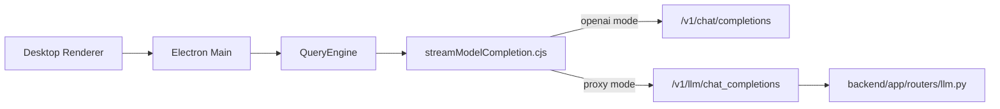

# LLM 서빙 상세 설계

목적: 현재 PIXLLM desktop runtime이 LLM을 어떻게 호출하는지 정리한다.

## 1. 현재 구조

현재 모델 호출의 진입점은 `QueryEngine.cjs`와 `services/model/streamModelCompletion.cjs`다.

호출 모드는 두 가지다.

- OpenAI-compatible direct call
- backend proxy call

## 2. mode 결정

`streamModelCompletion.cjs`는 base URL을 보고 모드를 고른다.

- base URL이 `/api`로 끝나면 `proxy`
- 아니면 `openai`

primary/fallback base URL과 token도 같이 지원한다.

## 3. 요청 payload

공통 핵심 필드:

- `model`
- `messages`
- `tools`
- `tool_choice`
- `max_tokens`
- `temperature`
- `stop`

response format 차이:

- proxy mode: 문자열 `response_format`
- openai mode: OpenAI 형식의 `response_format`

message는 `query.cjs`가 block transcript를 model-friendly message 배열로 flatten한 결과를 쓴다.

## 4. streaming 처리

현재 streaming 동작:

1. SSE 또는 OpenAI stream에서 text delta를 누적한다.
2. tool call delta도 같이 누적한다.
3. token은 즉시 UI로 전달한다.
4. `StreamingToolExecutor`가 parse 가능한 concurrency-safe tool call은 미리 실행 시작한다.
5. turn 종료 시 `ToolRuntime`이 prefetched execution을 claim하거나 synthetic result로 복구한다.

중요:

- 현재는 same-stream tool result reinjection이 아니다.
- 즉 claude-code처럼 같은 생성 스트림 안에서 완료된 tool result를 다시 모델에 먹이지 않는다.

## 5. 반환 구조

현재 query loop가 받는 핵심 구조:

- `text`
- `tool_calls`
- `finish_reason`
- `usage`

streaming일 때도 최종적으로는 이 구조로 수렴한다.

## 6. backend proxy 역할

backend `routers/llm.py`의 역할:

- OpenAI-compatible 요청을 backend 정책 아래로 감쌈
- stream event를 token/done/error 형태로 중계
- proxy 모드 payload shape를 안정화

desktop의 주 loop는 여기 있지 않다. backend는 LLM proxy와 evidence/control API 역할을 한다.

## 7. 현재 강점과 한계

강점:

- direct/proxy 전환이 설정만으로 가능
- primary/fallback endpoint 지원
- native tool-calling 기반 flattening 사용
- streaming 중 tool prefetch와 cancel recovery 지원

한계:

- same-stream tool result reinjection 없음
- claude-code 수준의 깊은 generation-integrated executor는 아님
- 모델별 고급 routing은 아직 얕음

현재 PIXLLM의 LLM serving을 설명할 때는 `desktop QueryEngine이 model loop를 주도하고, streamModelCompletion이 direct/proxy transport를 담당한다`고 쓰는 것이 정확하다.
