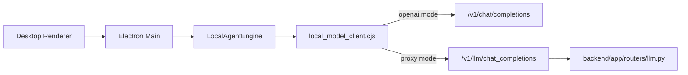

# LLM 서빙 상세 설계

> 목적: 현재 PIXLLM 데스크톱 로컬 에이전트가 LLM을 어떻게 호출하는지 정리

## 1. 현재 구조

현재 모델 호출의 실제 진입점은 `desktop/src/main/core/local_model_client.cjs`입니다.

호출 표면은 두 가지입니다.

- OpenAI-compatible 직접 호출
- backend proxy 호출

## 2. 엔드포인트 결정 방식

`local_model_client.cjs`는 base URL을 보고 두 모드 중 하나를 고릅니다.

- base URL이 `/api`로 끝나면 `proxy`
- 아니면 `openai`

현재 사용 엔드포인트:

| 모드 | 비스트리밍 | 스트리밍 |
|---|---|---|
| `openai` | `/v1/chat/completions` | `/v1/chat/completions` with `stream: true` |
| `proxy` | `/v1/llm/chat_completions` | `/v1/llm/chat_completions/stream` |

추가로 primary/fallback base URL과 token을 둘 다 설정할 수 있습니다.

## 3. 요청 payload

현재 요청은 아래 공통 필드를 중심으로 구성됩니다.

- `model`
- `messages`
- `tools`
- `tool_choice`
- `max_tokens`
- `temperature`
- `stop`

response format은 모드별로 다르게 맞춰집니다.

- proxy 모드: `response_format: "text" | "json_object"` 식
- openai 모드: OpenAI 형식 `response_format: { type: "json_object" }`

## 4. 스트리밍 처리 방식

현재 스트리밍은 "토큰은 즉시", "도구 실행은 응답 종료 후" 구조입니다.

구체적으로는:

1. SSE 청크를 읽으면서 text delta를 누적합니다.
2. openai/tool delta 또는 proxy `done` payload에서 tool call 조각을 누적합니다.
3. 토큰은 곧바로 UI에 전달합니다.
4. tool call은 응답이 끝난 뒤 엔진이 batch로 실행합니다.

즉 현재 구현은 `streaming-time tool execution`이 아닙니다.

## 5. 반환 구조

`local_model_client.cjs`가 엔진에 돌려주는 표준 구조는 아래와 같습니다.

- `text`
- `tool_calls`
- `finish_reason`
- `usage`

엔진은 이 결과를 다시 assistant text와 tool batch로 나눠 후속 처리합니다.

## 6. backend proxy 역할

backend 쪽 LLM 라우터는 `backend/app/routers/llm.py`입니다.

현재 역할:

- OpenAI-compatible 요청을 backend 정책 안으로 감쌉니다.
- 스트리밍 시 `token`, `done`, `error` 이벤트를 냅니다.
- tool call 조각을 수집해 최종 payload에 포함합니다.

보조 파싱 로직은 `backend/app/core/llm_utils.py`에 있습니다.

## 7. 현재 설계의 장점과 한계

장점:

- OpenAI-compatible endpoint와 backend proxy를 모두 붙일 수 있습니다.
- direct/proxy 전환이 설정만으로 가능합니다.
- 스트리밍 토큰 UX는 이미 있습니다.

한계:

- tool call은 스트리밍 중 즉시 실행되지 않습니다.
- 모델 선택은 기본적으로 단일 active model 중심입니다.
- Claude Code처럼 tool executor가 generation loop 안에 직접 붙어 있지는 않습니다.

## 8. 현재 기준 비범위

현재 로컬 경로에 없는 것:

- 모델별 역할 분담용 multi-agent serving
- MCP/open-world transport
- stream 중 즉시 tool execution
- tool result를 모델 스트림 안으로 실시간 재주입하는 구조

현재 PIXLLM의 LLM 서빙은 `로컬 에이전트가 하나의 모델 호출 루프를 돌리고, 도구는 응답 완료 후 batch 실행한다`로 이해하는 것이 맞습니다.
