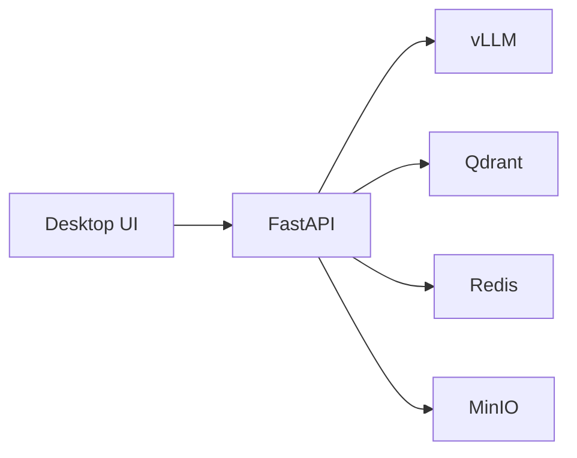

# LLM 서빙 상세 설계

> 목적: 현재 PIXLLM이 vLLM을 어떻게 사용하는지 정리

## 현재 구조

- UI: `desktop/`
- API: `backend/`
- vLLM: `192.168.2.212:8001`
- 기본 모델: `qwen3.5-27b`

## 현재 모델 사용 방식

- intent 분류
- 답변 타입 결정
- ReAct / tool-calling 계획
- 최종 답변 생성
- `usage_guide` 응답 생성

즉, 현재는 "다중 역할별 전용 모델"보다 "단일 기본 모델 + 검색/도구 보강" 구조가 중심이다.

## 현재 호출 범위

- `/v1/models`
- `/v1/chat/completions`

임베딩은 vLLM이 아니라 백엔드 내부 임베딩 경로에서 처리한다.
