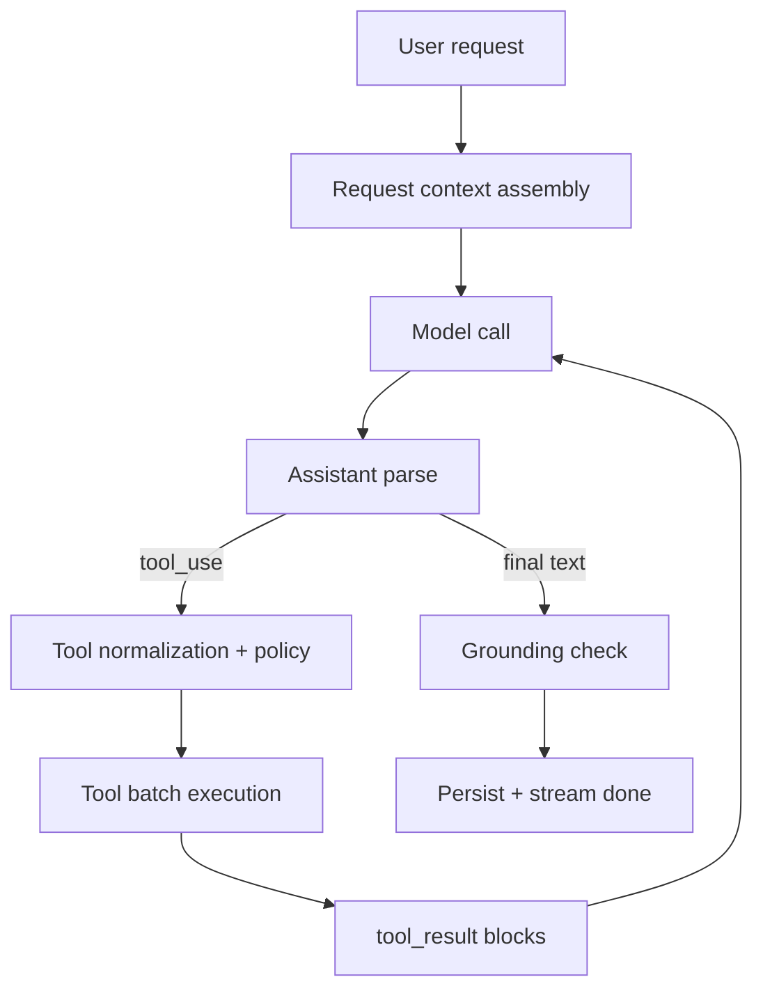

# 데스크톱 레이어드 툴 루프 아키텍처

기준일: 2026-04-01

이 문서는 현재 구현된 desktop local agent의 실제 레이어를 설명합니다.

## 1. 현재 핵심 개념

현재 구조의 중심은 `LocalAgentEngine + LocalAgentRuntime` 조합입니다.

- `LocalAgentEngine`: 모델 호출, assistant 파싱, 턴 반복, compaction, 종료 조건
- `LocalAgentRuntime`: request context, tool permission, grounded path, tool batch 실행
- `LocalToolCollection`: tool registry, 입력 정규화, permission gate

현재 구현은 단일 `tool_loop` 중심입니다. `team`, `remote`, `MCP`, `plugin/skill` 실행 평면은 로컬 에이전트 기본 경로에 없습니다.

## 2. 현재 레이어 정의

| 레이어 | 이름 | 현재 역할 |
|---|---|---|
| L0 | Desktop Event Surface | renderer와 main 사이의 요청/이벤트 전달 |
| L1 | Request Context Assembly | explicit path, selected file, intent 추출 |
| L2 | Model Turn Loop | 모델 호출, 응답 파싱, 반복 제어 |
| L3 | Tool Normalization and Policy | schema 검증, path 정책, permission gate |
| L4 | Tool Batch Execution | 도구 실행, trace 기록, transcript 기록 |
| L5 | Grounding and Recovery | grounded answer 검사, 반복 배치 차단, interrupt 처리 |
| L6 | Persistence and UI Stream | 상태 저장, stream event 방출, 최종 결과 반환 |

## 3. 현재 턴 흐름

## 4. Request Context Assembly

현재 런타임이 pre-loop에서 추출하는 정보:

- 사용자 프롬프트 원문
- selected file
- 사용자 요청에 직접 등장한 파일 경로
- change / execution / analysis / compare 성격

이 정보는 두 군데에 사용됩니다.

- 시스템 런타임 컨텍스트 메시지
- 도구 permission 판단

즉, 현재 PIXLLM은 `processUserInput`와 비슷한 역할을 최소 범위로 구현한 상태입니다.

## 5. Tool Policy

현재 tool policy는 아래를 강제합니다.

- 사용자 요청이나 이전 도구 결과에 없던 경로를 바로 읽지 않음
- 파일을 편집하기 전에 먼저 읽게 함
- overwrite 전에 현재 파일 내용을 읽게 함
- execution intent 없는 `bash` / `powershell` / `run_build`를 차단
- `config set`은 명시적 변경 의도가 있을 때만 허용

현재는 `tool permission denied`를 structured result로 돌려주고, 모델이 전략을 바꾸도록 유도합니다.

## 6. 현재 도구 범주

현재 로컬 registry의 주 도구 그룹:

- session/runtime: `todo_*`, `task_*`, `brief`, `ask_user_question`, `terminal_capture`
- discovery/search: `list_files`, `glob`, `grep`, `find_symbol`, `find_callers`, `find_references`, `tool_search`
- read/code intelligence: `read_file`, `read_symbol_span`, `symbol_outline`, `symbol_neighborhood`, `lsp`
- write/edit: `write`, `edit`, `notebook_edit`
- execute: `run_build`, `bash`, `powershell`
- web: `web_search`, `web`

현재 `tool_search`는 로컬 도구 설명 검색이며, MCP 도구 검색이 아닙니다.

## 7. 현재 Recovery and Grounding

현재 로컬 에이전트는 아래 recovery를 가집니다.

- malformed assistant reply 재시도
- output token cutoff recovery
- repeated tool batch 차단
- interrupted tool result 기록
- grounded final answer 재시도
- tool_result/message budget compaction

특히 최종 답변은 이전 read/search/list 결과에 나타나지 않은 파일 경로를 언급하면 재시도됩니다.

## 8. 현재 한계

아직 구현되지 않은 항목:

- streaming 중 즉시 tool execution
- separate executor abstraction
- team / remote / bridge escalation
- MCP/open-world tool registry
- backend tool runtime과 local runtime의 단일화

따라서 현재 데스크톱 툴 루프는 `claude-code`의 전체 QueryEngine 구조를 완전히 복제한 것이 아니라, 그중 `pre-loop + permission + grounded tool loop`를 로컬 런타임으로 압축한 형태입니다.
