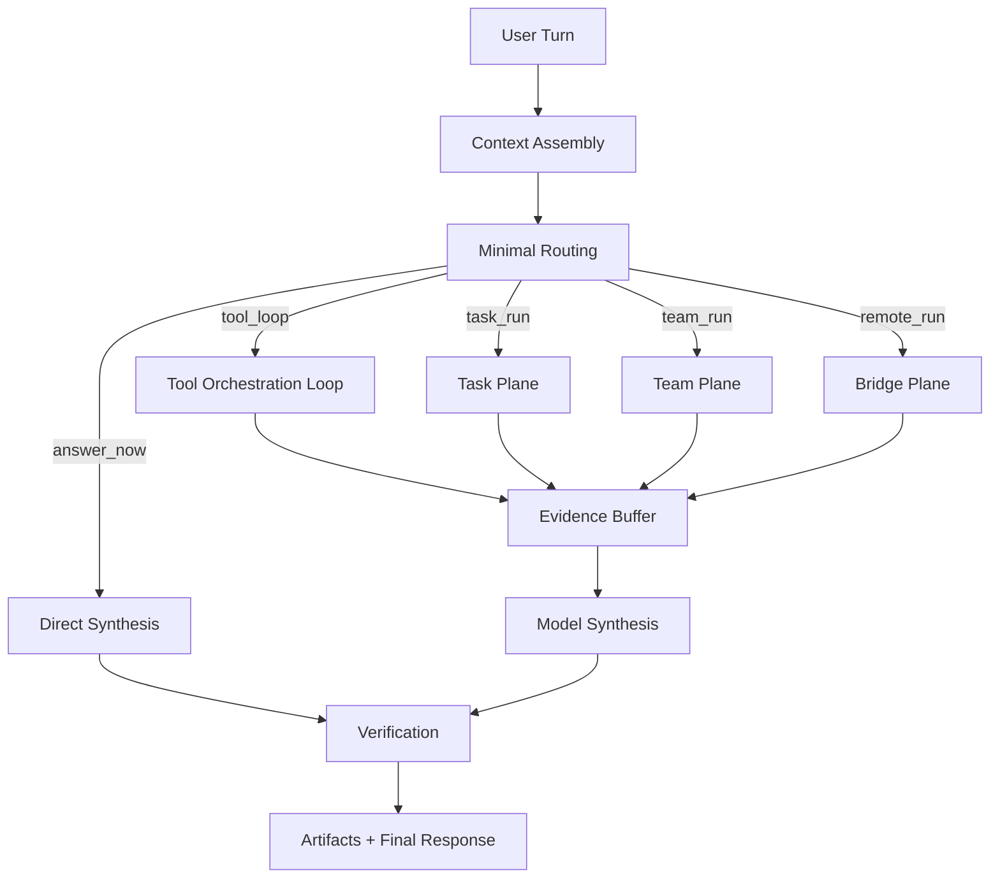

# 데스크톱 레이어드 툴 루프 아키텍처

## 문서 목적

이 문서는 PIXLLM의 핵심 실행 모델을 `로컬 오버레이 + 서버 RAG`가 아니라 `세션 커널이 여러 레이어를 통과하며 도구와 태스크를 조합하는 구조`로 재정의합니다.

여기서 레이어는 데이터 우선순위가 아니라 실행 단계와 책임 분리를 뜻합니다.

## 1. 핵심 개념

새 구조의 중심은 `session kernel`입니다.

session kernel은 한 턴을 처리할 때 아래를 수행합니다.

- 컨텍스트 조립
- 최소 라우팅
- 도구 루프 실행
- 태스크 승격
- 원격 브리지 연결
- 최종 검증과 응답 조립

즉 "백엔드가 알아서 검색해서 답한다"가 아니라, "세션 커널이 필요한 도구와 실행 표면을 선택하고 모델은 그 위에서 합성한다"가 핵심입니다.

## 2. 레이어 정의

| 레이어 | 이름 | 역할 |
|---|---|---|
| L0 | User Intent Surface | 사용자 요청과 UI 상태 수신 |
| L1 | Context Assembly | cwd, git 상태, 메모리, 이전 턴, 선택 파일 조립 |
| L2 | Minimal Routing | `즉답`, `tool loop`, `task`, `team`, `remote` 결정 |
| L3 | Tool Orchestration | 검색, 읽기, 편집, 셸, MCP, 웹, 플러그인 도구 실행 |
| L4 | Task and Bridge Escalation | 긴 실행, 원격 실행, 병렬 작업 분리 |
| L5 | Model Synthesis | 기존 모델 평면으로 최종 초안 생성 |
| L6 | Verification and Persistence | 검증, approval, 아티팩트 저장, 세션 기록 |

## 3. 턴 처리 흐름

## 4. Context Assembly 레이어

이 단계에서 모으는 것은 단순 프롬프트 문자열이 아닙니다.

- 현재 워크스페이스와 cwd
- git/svn 상태와 최근 변경
- 사용자 메모리와 프로젝트 메모리
- 세션 이력
- 선택 파일/심볼/에디터 범위
- 설정과 권한 모드
- 활성 plugin/skill/command 목록

중요한 점:

- 과거의 `local overlay`는 별도 특수 구조가 아니라 context assembly의 한 evidence source로 흡수됩니다.
- docs/vector 결과도 이 단계의 기본값이 아니라, 필요할 때 도구 루프가 호출하는 one-of-many source가 됩니다.

## 5. Minimal Routing 레이어

세밀한 intent taxonomy를 버리고 아래 다섯 가지만 판단합니다.

- `answer_now`
- `tool_loop`
- `task_run`
- `team_run`
- `remote_run`

라우터는 질문의 의미를 과하게 이해하려고 하지 않습니다.

- 기술 질문 대부분은 `tool_loop`로 보냅니다.
- 명시적 편집/검증/명령 실행 요청은 `task_run`으로 보냅니다.
- 병렬 분해가 필요한 경우만 `team_run`으로 보냅니다.
- 원격 환경이 필요하면 `remote_run`으로 보냅니다.

## 6. Tool Orchestration 레이어

이 레이어가 참고 소스의 `QueryEngine + tools`에 가장 가까운 부분입니다.

도구 종류:

- 파일 읽기/검색
- 편집/쓰기
- 셸 명령
- MCP 리소스와 도구
- 웹 조회
- 플러그인/스킬 제공 도구
- LSP/구조 검색

동작 원리:

1. 모델은 다음 도구를 제안합니다.
2. 런타임은 권한과 정책을 확인합니다.
3. 도구를 실행하고 결과를 evidence buffer에 저장합니다.
4. 증거가 충분해질 때까지 반복합니다.

핵심 변화:

- 예전처럼 "먼저 intent를 맞추고 그에 맞는 고정 lane으로 간다"가 아닙니다.
- 대부분의 실질적 분기는 도구 결과를 본 뒤 뒤늦게 결정됩니다.

## 7. Task and Bridge 레이어

한 턴 안에 숨기지 말아야 할 작업은 task로 승격합니다.

승격 조건:

- 실행 시간이 길다
- 파일 변경이 발생한다
- 테스트/빌드/배포 검증이 필요하다
- 중간 실패와 재시도가 중요하다
- UI에서 별도 진행률과 산출물을 보여줘야 한다

bridge는 이 task가 로컬이 아닌 환경에서 돌아야 할 때 붙습니다.

- remote session 생성
- work polling
- session ingress
- reconnect/stop

## 8. Team 레이어

병렬 작업은 기본값이 아닙니다.

다만 아래 상황에서는 team plane으로 올립니다.

- 서로 다른 파일 집합을 독립적으로 수정할 수 있다
- 검증, 구현, 리뷰가 병렬 가능하다
- 긴 조사 작업을 분할하면 latency를 크게 줄일 수 있다

team plane의 산출물도 결국 artifact와 evidence buffer로 다시 들어갑니다.

## 9. Model Synthesis 레이어

여기서만 기존 모델 평면이 등장합니다.

- vLLM과 모델 설정은 기존 문서를 유지합니다.
- 모델은 도구 결과와 태스크 산출물을 읽고 최종 초안을 만듭니다.
- 모델이 단독으로 사실을 결정하는 구조는 피합니다.

즉 모델은 오케스트레이터가 아니라 evidence-aware synthesizer 역할에 가깝습니다.

## 10. Verification 레이어

완료 직전에는 아래를 확인합니다.

- 충분한 evidence가 있는가
- 위험 작업은 승인되었는가
- 파일 변경이 있으면 diff와 검증 결과가 있는가
- 태스크가 terminal state에 도달했는가
- 사용자에게 보여줄 artifact가 정리되었는가

검증 결과는 final response의 일부여야 합니다.

## 11. 새 구조에서의 우선순위

기존 구조:

1. intent
2. lane
3. retrieval
4. answer

새 구조:

1. session context
2. minimal routing
3. tool/task execution
4. evidence accumulation
5. model synthesis
6. verification

즉 PIXLLM의 레이어드 툴 루프는 이제 `source priority merge`가 아니라 `execution-stage architecture`로 이해해야 합니다.
