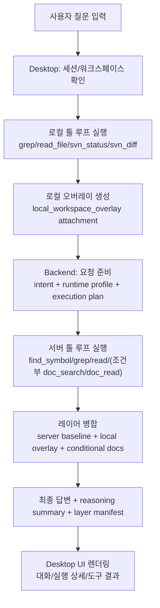
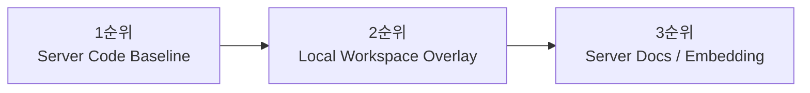
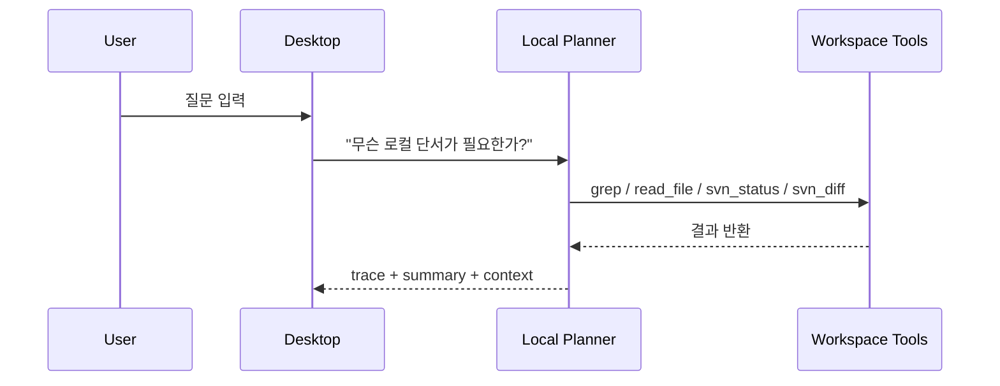
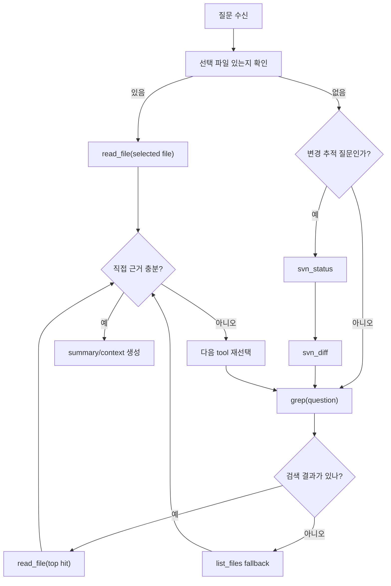
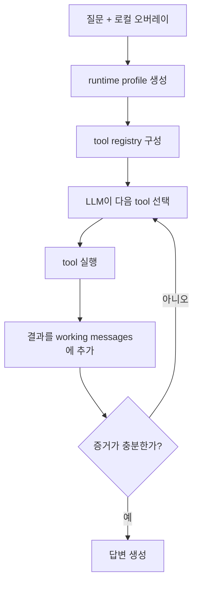
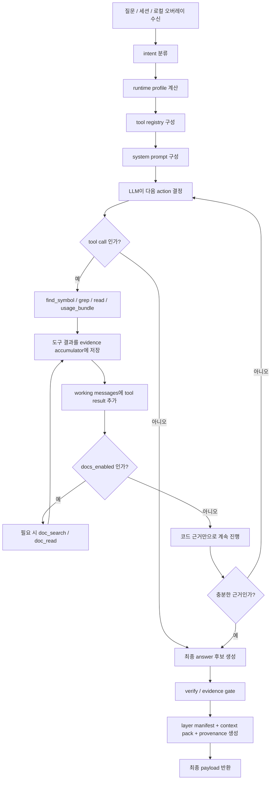

# 데스크톱 레이어드 툴 루프 아키텍처

## 문서 목적

이 문서는 PIXLLM 데스크톱 앱이 사용자의 질문을 받았을 때

1. 어떤 코드와 문서를 참고하는지
2. 로컬 워크스페이스와 서버 지식을 어떤 순서로 다루는지
3. 로컬 툴 루프와 서버 툴 루프가 각각 무슨 역할을 하는지
4. 최종 답변을 어떤 방식으로 합성하는지

를 처음 보는 사람도 이해할 수 있게 설명한다.

이 문서는 현재 구현을 기준으로 작성한다.

## 한 줄 요약

현재 구조는 다음 원칙으로 동작한다.

- 서버에 저장된 엔진 코드와 인덱싱된 서버 지식이 기본 기준이다.
- 로컬 워크스페이스는 최신 작업 상태를 보여주는 보조 오버레이 레이어다.
- 문서/임베딩 검색은 문서성 질문일 때만 활성화된다.
- 질문 하나를 처리할 때 로컬 툴 루프와 서버 툴 루프가 순차적으로 협력한다.

## 핵심 개념

### 1. 서버 코드 베이스라인

서버에 저장된 엔진 코드와 서버가 인덱싱한 코드 검색 결과를 말한다.

- 예: `find_symbol`, `grep`, `read`, `usage_bundle`
- 역할: 기본 구조, 정의 위치, 호출 흐름, 엔진 표준 동작 파악
- 우선순위: 가장 높음

### 2. 로컬 워크스페이스 오버레이

사용자가 현재 열어둔 워크스페이스의 최신 상태를 말한다.

- 예: 현재 수정된 파일, `svn status`, `svn diff`, 선택한 파일 내용
- 역할: 서버 코드 기준 위에 현재 작업 중 변경분을 덧붙임
- 우선순위: 서버 코드 다음

### 3. 서버 문서/임베딩 레이어

문서 인덱스, chunk 검색, 임베딩 기반 검색을 말한다.

- 예: `doc_search`, `doc_read`
- 역할: 개념 설명, 사용법, 문서성 보완
- 우선순위: 가장 낮음
- 활성화 조건: 문서성 질문일 때만

## 왜 학습이 아니라 레이어링을 쓰는가

이 구조는 모델을 다시 학습시키는 방식이 아니라, 질문 시점에 최신 정보를 붙이는 방식이다.

이유는 단순하다.

- 로컬 워크스페이스 코드는 자주 바뀐다.
- 서버 인덱스도 갱신될 수 있다.
- 사용자가 지금 막 수정한 내용은 학습 데이터에 들어 있지 않다.
- 따라서 최신 상태는 검색과 컨텍스트 주입으로 다루는 것이 맞다.

즉:

- 모델 기본 지식 = 일반 상식과 코딩 습관
- 서버 코드 = 현재 시스템의 정답 기준
- 로컬 코드 = 사용자가 지금 작업 중인 최신 변경분
- 문서 = 필요할 때만 추가하는 설명 레이어

## 전체 처리 흐름

## 레이어 우선순위

현재 구현의 기본 우선순위는 아래와 같다.

의미는 다음과 같다.

- 서버 코드가 정답 기준이다.
- 로컬은 현재 작업 중 차이를 보완한다.
- 문서는 설명 보강용이다.

즉 로컬이 있다고 해서 서버 기준을 뒤집는 것이 아니라, 서버 기준 위에 최신 작업 상태를 추가하는 구조다.

## 질문 처리 단계별 상세 설명

## 1. Desktop 입력 단계

데스크톱 앱은 질문을 받으면 먼저 현재 선택된 워크스페이스와 세션을 확인한다.

여기서 중요한 점은 질문을 바로 서버로 보내지 않는다는 것이다.

먼저 로컬에서 필요한 최신 단서를 모으려고 시도한다.

관련 구현 파일:

- `desktop/src/renderer/App.svelte`
- `desktop/src/main/local_agent.cjs`
- `desktop/src/main/workspace.cjs`

## 2. 로컬 툴 루프

로컬 툴 루프는 작은 에이전트 루프다.

LLM 또는 fallback heuristic가 다음 행동을 고른다.

- `list_files`
- `grep`
- `read_file`
- `svn_status`
- `svn_diff`

그리고 선택된 도구가 실제 워크스페이스 파일 시스템에서 실행된다.

핵심 특징:

- 로컬 루프는 서버 엔진 코드의 대체제가 아니다.
- 로컬 루프는 현재 워크스페이스의 최신 상태를 모으는 보조 단계다.
- `svn_status`와 `svn_diff`는 모든 질문에 쓰지 않고, 최근 변경/회귀/수정 영향 질문일 때만 우선된다.

### 로컬 루프에서 실제로 하는 일

### 로컬 툴 루프 상세 상태 전이

### 로컬 루프의 목적

- 현재 선택한 파일을 먼저 읽기
- 최근 수정 영향 보기
- 질문 관련 코드가 현재 워크스페이스에 있는지 확인하기
- 서버 기준 답변에 덧붙일 최신 단서 만들기

## 3. 로컬 오버레이 생성

로컬 툴 루프 결과는 단순 문자열이 아니라 구조화된 attachment로 변환된다.

이 attachment의 이름은 `local_workspace_overlay`다.

포함되는 정보 예시:

- workspace 경로
- 선택된 파일 경로
- 선택된 파일 내용 일부
- `svn status`
- `svn diff`
- 로컬 summary
- 로컬 trace

이 데이터는 서버에 보내는 요청 본문 안에 들어간다.

즉 backend는 "로컬 상태가 있다"는 사실을 명시적으로 알 수 있다.

## 4. Backend 준비 단계

backend는 요청을 받으면 먼저 다음을 수행한다.

- intent 분류
- response type 결정
- runtime routing profile 생성
- execution plan 생성
- run tracker 시작

이 단계에서 backend는 attachment 안에 `local_workspace_overlay`가 있는지 검사한다.

검사 결과는 `workspace_overlay_present`로 기록된다.

이 값은 이후 routing profile과 execution metadata에 들어간다.

## 5. Runtime Routing Profile

runtime profile은 이 질문에서 어떤 검색 전략을 쓸지 결정한다.

현재 핵심 정책:

- 기본 전략: `server_code_first_with_local_overlay`
- 문서 질문일 때만 `docs_enabled = true`
- 오버레이 정책: `server_code_is_authoritative_local_overlay_is_supplemental`

즉 시스템은 질문을 받을 때마다 이렇게 생각한다.

- 기본은 서버 코드에서 시작한다.
- 로컬 오버레이가 있으면 그걸 함께 고려한다.
- 문서성 질문이 아니면 문서 도구는 기본적으로 열지 않는다.

## 6. 서버 ReAct 툴 루프

이 단계가 메인 툴 루프다.

서버는 runtime profile에 따라 tool registry를 구성한다.

### 기본적으로 열리는 코드 도구

- `find_symbol`
- `grep`
- `read`
- `glob`
- `usage_bundle`(usage_guide 계열 질문일 때)

### 문서 질문일 때만 열리는 도구

- `doc_search`
- `doc_read`

즉 일반 코드 질문에서는 docs 도구가 기본 도구 목록이 아니다.

### 서버 툴 루프의 동작

### 서버 ReAct 툴 루프 상세 상태 전이

### 중요한 점

서버 ReAct 루프는 "필요한 코드 부분"을 직접 다 읽지 않는다.

대신 다음 순서로 움직인다.

1. 정의 위치 찾기
2. 패턴 검색
3. 필요한 라인 범위 읽기
4. 부족하면 추가 검색
5. 충분하면 답 생성

즉 어떤 코드를 읽을지 판단하는 것은 루프가 하고, 실제 읽기는 도구가 한다.

## 7. 레이어 병합

최종 답변 직전에는 layer manifest가 생성된다.

이 manifest는 다음을 기록한다.

- authoritative layer
- merge order
- 각 레이어의 evidence 개수
- docs 활성화 여부

현재 기본 merge order:

1. `server_code_baseline`
2. `local_workspace_overlay`
3. `server_docs`

이 단계는 완전한 semantic conflict resolver까지는 아니지만, 적어도 시스템이 어떤 레이어 구조로 답을 만들었는지는 명시적으로 드러난다.

## 8. 최종 payload와 UI 반영

최종 payload에는 다음 정보가 포함된다.

- answer
- sources
- reasoning summary
- reasoning trace
- local overlay summary
- layer manifest

데스크톱 UI에서는 assistant 메시지 아래 `Execution details`를 펼치면 다음을 볼 수 있다.

- backend reasoning summary
- layer merge summary
- local overlay summary
- executed tools
- edited files summary

즉 사용자는 “무슨 도구를 돌렸는지”와 “어떤 레이어를 썼는지”를 동시에 볼 수 있다.

## 로컬 검색과 서버 검색의 차이

많이 헷갈리는 부분이라 따로 정리한다.

### 로컬 검색

현재 desktop가 들고 있는 workspace 디렉터리에서 직접 찾는다.

도구 예:

- `grep`
- `read_file`
- `svn_status`
- `svn_diff`

특징:

- 현재 작업 디렉터리 기준
- 최신 수정 상태 반영
- 서버 인덱스와 무관

### 서버 코드 검색

서버가 이미 인덱싱한 엔진 코드/레포에서 찾는다.

도구 예:

- `find_symbol`
- `grep`
- `read`
- `usage_bundle`

특징:

- 서버가 아는 기준 코드
- 엔진의 표준 구조 탐색에 적합
- 현재 로컬 수정본과 다를 수 있음

### 서버 문서/임베딩 검색

서버 문서 인덱스와 embedding 기반 검색을 사용한다.

도구 예:

- `doc_search`
- `doc_read`

특징:

- 개념 설명
- 사용법
- 공식 문서 스타일 정보

## 이 구조가 Codex/Claude Code와 비슷한 점

- 질문을 받으면 바로 답하지 않고 먼저 도구를 돌린다
- 필요한 코드 부분만 좁혀서 읽는다
- 중간 실행 로그와 결과를 남긴다
- 여러 턴 대화와 세션을 유지한다
- 실행 결과를 바탕으로 다음 행동을 고른다

## 아직 부족한 점

현재 구현은 많이 정리됐지만 아직 완전하지는 않다.

남아 있는 과제:

- 레이어별 결과를 완전히 공통 스키마로 정규화
- local/server/docs 충돌을 자동 판단하는 conflict resolver 강화
- answer 문장 단위 provenance 강화
- local loop와 server loop를 더 강하게 연결하는 unified planning

즉 지금은

- soft hybrid 수준은 넘었고
- explicit layered routing까지는 왔지만
- 완전한 semantic merge engine은 아직 다음 단계다

## 추천 운영 원칙

현재 시스템을 사용할 때 권장 원칙은 다음과 같다.

- 구조/정의/호출 흐름 질문은 서버 코드 baseline을 신뢰한다.
- 현재 수정본/최근 변경 영향은 로컬 오버레이를 참고한다.
- 문서 설명은 docs layer를 조건부로 추가한다.
- 로컬과 서버가 다르면, 차이를 명시적으로 설명한다.

## 체크리스트

이 구조가 제대로 동작하는지 확인할 때는 아래를 본다.

- 질문이 code 질문인데 docs tool이 과하게 열리지 않는가
- 최근 수정 질문이 아닌데 `svn diff`가 먼저 돌지 않는가
- 로컬 오버레이가 request에 구조화되어 전달되는가
- backend run metadata에 `workspace_overlay_present`가 남는가
- UI에서 `Executed tools`와 `Layer merge summary`가 보이는가

## 관련 구현 파일

- Desktop
  - `desktop/src/renderer/App.svelte`
  - `desktop/src/main/local_agent.cjs`
  - `desktop/src/main/server.cjs`
  - `desktop/src/main/workspace.cjs`
  - `desktop/src/main/preload.cjs`
  - `desktop/src/renderer/lib/api.ts`

- Backend
  - `backend/app/services/chat/preparation.py`
  - `backend/app/services/chat/runtime_profile.py`
  - `backend/app/services/chat/planning.py`
  - `backend/app/services/chat/results.py`
  - `backend/app/services/chat/layered_merge.py`
  - `backend/app/services/chat/react/engine.py`
  - `backend/app/services/chat/react/loop.py`
