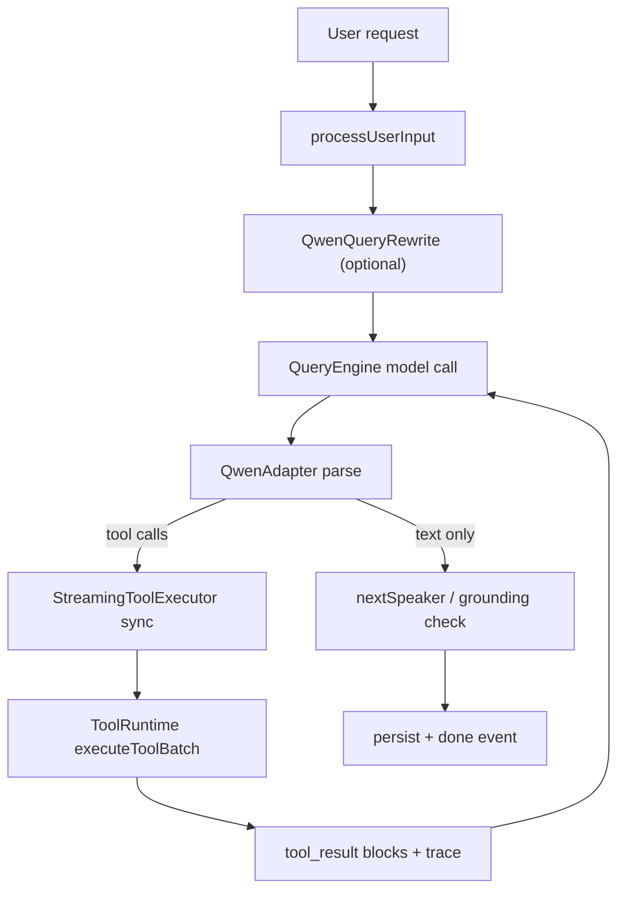

# Desktop Layered Tool Loop Architecture

기준일: 2026-04-06

이 문서는 현재 desktop 로컬 agent loop를 계층별로 설명한다.

## 1. 현재 핵심 개념

현재 중심 구조는 `QueryEngine + QwenAdapter + ToolRuntime + tools/*`다.

- `QueryEngine`이 모델 turn loop를 관리한다.
- `processUserInput`이 pre-loop에서 request context를 만든다.
- `QwenQueryRewrite`가 한국어 또는 mixed prompt를 검색 힌트로 재작성한다.
- `QwenAdapter`가 Qwen textual tool-call 출력과 reasoning 출력을 block transcript로 변환한다.
- `ToolRuntime`이 active tools, permission, grounding, tool batch execution을 관리한다.
- `StreamingToolExecutor`가 스트리밍 중 parse 가능한 tool call의 선실행과 drain/recovery를 담당한다.
- `tools/*`는 실제 file, shell, build, reference, task tool 구현이다.

현재 구조는 `single local tool loop`다. team, remote, MCP, plugin registry는 기본 경로가 아니다.

## 2. 레이어 정의

| 레이어 | 이름 | 현재 역할 |
|---|---|---|
| L0 | Desktop Event Surface | renderer와 main 사이의 요청/이벤트 전달 |
| L1 | Pre-loop Context | intent, directives, explicit path, evidence mode, language profile, initial tool scope 계산 |
| L2 | Rewrite and Prompt Adaptation | Qwen search hint rewrite, system prompt/tool catalog 생성 |
| L3 | Query Loop | model call, parse, retry, compaction, continuation, grounding retry |
| L4 | Streaming Tool Prefetch | tool delta sync, parseable tool call 선실행, claim/drain |
| L5 | Permission and Grounding | deny-by-default gate, read-before-edit, backend-reference 분리 |
| L6 | Tool Execution | workspace, task runtime, backend evidence API 호출 |
| L7 | Transcript and Persistence | trace, transcript, file cache, session state 갱신 |

## 3. 현재 흐름

## 4. pre-loop

`processUserInput`가 현재 계산하는 것:

- intent: analysis, change, execution, compare
- directives: `/reference`, `/workspace`, `/hybrid`, `/exec`, `/change`, `/analysis`, `/config`
- explicit path candidate
- allowed direct paths
- evidence preference: `workspace`, `reference`, `hybrid`
- `languageProfile`
- initial tool names

추가로 한국어 또는 mixed prompt이며 tool-first 성격이면 `QwenQueryRewrite`가 아래 힌트를 만든다.

- `searchHints`
- `symbolHints`
- `rewriteNotes`

이 힌트는 request context에 편입되고 parser recovery와 search tool 유도에 같이 쓰인다.

## 5. tool policy

현재 policy는 deny-by-default다.

주요 규칙:

- 이번 turn에 enable되지 않은 tool은 거절
- unknown path는 바로 `read/edit/write`하지 않음
- edit/write 전에 read가 필요함
- backend reference path는 local file tool이 아니라 `company_reference_search`로 읽어야 함
- shell/build/task mutation은 execution intent 또는 충분한 grounded context가 있어야 함
- 새 tool이 명시 policy 없이 추가되면 `tool_policy_missing`으로 막힘

## 6. tool 범주

현재 registry의 주 범주:

- runtime/meta: `tool_search`
- todo: `todo_read`, `todo_write`
- runtime task read: `terminal_capture`, `task_get`, `task_list`, `task_output`
- workspace discovery: `list_files`, `glob`, `grep`, `project_context_search`, `find_symbol`, `find_callers`, `find_references`
- file/code read: `read_file`, `read_symbol_span`, `symbol_outline`, `symbol_neighborhood`, `lsp`
- mutation: `write`, `edit`, `notebook_edit`
- execution: `run_build`, `bash`, `powershell`, `task_create`, `task_update`, `task_stop`
- backend reference: `company_reference_search`
- config: `config`

`web_search`, `web`, MCP/open-world registry는 현재 기본 경로에 없다.

## 7. Qwen adapter의 현재 역할

현재 구현에서 `QwenAdapter`는 parser가 아니라 tool loop의 일부다.

주요 기능:

- `<tool_call>...</tool_call>` 파싱
- malformed JSON-like payload 복구
- XML-style function payload 복구
- `reasoning_content` / `reasoning` 안의 tool intent 회수
- bash fence 기반 read/search intent 회수
- transcript flattening
  - assistant -> textual `<tool_call>`
  - user/tool result -> textual `<tool_response>`

즉 현재 PIXLLM의 model contract는 `native OpenAI tool-calling transcript`가 아니라 `Qwen textual protocol + tolerant recovery`다.

## 8. streaming executor의 현재 수준

현재 구현은 완전한 claude-code식 same-stream reinjection은 아니다.

- tool call delta가 충분히 parse되면 바로 실행을 시작한다.
- concurrency-safe가 아닌 tool은 turn 종료 후 batch에서 실행한다.
- batch 단계에서 prefetched result를 claim해 재사용한다.
- cancel, parse failure, model error 시 `drainUnclaimed()`로 transcript 정합성을 복구한다.

즉 현재는 `streaming prefetch + claim/recovery` 구조다.

## 9. continuation, grounding, recovery

현재 recovery 장치:

- parse retry
- output token cutoff recovery
- message/tool_result compaction
- compaction 뒤 user query 재주입
- repeated tool batch 제한
- no-progress retry
- `nextSpeakerCheck` 기반 continuation
- ungrounded final answer retry
- interrupted tool result synthetic recovery
- stale-read 방어와 content hash fallback

`nextSpeakerCheck`는 prose-only 응답 뒤에 model이 계속 말해야 하는지 Qwen-compatible way로 판정한다. 이 계층은 heavy evidence contract보다 약하지만, `I'll search...`류 중간 응답이 너무 일찍 종료되는 문제를 줄인다.

## 10. 현재 한계

- same-stream tool_result 재주입 없음
- per-tool module 분리는 진행 중이지만 일부 registry/helper가 `tools.cjs`에 남아 있음
- claude-code 수준의 깊은 pre-loop 전처리까지는 아님
- desktop runtime과 backend ops plane은 분리되어 있음

현재 PIXLLM을 설명할 때는 `Qwen-first single loop를 강화한 grounded tool architecture`라고 표현하는 것이 가장 정확하다.
