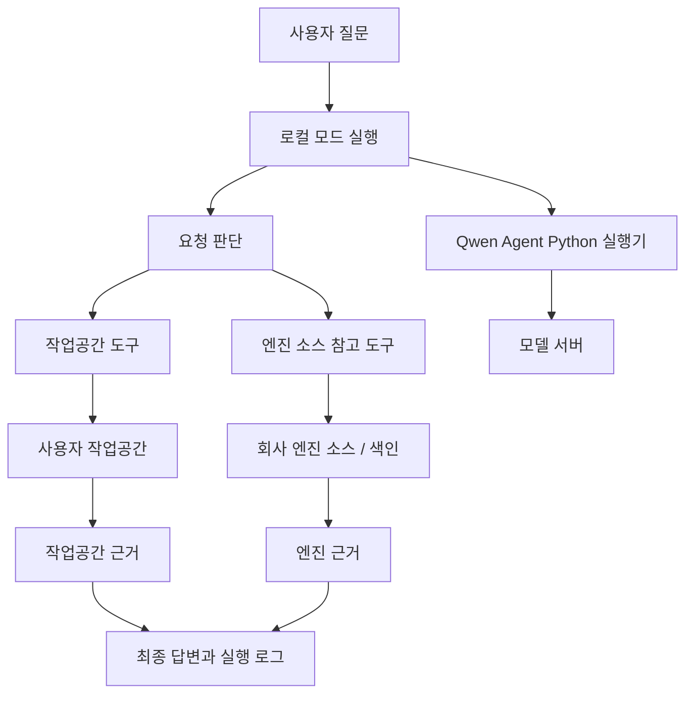

# 구현 계획서

## 1. 최종 구현 목표

PIXLLM의 최종 구현 목표는 사용자가 로컬 작업공간을 선택하고 질문하는 하나의 실행 흐름을 제공하는 것이다.

사용자에게 노출되는 실행 모드는 로컬 모드 하나다. 모델은 사용자의 작업공간을 1차 근거로 삼고, 엔진 코드 설명이나 활용법이 필요할 때만 회사 엔진 소스를 참고한다. 작업공간 분석, 작업공간 수정, 엔진 API 설명, 타입 관계 확인, 사용 예시 확인은 같은 질문 실행 로그 안에서 이어져야 한다.



최종 목표에서 엔진 소스는 별도 질문 모드가 아니라 로컬 모드 안의 참고 근거다. `엔진 관련 질문` 선택값은 실행 경로를 갈라놓기 위한 값이 아니라, 로컬 질문 실행에 엔진 참고 도구를 함께 열지 정하는 값으로 사용한다.

## 2. 코드 기준과 목표 구조

코드 기준 실행은 `local`과 `source`로 나뉘어 있다. 이 구현 계획은 코드 기준 구현물을 재사용하되, 최종 목표를 시스템 전체 흐름 설계의 로컬 모드 단일 실행으로 맞춘다.

| 구분 | 코드 기준 | 최종 목표 |
| --- | --- | --- |
| 사용자 실행 모드 | `local`/`source` 내부 분기 | 로컬 모드 하나 |
| 작업공간 질문 | Qwen Agent Python 실행기와 작업공간 도구 | 동일 |
| 엔진 관련 질문 | 백엔드가 엔진 소스만 보고 별도 답변 | 로컬 실행 안에서 엔진 소스 참고 도구 호출 |
| 작업공간과 엔진 근거 결합 | 실행 로그에는 함께 표시되지만 모델 호출 경로는 분리 | 같은 모델 도구 호출 루프 안에서 결합 |
| 엔진 소스 조회 구현물 | 백엔드 소스 API와 소스 서비스 | 같은 조회 방식을 엔진 참고 도구로 감싸 사용 |

백엔드 소스 API의 색인 형식, 조회 경로, 응답 필드는 유지한다. 바뀌어야 하는 지점은 사용자 질문 실행에서 백엔드 직접 답변을 최종 답변 경로로 쓰는 방식이 아니라, 엔진 소스 조회 결과를 로컬 모델 실행의 도구 관측으로 넣는 방식이다.

## 3. 사용할 구성 요소

| 영역 | 사용할 것 | 구현 방식 |
| --- | --- | --- |
| 화면 | Svelte 화면 | 작업공간, 세션, 질문 입력, 실행 로그, 엔진 참고 상태, 소스 탐색 탭을 표시한다. |
| 데스크톱 실행부 | Electron 메인 프로세스 | 설정 저장, 세션 저장, 요청 판단, 도구 범위 구성, 결과 조립을 담당한다. |
| 화면 호출 | 프로세스 간 통신 | 화면에서 설정/세션/요청 실행/소스 조회 기능을 호출한다. |
| 요청 판단 | 요청 전처리 | 작업공간 유무, 선택 파일, `엔진 관련 질문` 값으로 열 도구 범위를 정한다. |
| 모델 연결 | Qwen Agent Python 실행기 | OpenAI 호환 모델 서버를 호출하고 도구 호출 루프를 주도한다. |
| 작업공간 도구 | Node.js 도구 실행 계층 | 파일 목록, 패턴 찾기, 텍스트 검색, 심볼 조회, 파일 읽기, 파일 수정을 제공한다. |
| 엔진 참고 도구 | 소스 API 조회 래퍼 | 엔진 개요, 검색, 읽기, 타입 관계, 사용처 조회를 로컬 도구처럼 제공한다. |
| 엔진 색인 | 백엔드 Python 소스 서비스 | 엔진 원본 소스에서 메서드 색인, 소스 명세, 타입 관계, 사용처 후보를 만든다. |
| 로컬 도구 연결 | `POST /tool-call` HTTP 연결 | Python 실행기의 도구 호출을 데스크톱 도구 실행 계층으로 전달한다. |
| 저장 | 사용자 데이터 폴더의 JSON 파일 | 설정, 세션, 실행 상태, 수정 차이를 저장한다. |

## 4. 설정과 실행 자료

데스크톱 설정은 코드 기준으로 아래 값을 저장한다.

```json
{
  "serverBaseUrl": "http://192.168.2.238:8000/api",
  "llmBaseUrl": "http://192.168.2.212:8000/v1",
  "workspacePath": "사용자 작업공간 경로",
  "engineQuestionDefault": true,
  "recentWorkspaces": []
}
```

모델 이름은 별도로 저장하지 않는다. LLM 서버에 모델이 하나만 떠 있으면
요청의 `model` 필드를 비워도 그 모델로 응답하므로, 모델명을 설정에서
관리할 필요가 없다.

엔진 소스 루트와 색인 런타임 경로는 데스크톱 설정이 아니라 백엔드 환경값으로 관리한다.

| 백엔드 값 | 기본 역할 |
| --- | --- |
| `RAW_SOURCE_ROOT` | 엔진 원본 소스 루트 |
| `SOURCE_RUNTIME_DIR` | 색인과 명세 JSON 저장 경로 |
| `LLM_BASE_URL` | 백엔드 직접 답변 경로에서 쓰는 기본 모델 서버 |
| `API_PREFIX` | 백엔드 API 접두사, 기본 `/api/v1` |

화면이 질문 실행을 시작할 때 넘기는 값은 아래 형태다.

```json
{
  "workspacePath": "사용자 작업공간 경로",
  "prompt": "사용자 질문",
  "model": "Qwen/Qwen3.6-27B",
  "baseUrl": "모델 서버 주소 또는 호출 기준 주소",
  "serverBaseUrl": "http://192.168.2.238:8000/api",
  "llmBaseUrl": "http://192.168.2.212:8000/v1",
  "engineQuestionOverride": true,
  "selectedFilePath": "선택 파일",
  "sessionId": "세션 식별자",
  "historyMessages": []
}
```

코드 기준 요청 문맥은 아래처럼 `mode`와 `initialToolNames`를 가진다.

```json
{
  "prompt": "사용자 질문",
  "workspacePath": "사용자 작업공간 경로",
  "selectedFilePath": "선택 파일",
  "explicitPaths": ["질문에서 추출한 작업공간 상대 경로"],
  "engineQuestionOverride": false,
  "mode": "local",
  "initialToolNames": ["list_files", "glob", "grep", "find_symbol", "find_callers", "find_references", "lsp", "read_symbol_span", "symbol_outline", "symbol_neighborhood", "read_file", "edit"]
}
```

최종 목표의 요청 문맥은 사용자 실행 모드를 `local`로 고정하고, 엔진 참고 여부를 도구 범위로 표현한다.

```json
{
  "executionMode": "local",
  "workspacePath": "사용자 작업공간 경로",
  "selectedFilePath": "선택 파일",
  "explicitPaths": ["질문에서 추출한 작업공간 상대 경로"],
  "engineReference": {
    "enabled": true,
    "reason": "엔진 API 의미와 사용 예시 확인 필요"
  },
  "initialToolNames": [
    "list_files",
    "glob",
    "grep",
    "find_symbol",
    "find_callers",
    "find_references",
    "lsp",
    "read_symbol_span",
    "symbol_outline",
    "symbol_neighborhood",
    "read_file",
    "edit",
    "source_overview",
    "source_search",
    "source_read",
    "source_type_graph",
    "source_usages"
  ]
}
```

## 5. 요청 판단 설계

요청 판단은 사용자의 작업공간을 기준으로 시작한다.

| 판단 항목 | 처리 |
| --- | --- |
| 작업공간 경로 | 로컬 실행의 기준 경로로 사용한다. |
| 선택 파일 | 작업공간 안의 상대 경로로 바꿔 모델 문맥에 넣는다. |
| 질문 속 경로 | 작업공간 밖으로 나가는 경로와 URL은 제외한다. |
| `엔진 관련 질문` 체크 | 엔진 참고 도구를 열지 정한다. |
| 엔진 관련 표현 | API 의미, 사용법, 타입 관계, 사용 예시가 필요하면 엔진 참고 대상으로 본다. |

최종 목표에서 요청 판단의 결과는 “다른 실행 모드”가 아니라 “열 도구 목록”이다.

| 질문 성격 | 열 도구 |
| --- | --- |
| 작업공간 구조 설명 | 작업공간 검색/읽기 도구 |
| 작업공간 파일 수정 | 작업공간 읽기/수정 도구 |
| 엔진 API 사용법 질문 | 작업공간 도구 + 엔진 검색/읽기 도구 |
| 선택 코드가 엔진 API를 쓰는 흐름 질문 | 작업공간 검색/읽기 + 엔진 사용처/선언 조회 |
| 엔진 타입 관계 설명 | 엔진 타입 관계/소스 읽기 도구 |

## 6. 로컬 실행 설계

로컬 실행은 데스크톱 내부에서 Qwen Agent Python 실행기를 띄우고, 실행기에서 발생한 도구 호출을 데스크톱 HTTP 연결부가 받아 처리한다.

| 단계 | 처리 |
| --- | --- |
| 요청 준비 | 작업공간 경로, 선택 파일, 명시 경로, 대화 기록, 엔진 참고 여부를 문맥으로 만든다. |
| 도구 목록 구성 | 작업공간 도구와 필요한 엔진 참고 도구 이름/설명을 모델 실행기에 넘긴다. |
| 실행기 시작 | Python 실행기에 모델 서버, 모델명, 시스템 지시, 메시지, 도구 설명을 JSON으로 전달한다. |
| 도구 호출 수신 | 실행기가 `POST /tool-call`로 `{name, arguments, raw_params}`를 보낸다. |
| 작업공간 도구 실행 | 데스크톱 도구 실행 계층이 사용자 작업공간 파일/심볼/수정 도구를 실행한다. |
| 엔진 참고 도구 실행 | 데스크톱 도구 실행 계층이 백엔드 소스 API 조회 결과를 모델 재입력용 요약으로 바꾼다. |
| 결과 반환 | `{ok, content}` 형태로 Python 실행기에 돌려준다. |
| 화면 알림 | 상태, 모델 메시지, 도구 호출, 도구 결과, 완료/오류를 실행 로그에 남긴다. |

로컬 도구가 파일을 읽을 때 줄 범위 필드는 `lineRange`를 사용한다. 파일 수정 도구는 `occurrences`, `replace_all`, `added`, `removed`, `diff`, `diff_truncated`를 결과에 포함한다.

## 7. 엔진 참고 도구 설계

엔진 참고 도구는 백엔드 소스 API와 소스 서비스의 조회 방식을 로컬 도구 형태로 감싼다. 모델이 보는 것은 도구 이름과 관측 요약이며, 원본 조회 구현은 백엔드 소스 서비스가 담당한다.

| 도구 | 입력 | 역할 |
| --- | --- | --- |
| `source_overview` | 없음 | 엔진 소스 루트, 파일 수, 메서드 수, 모듈 요약 확인 |
| `source_search` | `query`, `limit` | 선언 후보, 파일 후보, 추천 읽기 대상 찾기 |
| `source_read` | `path`, `start_line`, `end_line` | `Source/...` 파일 범위 또는 색인 선언 읽기 |
| `source_type_graph` | `query`, `limit` | 타입, 멤버, 입출력 관계 조회 |
| `source_usages` | `query`, `limit` | 실제 사용 위치와 주변 줄 조회 |

백엔드 소스 API의 응답은 `{"ok": true, "data": ..., "error": null}` 봉투를 사용한다. 소스 파일 읽기 결과의 줄 범위 필드는 `line_range`다.

엔진 참고 도구의 모델 재입력 요약은 아래 우선순위를 따른다.

| 근거 | 요약 방식 |
| --- | --- |
| API 선언 | 심볼, C# 호출 시그니처, 반환 타입, 매개변수 타입 |
| 사용 예시 | 파일 경로, 줄 범위, 주변 소스 |
| 타입 관계 | 관련 타입, 멤버, 연결 이유 |
| 추천 읽기 대상 | `source_read`로 이어질 경로와 줄 범위 |

## 8. 화면 설계 기준

| 화면 요소 | 동작 |
| --- | --- |
| 작업공간 선택 | 로컬 실행 대상 경로를 고른다. |
| `엔진 관련 질문` 선택 | 로컬 실행 안에서 엔진 참고 도구를 함께 열지 정한다. |
| 연결 설정 | 백엔드 API 주소, 모델 서버 주소, 모델명을 저장한다. |
| 실행 로그 | 작업공간 도구 결과와 엔진 참고 도구 결과를 같은 대화 실행 기록에 표시한다. |
| 소스 탐색 탭 | 백엔드 소스 개요, 검색, 읽기를 화면에서 확인한다. |

화면에는 엔진 소스 경로 입력이나 색인 다시 만들기 버튼이 없다. 엔진 소스 경로와 색인 위치는 백엔드 환경값과 백엔드 소스 API에서 관리한다.

## 9. 문서 AI/RAG와의 관계

초기 문서의 문서 AI/RAG는 문서 파싱, 청킹, 벡터 검색, 그래프 확장을 통해 문서 조각을 답변 근거로 쓰는 구조였다.

이 설계의 실행 경로는 문서 조각 검색을 사용하지 않는다. 답변 근거는 사용자의 작업공간 코드와 회사 엔진 원본 소스다. 초기 문서의 “근거를 찾아 모델에 넣는다”는 방향은 유지하되, 근거 대상과 조회 방식은 코드 도구 호출로 바뀐다.

| 초기 문서 내용 | 이 설계에서의 수정 |
| --- | --- |
| 문서 AI와 RAG를 주요 제품 경로로 포함 | 작업공간 코드와 엔진 소스 근거 조회로 정리 |
| 문서 벡터 검색과 그래프 확장 단계 포함 | 소스 파일, 심볼, 타입 관계, 사용처 조회로 정리 |
| 웹 화면과 API 중심 실행 | Electron 데스크톱 화면과 백엔드 소스 API 조합으로 정리 |
| 여러 데이터 수집/적재 경로 포함 | 데스크톱 작업공간 도구와 백엔드 소스 색인으로 범위 축소 |
| 에이전트 상태와 검색 결과를 별도 관리 | 실행 로그와 세션 기록으로 합쳐 표시 |
