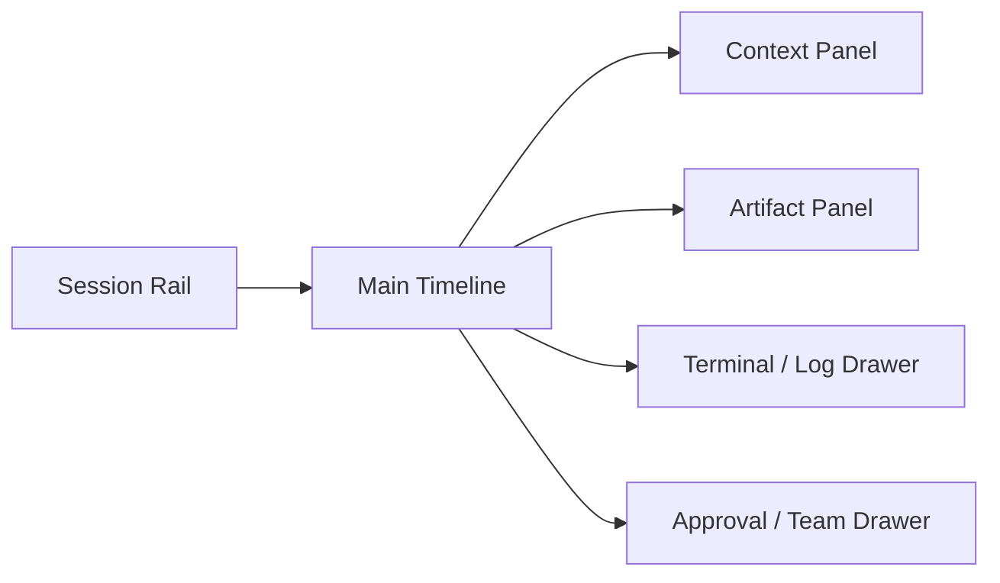

# 데스크톱 UI 상세 설계

> 목적: PIXLLM 데스크톱을 채팅창이 아니라 실행 콘솔로 설계

## 1. UI 목표

- 답변뿐 아니라 실행 과정을 보여줍니다.
- 세션, 태스크, 승인, 아티팩트를 같은 표면에서 다룹니다.
- 사용자가 "왜 이 답이 나왔는지"와 "무슨 작업이 수행됐는지"를 동시에 볼 수 있어야 합니다.

## 2. 기본 레이아웃

## 3. 화면 영역

### Session Rail

- 세션 목록
- 워크스페이스 선택
- 실행 중 task 수
- 최근 remote session 상태

### Main Timeline

- 사용자 메시지
- assistant 응답
- tool start/result 이벤트
- task 진행률
- approval 요청과 처리 결과
- verification 요약

### Context Panel

- 현재 파일과 심볼
- evidence bundle
- 소스 참조
- 모델/실행 모드

### Artifact Panel

- diff viewer
- build/test 결과
- 계획서
- 리뷰 findings
- 명령 결과 로그

### Approval and Team Drawer

- 승인 큐
- 병렬 worker 상태
- 파일 ownership
- remote bridge 상태

## 4. 상호작용 규칙

- 위험 작업은 타임라인 안에서도 보이고 approval drawer에도 남깁니다.
- 최종 답변은 항상 관련 artifact 링크와 함께 보입니다.
- task가 살아 있는 동안에는 단일 채팅 메시지로 축약하지 않습니다.
- 실패한 검증은 빨간 배너가 아니라 재실행 가능한 task 상태로 다룹니다.

## 5. 주요 컴포넌트

- `PromptComposer`
- `TimelineStream`
- `ToolEventRow`
- `TaskCard`
- `ArtifactTabs`
- `ApprovalInbox`
- `TeamMonitor`
- `BridgeStatus`

## 6. 상태 모델

UI가 직접 다뤄야 하는 상태는 아래입니다.

- `active_session`
- `active_turn`
- `tasks_by_session`
- `artifacts_by_task`
- `pending_approvals`
- `team_members`
- `bridge_connections`

## 7. 제품 원칙

- 채팅 UX는 유지하되, 채팅만 남기는 구조로 축소하지 않습니다.
- 숨겨진 백그라운드 작업보다 드러나는 실행 로그를 선호합니다.
- 사용자가 승인, 취소, 재시도, 재개를 직접 제어할 수 있어야 합니다.
