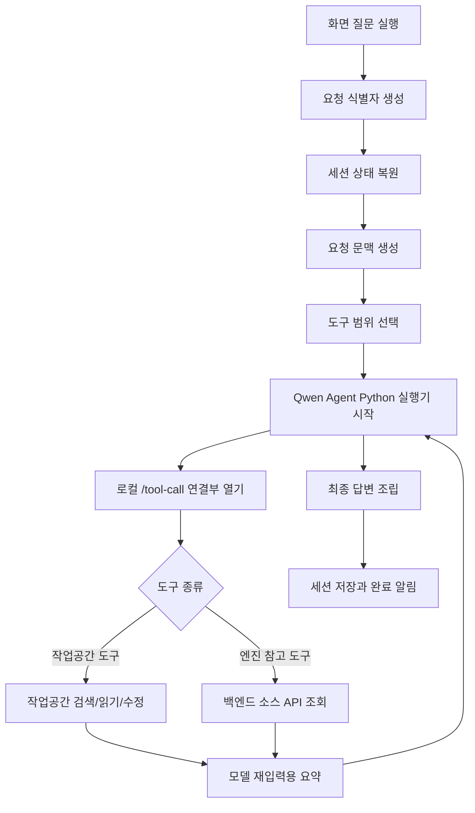
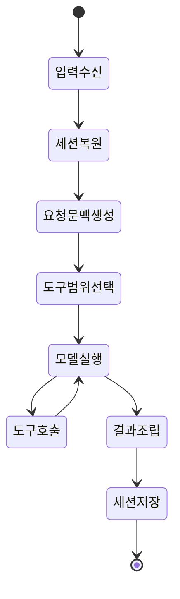

# 데스크톱 실행 흐름 설계

## 1. 목적

이 문서는 데스크톱 앱 안에서 한 번의 질문이 어떻게 실행되는지 설명한다.

최종 목표의 실행 흐름은 로컬 모드 하나다. 데스크톱 실행부는 작업공간을 기준으로 Qwen Agent Python 실행기를 실행하고, 요청 판단 결과에 따라 작업공간 도구와 엔진 소스 참고 도구를 함께 제공한다.

코드 기준으로는 `local` 실행과 백엔드 `source` 답변 실행이 분리되어 있다. 최종 목표에서는 백엔드 소스 API를 엔진 참고 도구의 조회 수단으로 사용한다.

## 2. 실행 계층

| 계층 | 책임 |
| --- | --- |
| 화면 계층 | 사용자 입력, 작업공간 선택, 설정 변경, 실행 로그 표시 |
| 요청 실행 서비스 | 요청 식별자 생성, 취소 제어, 실행 로그 알림 전달 |
| 요청 실행 엔진 | 세션 상태 복원, 요청 문맥 구성, 도구 범위 선택, 결과 조립 |
| 요청 판단기 | 작업공간 경로, 선택 파일, 엔진 참고 선택값으로 열 도구 목록 결정 |
| Qwen Agent Python 실행기 | 모델 호출과 도구 호출 루프 실행 |
| 도구 실행 계층 | 작업공간 도구와 엔진 참고 도구 실행 |
| 백엔드 소스 API | 엔진 원본 소스와 색인을 조회 |
| 세션 저장 계층 | 대화 메시지, 실행 로그, 설정, 최근 작업공간 저장 |

## 3. 실행 경로

| 구분 | 실행 주체 | 기준 데이터 | 도구 위치 |
| --- | --- | --- | --- |
| 로컬 질문 실행 | Qwen Agent Python 실행기 | 선택된 작업공간 | 데스크톱 도구 실행 계층 |
| 작업공간 도구 | 데스크톱 Node.js 도구 | 사용자 작업공간 | 로컬 파일 접근 |
| 엔진 참고 도구 | 데스크톱 도구 실행 계층 | 백엔드 엔진 소스와 색인 | 백엔드 소스 API |

사용자가 보는 질문 실행은 하나다. 엔진 참고가 켜진 질문에서도 최종 답변은 Qwen Agent Python 실행기가 작업공간 근거와 엔진 근거를 함께 보고 생성한다.

## 4. 전체 실행 흐름



## 5. 로컬 질문 실행 흐름

| 순서 | 동작 |
| --- | --- |
| 1 | 화면이 질문, 작업공간, 선택 파일, 세션 식별자, 모델 설정, 엔진 참고 선택값을 전달한다. |
| 2 | 요청 실행 엔진이 세션 상태를 JSON에서 복원하고 사용자 메시지를 추가한다. |
| 3 | 요청 판단기가 작업공간 도구와 엔진 참고 도구의 제공 범위를 정한다. |
| 4 | 데스크톱 실행부가 `127.0.0.1` 로컬 HTTP JSON 도구 연결부를 연다. |
| 5 | 데스크톱 실행부가 Qwen Agent Python 실행기에 요청 JSON을 표준 입력으로 전달한다. |
| 6 | Qwen Agent Python 실행기가 모델 서버를 호출한다. |
| 7 | 모델이 도구를 요청하면 Qwen Agent Python 실행기가 `/tool-call`로 도구 이름과 인자를 보낸다. |
| 8 | 데스크톱 도구 실행 계층이 작업공간 도구 또는 엔진 참고 도구를 실행한다. |
| 9 | 도구 관측 결과를 모델 재입력용 문자열로 줄여 Qwen Agent Python 실행기에 반환한다. |
| 10 | Qwen Agent Python 실행기가 관측 결과를 모델에 다시 넣고 최종 답변을 만든다. |
| 11 | 요청 실행 엔진이 답변, 실행 추적, 대화 실행 기록, 사용량을 세션에 저장한다. |

도구 연결부 요청:

```json
{
  "name": "grep",
  "arguments": {
    "query": "NXImageView",
    "limit": 20
  },
  "raw_params": ""
}
```

도구 연결부 응답:

```json
{
  "ok": true,
  "content": "tool: grep\nquery: NXImageView\nmatches:\n- src/main.cpp:10 ..."
}
```

## 6. 엔진 참고 도구 실행

엔진 참고 도구는 모델이 직접 백엔드에 접근하지 않게 한다. 모델은 `source_search`, `source_read`, `source_type_graph`, `source_usages` 같은 도구를 호출하고, 데스크톱 도구 실행 계층이 백엔드 소스 API를 호출해 관측 요약을 만든다.

| 도구 | 백엔드 조회 | 결과 |
| --- | --- | --- |
| `source_overview` | `/v1/source/context` | 엔진 루트, 파일 수, 메서드 수, 모듈 요약 |
| `source_search` | `/v1/source/search` | 선언 후보, 파일 후보, 추천 읽기 대상 |
| `source_read` | `/v1/source/read` | 소스 범위 또는 색인 선언 |
| `source_type_graph` | `/v1/source/type-graph` | 타입, 멤버, 입출력 관계 |
| `source_usages` | `/v1/source/usages` | 실제 사용 위치와 주변 줄 |

코드 기준의 `/v1/source/answer`는 백엔드가 엔진 질문에 직접 답하는 경로다. 최종 목표에서는 이 경로를 사용자 질문의 최종 답변 경로로 쓰지 않고, 위 조회 도구를 로컬 질문 실행 안에서 사용한다.

## 7. 요청 생명주기



| 단계 | 설명 |
| --- | --- |
| 입력 수신 | 화면에서 질문, 선택 파일, 설정, 엔진 참고 선택값을 전달한다. |
| 세션 복원 | 이전 대화와 실행 상태를 요청 문맥으로 정리한다. |
| 요청 문맥 생성 | `prompt`, 작업공간, 선택 파일, 엔진 참고 여부를 만든다. |
| 도구 범위 선택 | 작업공간 도구와 엔진 참고 도구 목록을 정한다. |
| 모델 실행 | Qwen Agent Python 실행기가 모델 서버와 도구 호출 루프를 처리한다. |
| 도구 호출 | 데스크톱 도구 실행 계층이 작업공간 또는 엔진 소스 조회를 수행한다. |
| 결과 조립 | 답변, 실행 추적, 사용량, 종료 사유를 묶는다. |
| 세션 저장 | 화면에 보인 결과를 사용자 데이터 폴더에 저장한다. |

## 8. 실행 로그 전달 구조

질문 실행은 오래 걸릴 수 있으므로, 데스크톱 실행부는 중간 상태를 화면에 바로 보낸다.

| 화면에 보일 내용 | 내부 전달 값 |
| --- | --- |
| 요청 시작 | `request_start`: 세션, 작업공간, 선택 파일 |
| 세션 복원 | `session_restored`: 복원된 세션 |
| 실행 상태 | `status`: 모델 실행, 도구 실행, 결과 조립 |
| 모델 중간 출력 | `model`, `token`: 생성 중인 답변 조각 |
| 도구 묶음 시작 | `tool_batch_start`: 도구 호출 묶음 시작 |
| 도구 호출 | `tool_use`: 도구 이름과 입력 |
| 도구 결과 | `tool_result`: 관측 결과와 요약 |
| 도구 묶음 종료 | `tool_batch_end`: 도구 호출 묶음 종료 |
| 단계 변화 | `transition`: 실행 엔진 내부 단계 |
| 최종 답변 | `done`: 답변, 실행 추적, 대화 실행 기록 |
| 종료 상태 | `terminal`, `error`, `cancelled`: 완료, 오류, 취소 |

세션 저장은 실행 추적 `trace`와 대화 실행 기록 `transcript`를 남긴다.

## 9. 결과 조립

| 결과 | 설명 |
| --- | --- |
| 최종 답변 | 대화 영역에 표시할 모델 답변 |
| 실행 추적 | 도구 이름, 입력, 관측 결과 |
| 대화 실행 기록 | 사용자 요청, 모델 요청, 도구 결과, 실행 단계 |
| 사용량 | 모델 호출과 도구 호출 사용량 |
| 수정 차이 | 파일이 바뀐 경우의 줄 단위 차이 |
| 종료 사유 | 완료, 취소, 오류 중 하나 |

## 10. 실패 유형

| 유형 | 화면에 보여줄 핵심 |
| --- | --- |
| 모델 서버 주소 오류 | 모델 호출 대상이 올바르지 않음 |
| 백엔드 API 주소 오류 | 엔진 소스 조회 또는 상태 확인 호출 실패 |
| Qwen Agent Python 실행기 오류 | Python 또는 Qwen Agent 실행 준비 실패 |
| 엔진 소스 조회 오류 | 엔진 소스 검색, 읽기, 관계 조회 실패 |
| 도구 실행 오류 | 검색, 읽기, 수정 중 하나가 실패 |
| 빈 답변 | 실행은 끝났지만 표시할 답변이 없음 |

## 11. 초기 문서에서 바뀐 점

초기 `에이전트 상세 설계`는 라우터 에이전트, 문서 에이전트, 코드 에이전트, 작업 계획자를 나눈 구조였다.

이 문서는 데스크톱 요청 실행 엔진, Qwen Agent Python 실행기, 작업공간 도구, 엔진 참고 도구의 실행 흐름으로 수정했다.

| 초기 문서 내용 | 이 문서에서의 수정 |
| --- | --- |
| 여러 에이전트가 역할별로 분기 | 로컬 질문 실행 안에서 도구 범위 선택 |
| 문서/코드 에이전트 분리 | 작업공간 도구와 엔진 참고 도구로 정리 |
| 실행 그래프와 체크포인트 중심 | 세션 복원, 실행 로그 전달, 세션 기록 중심 |
| 별도 문서 검색 경로 존재 | 문서 검색 대신 작업공간 도구와 엔진 소스 조회 사용 |
