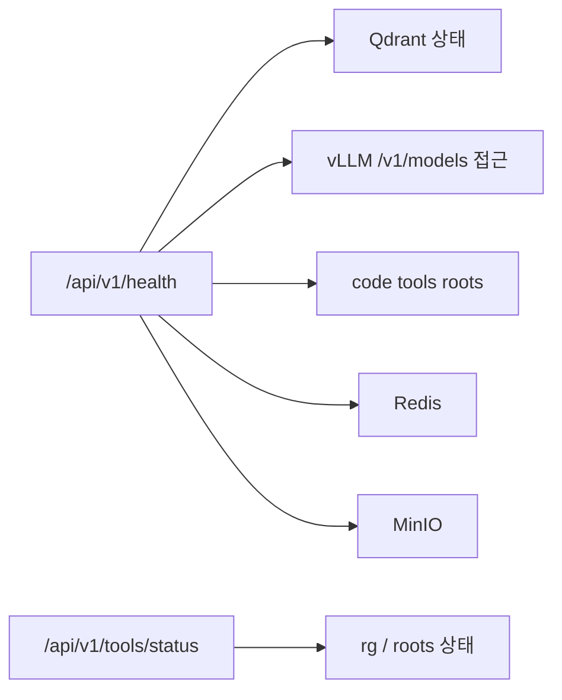

# 모니터링 상세 설계

> 목적: 현재 코드에서 실제로 가능한 상태 점검과 앞으로 필요한 관측성 작업을 구분해서 정리

## 1. 현재 구현된 상태 점검

현재 코드 기준으로 실제 구현된 모니터링/상태 점검은 비교적 단순합니다.

### 1.0 현재 상태 확인 구조

### 1.1 Health API

- 엔드포인트: `GET /api/v1/health`

현재 확인하는 항목:

- Qdrant
- LLM(vLLM `/v1/models` 접근 여부)
- code tools (`rg` 사용 가능 여부, roots 존재 여부)
- Redis
- MinIO
- `embedding_model`

즉 현재는 "관측성 플랫폼"보다 "앱이 지금 살아 있는가"를 보는 health endpoint가 중심입니다.

### 1.2 Tools Status API

- 엔드포인트: `GET /api/v1/tools/status`

현재 확인하는 항목:

- code tools enabled 여부
- `rg` 사용 가능 여부
- configured roots
- available roots
- missing roots

이건 RAG 품질과 연결되는 코드 검색 환경 상태를 확인하는 데 유용합니다.

### 1.3 Docker healthcheck

현재 compose에서 개별 서비스 healthcheck가 있습니다.

- Qdrant
- Redis
- MinIO

즉, 앱 외부에서 컨테이너 단위 상태 확인도 가능합니다.

## 2. 현재 로그 기반 추적

현재 코드에서는 별도 Prometheus metrics 노출보다 로그 기반 추적이 더 중요합니다.

대표적으로:

- `trace_id`
- phase log
- tool 호출 단계
- source guard redaction 경고

즉 현재 운영에서 문제를 볼 때는
"대시보드"보다 "API 로그 + ReAct phase 로그 + health 응답"이 더 직접적인 도구입니다.

## 3. 현재 운영에서 보는 것이 좋은 것

실무 기준으로 현재 가장 유용한 확인 포인트:

- `/api/v1/health`
- `/api/v1/tools/status`
- `docker ps`
- 컨테이너 로그
- vLLM `/v1/models` 응답
- 긴 질의 시 `status` / `sources` / `done` 이벤트 흐름

## 4. 앞으로 필요한 일

현재 코드 기준으로 추가 가치가 큰 항목:

- Health 응답 확장
- 대화/검색/응답 시간 지표 분리
- tool call 횟수 및 단계별 시간 기록
- import job 상태 대시보드
- GPU/LLM 상태 대시보드

즉 현재 모니터링은
"기본 헬스 체크 + 로그 추적" 수준이고, 본격적인 메트릭 기반 관측성은 앞으로 확장해야 할 영역입니다.
