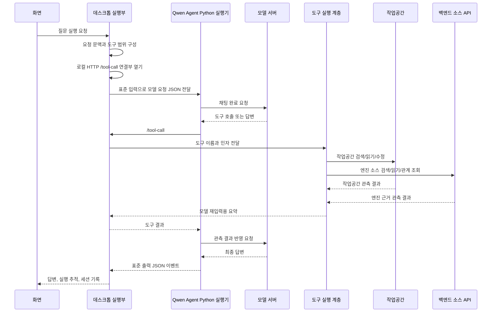

# 모델 연동 설계

## 1. 모델 호출 목표

최종 목표의 모델 호출 경로는 로컬 질문 실행 하나다. 데스크톱 실행부는 Qwen Agent Python 실행기를 실행하고, Qwen Agent Python 실행기는 모델 서버를 호출하면서 필요한 도구를 요청한다.

작업공간 도구와 엔진 소스 참고 도구는 같은 모델 도구 호출 루프 안에서 사용한다. 모델은 작업공간을 1차 근거로 보고, 엔진 API 의미나 사용 예시가 필요할 때 엔진 참고 도구를 추가로 호출한다.

코드 기준으로는 백엔드가 `/v1/source/answer`에서 엔진 질문에 직접 답하는 경로도 있다. 이 경로는 엔진 소스 조회 구현을 재사용하기 위한 기준이며, 최종 목표에서는 사용자 질문의 별도 모델 호출 경로로 두지 않는다.

## 2. 전체 호출 흐름



Qwen Agent Python 실행기는 도구를 직접 실행하지 않는다. 도구 호출을 로컬 HTTP로 데스크톱 실행부에 넘기고, 데스크톱 실행부가 도구 실행 계층에서 실제 기능을 실행한다.

## 3. 도구 범위 구성

모델에 제공하는 도구는 요청 판단 결과로 정한다.

| 범위 | 제공 도구 |
| --- | --- |
| 작업공간 기본 도구 | `list_files`, `glob`, `grep`, `find_symbol`, `find_callers`, `find_references`, `lsp`, `read_symbol_span`, `symbol_outline`, `symbol_neighborhood`, `read_file`, `edit` |
| 엔진 핵심 참고 도구 | `source_search`, `source_read`, `source_type_graph`, `source_usages` |
| 엔진 넓은 조회 도구 | `source_overview`, `source_ls`, `source_glob` |

작업공간 구조 설명이나 파일 수정처럼 엔진 근거가 필요하지 않은 질문은 작업공간 도구만 제공한다. 엔진 API 의미, 사용 예시, 타입 관계를 묻는 질문은 엔진 참고 도구를 함께 제공한다.

## 4. Qwen Agent Python 실행기 요청

데스크톱 실행부는 Qwen Agent Python 실행기에 JSON 요청을 표준 입력으로 전달한다.

```json
{
  "llm": {
    "model": "Qwen/Qwen3.6-27B",
    "model_server": "http://192.168.2.212:8000/v1",
    "api_key": "EMPTY",
    "max_tokens": 4096,
    "temperature": 0.2,
    "top_k": 20,
    "enable_thinking": true
  },
  "system": "시스템 지시",
  "messages": [],
  "tools": [],
  "tool_bridge_url": "http://127.0.0.1:포트",
  "max_llm_calls": 16
}
```

| 값 | 설명 |
| --- | --- |
| `llm.model` | 모델 이름. 데스크톱은 이 값을 항상 빈 문자열로 보낸다 — LLM 서버에 모델이 하나만 떠 있으면 비워도 그 모델로 응답하기 때문에 사용자가 따로 지정할 필요가 없다. |
| `llm.model_server` | OpenAI 호환 모델 서버 주소. `/v1`이 없으면 실행기가 붙인다. |
| `llm.api_key` | 기본값은 `EMPTY` |
| `llm.max_tokens` | 답변 생성 한도 |
| `llm.temperature` | 로컬 질문 실행은 `0.2` |
| `llm.top_k` | `20` |
| `llm.enable_thinking` | 생각 모드 전달값 |
| `system` | 작업공간과 엔진 참고 역할을 설명하는 시스템 지시 |
| `messages` | 세션에서 압축한 사용자/답변 문맥 |
| `tools` | 요청 판단 결과로 선택된 도구 정의 |
| `tool_bridge_url` | 로컬 도구 연결부 주소 |
| `max_llm_calls` | 도구 반복을 포함한 호출 한도. 실행기에서 최대 20으로 제한한다. |

## 5. Qwen Agent Python 실행기 이벤트

Qwen Agent Python 실행기는 JSON 이벤트를 표준 출력으로 내보낸다.

| 이벤트 | 설명 |
| --- | --- |
| `start` | 모델 실행 시작, 도구 수와 생각 모드 표시 |
| `assistant` | 모델 중간 출력 누적 값 |
| `done` | 최종 답변과 실행기 메시지 요약 |
| `error` | 모델 호출 또는 도구 연결 실패 |

## 6. 도구 호출 구현

모델이 도구를 선택하면 Qwen Agent Python 실행기가 로컬 도구 연결부로 JSON을 보낸다.

```json
{
  "name": "source_search",
  "arguments": {
    "query": "CreateImage",
    "limit": 8
  },
  "raw_params": ""
}
```

데스크톱 실행부는 도구 실행 결과를 모델 재입력용 문자열로 줄여 반환한다.

| 도구 종류 | 모델 재입력 요약 |
| --- | --- |
| 파일 목록 | 경로 목록 |
| 검색 | 경로, 줄 번호, 일치 줄 |
| 파일 읽기 | 필요한 범위의 내용 |
| 심볼 읽기 | 심볼명, 경로, 줄 범위, 본문 |
| 수정 | 추가/삭제 줄 수, 차이 요약 |
| 엔진 검색 | 선언 후보, 파일 후보, 추천 읽기 대상 |
| 엔진 읽기 | 선언 또는 주변 소스 범위 |
| 엔진 관계 | 타입, 멤버, 입출력 관계 |
| 엔진 사용처 | 실제 호출 위치와 주변 줄 |

## 7. 엔진 소스 조회와 모델 재입력

엔진 참고 도구는 백엔드 소스 API를 호출하지만, 백엔드가 최종 답변을 만들지는 않는다. 백엔드는 엔진 소스 조회 결과를 반환하고, 데스크톱 도구 실행 계층이 이를 모델 재입력용 관측 요약으로 바꾼다.

| 엔진 참고 도구 | 백엔드 조회 |
| --- | --- |
| `source_overview` | `/v1/source/context` |
| `source_search` | `/v1/source/search` |
| `source_read` | `/v1/source/read` |
| `source_type_graph` | `/v1/source/type-graph` |
| `source_usages` | `/v1/source/usages` |

코드 기준의 `/v1/source/answer` 요청 본문은 아래와 같다. 최종 목표에서는 이 경로 대신 위 조회 경로를 도구 내부에서 사용한다.

```json
{
  "prompt": "사용자 질문",
  "llm_base_url": "http://192.168.2.212:8000/v1",
  "model": "Qwen/Qwen3.6-27B",
  "session_id": "세션 식별자",
  "max_tokens": 4096,
  "max_llm_calls": 12,
  "enable_thinking": true
}
```

## 8. 모델 설정

| 설정 | 값 |
| --- | --- |
| 백엔드 API 주소 | `http://192.168.2.238:8000/api` |
| 모델 서버 주소 | `http://192.168.2.212:8000/v1` |
| 로컬 질문 호출 한도 | 기본 16회 |
| 최대 생성량 | 기본 4096 토큰 |
| 생각 모드 | `PIXLLM_QWEN_AGENT_ENABLE_THINKING`이 `0`, `false`, `no`, `off`가 아니면 사용 |

## 9. 실패 유형

| 유형 | 설명 |
| --- | --- |
| 모델 서버 주소 오류 | 모델 서버가 응답하지 않거나 백엔드 주소와 혼동된 경우 |
| Python 실행 환경 오류 | Qwen Agent Python 실행기를 실행할 수 없는 경우 |
| Qwen Agent 준비 오류 | 도구 호출 라이브러리를 가져오지 못한 경우 |
| 백엔드 소스 API 오류 | 엔진 소스 조회가 실패한 경우 |
| 호출 한도 도달 | 도구 반복이 요청 단위 한도를 넘어선 경우 |
| 빈 답변 | 도구 호출은 끝났지만 표시할 최종 답변이 없는 경우 |

## 10. 초기 문서에서 바뀐 점

초기 `LLM 서빙 상세 설계`는 GPU 배치, vLLM 실행, 모델별 서빙 설정, 배포 구성을 자세히 설명했다.

이 문서는 모델 서버 자체 구축보다 데스크톱 Qwen Agent Python 실행기가 모델 서버를 어떻게 호출하고, 작업공간 도구와 엔진 참고 도구를 어떻게 연결하는지로 수정했다.

| 초기 문서 내용 | 이 문서에서의 수정 |
| --- | --- |
| 모델별 GPU 배치와 서빙 명령 중심 | 모델 서버 주소 설정 중심 (모델 이름은 서버가 알려주므로 별도 설정 없음) |
| 백엔드가 모델 호출의 주요 주체 | 데스크톱 Qwen Agent Python 실행기가 질문 실행의 모델 호출 주체 |
| 모델별 운영 튜닝 포함 | 요청 단위 도구 호출과 실패 유형 중심 |
| 문서 질의 모델 호출 | 작업공간 근거와 엔진 소스 조회 결과를 같은 모델 호출 루프에서 사용 |
