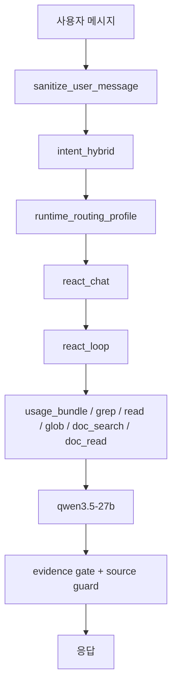
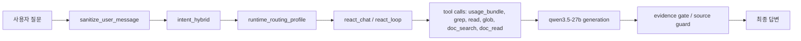
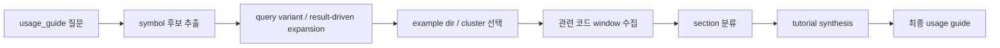

# 에이전트 상세 설계

> 목적: 현재 PIXLLM의 질문 분류, 라우팅, ReAct 실행, `usage_guide` 전용 흐름을 코드 기준으로 정리

## 1. 현재 런타임의 기본 구조

현재 운영 런타임은 LangGraph 기반 멀티 에이전트가 아니라, FastAPI + 정책 오케스트레이션 + ReAct 실행기 구조입니다.

핵심 파일:

- `backend/app/core/orchestration.py`
- `backend/app/services/chat/intent_hybrid.py`
- `backend/app/services/chat/runtime_routing_profile.py`
- `backend/app/services/chat/react_chat.py`
- `backend/app/services/chat/react_loop.py`
- `backend/app/services/tools/usage_guide_collector.py`

즉 현재 에이전트는 "그래프 엔진 위의 노드"보다 "정책 + 라우팅 + 도구 호출 + 생성"을 묶은 런타임 코드에 가깝습니다.

## 2. 현재 질문 처리 흐름

세부 순서:

1. 질문을 정제합니다.
2. LLM 기반 intent planner가 질문을 분류합니다.
3. 라우팅 프로필을 계산합니다.
4. ReAct 경로로 들어가 필요한 도구를 호출합니다.
5. 첫 검색이 약하면 query variant 또는 result-driven expansion으로 한 단계 넓혀 다시 찾습니다.
6. 모은 근거를 바탕으로 최종 답변을 생성합니다.
7. evidence gate와 source guard를 적용합니다.

## 3. 현재 intent planner

현재 질문 분류는 `intent_hybrid.py`의 LLM 기반 JSON planner가 담당합니다.

현재 planner가 만드는 핵심 값:

- `intent`
- `response_type`
- `retrieval_bias`
- `answer_style`
- `confidence`

현재 특징:

- strict JSON 출력 요구
- low-confidence fail-closed
- `usage_guide` 질문에 대해 concrete symbol bias
- `doc_lookup`, `code_explain`, `usage_guide` 등 response_type 중심 라우팅

## 4. 현재 intent 목록

현재 `.profiles/intents/*.md` 기준 실제 intent id:

- `general`
- `doc_lookup`
- `usage_guide`
- `api_lookup`
- `code_explain`
- `code_generate`
- `code_review`
- `bug_fix`
- `refactor`
- `troubleshooting`
- `design_review`
- `compare`
- `migration`

중요한 점:

- 파일명은 `api_usage.md`이지만 실제 intent id는 `api_lookup`입니다.
- 라우팅은 파일명보다 frontmatter의 `id`와 `response_type` 기준으로 동작합니다.

## 5. 현재 runtime routing

`runtime_routing_profile.py`가 intent 결과를 실제 실행 프로필로 바꿉니다.

대표 출력값:

- `intent_family`
- `agent_lane`
- `preferred_tool_mode`
- `tool_strategy`
- `tool_priority`
- `answer_style`
- `classification_stability`
- `agent_profile`

현재 lane 구분:

- `doc_rag_lane`
- `code_tool_lane`
- `general_assistant_lane`

현재 tool priority는 response type과 retrieval bias에 따라 달라지며, `usage_guide`는 `usage_bundle`이 가장 앞에 올 수 있습니다.

### 5.1 현재 lane / strategy 요약

| 항목 | 현재 값 |
|---|---|
| document lane | `doc_rag_lane` |
| code lane | `code_tool_lane` |
| general lane | `general_assistant_lane` |
| docs 전략 | `docs_first_then_code` |
| code 전략 | `code_first_then_docs` |
| hybrid 전략 | `balanced_code_and_docs` |

## 6. 현재 ReAct / tool calling

현재 ReAct 런타임은 `react_chat.py`와 `react_loop.py`가 담당합니다.

현재 특징:

- native OpenAI-compatible tool calling 기본 활성화
- fallback text/JSON ReAct 경로 유지
- stage timeout 분리
  - `prepare`
  - `retrieve`
  - `answer`
- 스트리밍 진행 상태 연동

현재 많이 쓰는 도구:

- `usage_bundle`
- `grep`
- `read`
- `glob`
- `doc_search`
- `doc_read`

현재 검색 확장 규칙:

- `search_code`는 첫 질의가 약하면 deterministic query variant를 순차적으로 시도합니다.
- `usage_bundle`은 source-only hit일 때 결과에서 심볼 family / path 단서를 뽑아 example 검색을 다시 수행합니다.
- 이 확장은 도메인별 고정 하드코딩보다 failure-driven refinement에 가깝게 유지합니다.

## 7. 현재 `usage_guide` 전용 흐름

현재 질문 종류 중 `usage_guide`만 상대적으로 전용 흐름이 있습니다.

구조:

1. symbol 후보 추출
2. 첫 검색이 약하면 query variant 재시도
3. source-only hit이면 result-driven example 재탐색
4. example directory / example cluster 선택
5. 관련 코드 window 수집
6. `setup / initialization / load_flow / events / render_update / cleanup` 분류
7. 튜토리얼형 답변 생성

현재 구현된 것:

- `usage_bundle` collector
- 대표 예제 중심 설명
- canonical symbol 추정
- deterministic query variant 재시도
- source-only hit에서 example family 재탐색
- 제목 후처리
- 예제 코드 후처리

현재 남은 문제:

- 넓은 심볼은 예제 클러스터 선택이 흔들릴 수 있음
- 예제 코드는 아직 모델 재구성 비중이 큼
- 시나리오 분리(`background map usage` vs `raster composite usage`)가 더 필요

## 8. 현재 세션 맥락 처리

현재 백엔드는 Redis에 대화 이력을 저장합니다.

관련 구성:

- `conversation_id`
- `ConversationsService`
- 최근 대화 메시지 일부를 generation에 전달

현재 한계:

- 프런트 메인 채팅이 `conversation_id`를 지속적으로 연결하는 구조는 아직 약함
- 질문 분류와 검색이 이전 대화의 누적 맥락을 충분히 활용하지 못함
- 프로젝트/심볼/intent 같은 세션 상태를 별도 메모리로 유지하지 않음

즉 현재 PIXLLM의 에이전트 구조는
"정책 기반 intent 분류 + runtime routing + ReAct/tool calling + 일부 intent 전용 수집기"로 이해하는 것이 가장 정확합니다.
