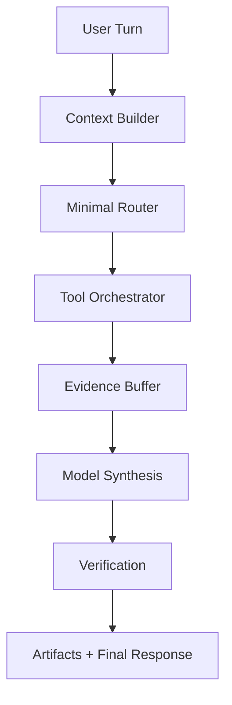

# 에이전트 상세 설계

> 목적: PIXLLM의 에이전트를 `질문 분류기`가 아니라 `세션 단위 실행 런타임`으로 정의

## 1. 에이전트 정의

새 구조에서 에이전트는 다음을 뜻합니다.

- 세션 안에서 실행되는 주체
- 도구와 태스크를 호출할 수 있는 런타임
- 메시지뿐 아니라 artifact와 verification 결과를 남기는 실행 단위

즉 에이전트는 `프롬프트 한 장`이나 `LangGraph 노드`가 아니라, 참고 소스의 `QueryEngine + Tool registry + Task abstraction`에 가까운 실행 커널입니다.

## 2. 에이전트 유형

| 유형 | 역할 |
|---|---|
| Primary Agent | 기본 세션을 담당하는 메인 런타임 |
| Task Agent | 긴 실행을 담당하는 백그라운드 작업 주체 |
| Team Worker | 병렬 분해된 하위 작업 담당 |
| Remote Agent | bridge 뒤 원격 환경에서 실행 |
| Verifier Agent | 결과 검증과 회귀 확인 담당 |

## 3. 내부 구성

에이전트는 아래 컴포넌트로 구성됩니다.

- `context builder`
- `minimal router`
- `tool orchestrator`
- `task manager`
- `verification adapter`
- `artifact emitter`

## 4. 기본 수명주기

1. 세션에 새 turn이 들어옵니다.
2. context builder가 cwd, 메모리, 선택 파일, 이전 이력을 조립합니다.
3. minimal router가 실행 모드를 결정합니다.
4. tool orchestrator가 필요한 도구를 반복 호출합니다.
5. 긴 실행은 task manager가 별도 task로 승격합니다.
6. 원격 환경이 필요하면 remote agent로 전환합니다.
7. 결과는 verifier를 거친 뒤 artifact와 함께 반환됩니다.

## 5. 도구와의 관계

에이전트는 도구를 직접 내장하기보다 registry를 통해 조합합니다.

도구 예시:

- file read/edit/write
- grep/glob/LSP
- shell/powershell
- web fetch/search
- MCP tools/resources
- plugin/skill commands

즉 에이전트는 "모든 일을 직접 아는 존재"가 아니라, "어떤 도구와 실행면을 쓸지 고르는 존재"입니다.

## 6. 태스크와의 관계

태스크는 에이전트의 하위 실행 단위입니다.

승격되는 경우:

- 편집과 검증이 필요함
- 오래 걸리는 명령 실행
- 취소/재시도/재개가 중요함
- UI에서 별도 진행률이 필요함

에이전트는 task를 만들고, task의 상태와 산출물을 다시 세션에 반영합니다.

## 7. 병렬 실행

병렬 실행은 team plane에서 다룹니다.

규칙:

- disjoint write scope가 있어야 합니다.
- worker마다 책임 파일 또는 책임 모듈이 있어야 합니다.
- 결과는 각자 artifact로 보고하고, primary agent가 통합합니다.

## 8. 원격 실행

remote agent는 아래 조건에서 사용합니다.

- 로컬에 없는 환경이 필요함
- 격리 worktree가 필요함
- 장시간 세션을 별도 머신에서 유지해야 함

remote agent도 동일한 session/task/event 계약을 따릅니다.

## 9. 모델과의 관계

모델은 유지하지만, 에이전트 개념은 바뀝니다.

- 모델은 여전히 생성 엔진입니다.
- 에이전트는 모델 위에서 도구와 태스크를 조정하는 런타임입니다.
- 따라서 "모델 = 에이전트"로 보지 않습니다.

## 10. 성공 기준

- 에이전트가 도구, 태스크, artifact를 일관되게 다룹니다.
- 병렬 worker와 remote agent도 같은 계약 아래 동작합니다.
- 최종 응답이 단순 텍스트가 아니라 검증된 실행 결과로 귀결됩니다.
