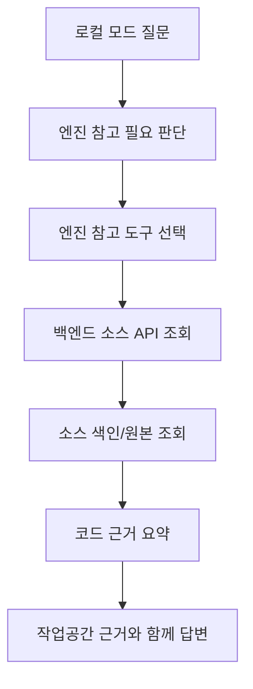

# 엔진 소스 참고 설계

## 1. 목적

엔진 소스 참고 기능은 로컬 질문 실행 안에서 회사 엔진 코드를 읽어 모델 답변의 설명과 활용 근거를 보강하기 위한 구조다.

사용자 작업공간은 실제 분석과 수정의 대상이다. 엔진 소스는 API 의미, 타입 관계, 사용 예시를 확인하는 참고 근거다.

엔진 원본 소스 조회와 색인 생성은 백엔드 소스 API와 소스 서비스가 담당한다. 최종 목표에서는 이 조회 결과를 데스크톱의 엔진 참고 도구가 받아 Qwen Agent Python 실행기의 도구 관측으로 넣는다.

## 2. 데이터 종류

| 데이터 | 설명 | 사용처 |
| --- | --- | --- |
| 엔진 원본 소스 | 회사 엔진 C/C++/C# 파일 | 선언 읽기, 파일 검색, 텍스트 검색 |
| 메서드 색인 | 타입, 멤버, 선언, 문서 주석, 위치 정보 | 심볼 검색, 선언 읽기 |
| 소스 명세 | 파일 수, 메서드 수, 모듈 요약 | 엔진 개요 표시 |
| 타입 관계 | 상속, 멤버, 반환 타입, 매개변수 타입 | API 관계 설명 |
| 사용처 후보 | 실제 소스 줄에서 찾은 참조 위치 | 활용 예시 확인 |

## 3. 구성



| 구성 요소 | 역할 |
| --- | --- |
| 데스크톱 엔진 참고 도구 | 로컬 질문 실행 안에서 엔진 소스 조회를 수행하고 모델 재입력용 요약을 만든다. |
| 백엔드 소스 서비스 | 엔진 원본 소스와 색인을 파일/심볼/관계 단위로 조회한다. |
| 백엔드 소스 API | 엔진 개요, 검색, 읽기, 타입 관계, 사용처 조회를 HTTP JSON으로 제공한다. |
| Qwen Agent Python 실행기 | 작업공간 근거와 엔진 근거를 함께 보고 최종 답변을 생성한다. |

## 4. 색인 생성 방식

색인 생성기는 Python 소스 서비스에 있다. 엔진 소스 루트를 입력으로 받아 조회에 필요한 구조화 JSON을 런타임 경로에 저장한다.

| 처리 | 구현 방식 |
| --- | --- |
| 파일 수집 | `.h`, `.hpp`, `.cpp`, `.cxx`, `.cc`, `.cs` 확장자를 대상으로 한다. |
| 문자 해석 | UTF-8, CP949, EUC-KR 순서로 읽는다. |
| 선언 추출 | 공개 클래스와 공개 멤버 선언을 정규식 기반으로 추출한다. |
| 문서 주석 | XML 주석의 요약, 매개변수, 반환 설명을 평문으로 정리한다. |
| 구현 연결 | `타입::메서드` 형태의 구현 후보를 찾아 선언의 참고 위치에 붙인다. |
| 타입 관계 | 타입명, 기반 타입, 반환 타입, 매개변수 타입을 관계 조회용으로 정리한다. |
| 명세 작성 | 파일 수, 메서드 수, 모듈별 파일 수, 생성 시간을 저장한다. |

색인은 조회 캐시다. 엔진 소스가 바뀌면 색인 다시 만들기 동작으로 갱신한다.

## 5. 색인 자료 구조

메서드 색인 항목은 아래 필드를 가진다.

```json
{
  "qualified_type": "엔진 네임스페이스.타입",
  "type_name": "타입",
  "member_name": "멤버",
  "qualified_symbol": "엔진 네임스페이스.타입.멤버",
  "doc_path": "Source/상대/경로.h",
  "heading_path": "엔진 네임스페이스.타입 Methods > 멤버",
  "text": "색인용 요약 텍스트",
  "source_refs": [
    {
      "path": "Source/상대/경로.h",
      "line_range": "10-10"
    }
  ],
  "declaration": "관측된 선언",
  "doc": {
    "summary": "요약",
    "parameters": [],
    "returns": "반환 설명"
  },
  "owner": {
    "namespace": "엔진 네임스페이스",
    "qualified_type": "엔진 네임스페이스.타입",
    "type_name": "타입"
  }
}
```

소스 명세 항목은 색인 파일의 원본 명세다.

```json
{
  "generated_at": "색인 생성 시각",
  "raw_source_root": "엔진 소스 경로",
  "file_count": 0,
  "method_count": 0,
  "modules": [
    {
      "module": "상위 폴더",
      "file_count": 0,
      "header_count": 0,
      "implementation_count": 0
    }
  ]
}
```

엔진 개요 응답은 소스 명세를 그대로 내보내지 않고 아래 형식으로 변환한다.

```json
{
  "source": {
    "id": "raw",
    "root_path": "엔진 소스 경로",
    "runtime_path": "색인 저장 경로",
    "method_count": 0,
    "file_count": 0,
    "generated_at": "색인 생성 시각"
  },
  "modules": [
    {
      "module": "상위 폴더",
      "file_count": 0,
      "header_count": 0,
      "implementation_count": 0
    }
  ]
}
```

색인 다시 만들기 응답은 아래 형식이다.

```json
{
  "methods_index_path": "색인 파일 경로",
  "source_manifest_path": "소스 명세 파일 경로",
  "method_count": 0,
  "file_count": 0,
  "raw_source_root": "엔진 소스 경로"
}
```

## 6. 백엔드 HTTP 경로

백엔드 기본 주소는 `http://192.168.2.238:8000/api`이고, 소스 API 접두사는 `/api/v1/source`다. 데스크톱 엔진 참고 도구는 기본 주소 뒤에 `/v1/source/...` 조회 경로를 붙여 요청한다.

HTTP 응답은 `{"ok": true, "data": ..., "error": null}` 봉투를 사용한다. 아래 표의 출력은 `data` 내부 형식이다.

| 경로 | 입력 | 출력 |
| --- | --- | --- |
| `GET /api/v1/source` | 없음 | 엔진 개요 |
| `POST /api/v1/source/context` | 없음 | 엔진 개요 |
| `POST /api/v1/source/index/rebuild` | 없음 | 색인 다시 만들기 결과 |
| `POST /api/v1/source/ls` | `path`, `depth`, `limit` | 디렉터리와 파일 목록 |
| `POST /api/v1/source/glob` | `pattern`, `limit` | 파일 패턴 검색 결과 |
| `POST /api/v1/source/grep` | `pattern`, `path_glob`, `regex`, `case_sensitive`, `limit`, `context` | 텍스트 검색 결과 |
| `POST /api/v1/source/symbols` | `query`, `limit` | 심볼 검색 결과 |
| `POST /api/v1/source/type-graph` | `query`, `limit` | 타입 관계 결과 |
| `POST /api/v1/source/usages` | `query`, `limit` | 사용처 검색 결과 |
| `POST /api/v1/source/search` | `query`, `limit`, `include_content`, `kind` | 통합 검색 결과 |
| `POST /api/v1/source/read` | `path`, `start_line`, `end_line` | 소스 파일 범위 또는 색인 선언 |
| `POST /api/v1/source/answer` | `prompt`, `model`, `llm_base_url`, `session_id`, `max_tokens`, `max_llm_calls`, `enable_thinking` | 코드 기준 백엔드 직접 답변 |

`/api/v1/source/answer`는 코드 기준의 별도 백엔드 직접 답변 경로다. 최종 목표에서는 사용자 질문의 최종 답변 경로로 쓰지 않고, 엔진 참고 도구가 위 조회 경로를 사용한다.

## 7. 엔진 참고 도구

로컬 질문 실행에서 모델에 노출할 엔진 참고 도구는 아래와 같다.

| 도구 이름 | 입력 | 역할 |
| --- | --- | --- |
| `source_overview` | 없음 | 색인 상태와 모듈 요약을 반환한다. |
| `source_ls` | `path`, `depth`, `limit` | 엔진 소스 디렉터리와 파일을 나열한다. |
| `source_glob` | `pattern`, `limit` | 엔진 파일 후보를 패턴으로 찾는다. |
| `source_search` | `query`, `limit` | 선언 후보, 파일 후보, 추천 읽기 대상을 찾는다. |
| `source_read` | `path`, `start_line`, `end_line` | `Source/...` 파일 범위 또는 `.runtime/methods_index.json#심볼` 선언을 읽는다. |
| `source_type_graph` | `query`, `limit` | 타입, 멤버, 입출력 관계를 조회한다. |
| `source_usages` | `query`, `limit` | 실제 사용 위치를 찾는다. |

`source_grep` 처리는 서비스 코드에 있지만 모델 도구 목록에는 포함하지 않는다. 텍스트 검색이 필요하면 HTTP의 `/grep` 경로 또는 통합 검색 경로에서 사용한다.

모델은 기본적으로 `source_search`, `source_read`, `source_type_graph`, `source_usages`를 우선 사용한다. 전체 구조, 폴더, 모듈, 파일 목록 질문에서는 `source_overview`, `source_ls`, `source_glob`도 함께 제공한다.

## 8. 주요 응답 형식

파일 목록 응답:

```json
{
  "ok": true,
  "path": "Source/",
  "total": 0,
  "items": [
    {
      "path": "Source/상대/경로.h",
      "kind": "source_file",
      "size": 0
    }
  ]
}
```

파일 패턴 검색 응답:

```json
{
  "ok": true,
  "pattern": "**/*.h",
  "total": 0,
  "matches": [
    {
      "path": "Source/상대/경로.h",
      "kind": "source_file",
      "size": 0
    }
  ]
}
```

텍스트 검색 응답:

```json
{
  "ok": true,
  "pattern": "검색어",
  "path_glob": "**/*.h",
  "total": 0,
  "matches": [
    {
      "path": "Source/상대/경로.h",
      "line": 10,
      "start_line": 8,
      "end_line": 12,
      "line_text": "일치 줄",
      "line_range": "8-12",
      "snippet": "주변 줄"
    }
  ]
}
```

심볼 검색 응답:

```json
{
  "ok": true,
  "query": "검색어",
  "total": 0,
  "results": [
    {
      "symbol": "엔진 네임스페이스.타입.멤버",
      "qualified_type": "엔진 네임스페이스.타입",
      "type_name": "타입",
      "member_name": "멤버",
      "declaration": "관측된 선언",
      "csharp_signature": "C# 호출용 시그니처",
      "return_type": "반환 타입",
      "parameter_types": [],
      "kind": "symbol",
      "path": ".runtime/methods_index.json#엔진 네임스페이스.타입.멤버",
      "source_refs": [
        {
          "path": "Source/상대/경로.h",
          "line_range": "10-10"
        }
      ]
    }
  ]
}
```

HTTP 통합 검색 응답:

```json
{
  "source_id": "raw",
  "query": "검색어",
  "total": 0,
  "results": [
    {
      "path": "Source/상대/경로.h",
      "title": "Source/상대/경로.h",
      "kind": "source_span",
      "line_range": "8-12",
      "excerpt": "주변 줄"
    }
  ]
}
```

엔진 참고 도구의 `source_search` 응답:

```json
{
  "ok": true,
  "query": "검색어",
  "workspace": {
    "source_root": null,
    "file_count": null,
    "method_count": null
  },
  "type_relations": [],
  "csharp_ref_constraints": [],
  "event_declarations": [],
  "type_members": [],
  "candidates": [],
  "files": [],
  "recommended_reads": [],
  "read_targets": [],
  "source_spans": []
}
```

`source_search` 도구의 `workspace` 항목은 코드 기준으로 위 키를 유지한다. 경로와 파일 수를 답변 근거로 써야 할 때는 `source_overview` 응답의 `source.root_path`, `source.file_count`, `source.method_count`를 사용한다.

소스 읽기 응답은 파일을 읽을 때와 색인 선언을 읽을 때가 다르다.

```json
{
  "ok": true,
  "source_id": "raw",
  "path": "Source/상대/경로.h",
  "title": "상대/경로.h",
  "kind": "source_file",
  "line_range": "1-120",
  "context": {
    "namespace_path": "엔진 네임스페이스",
    "namespaces": [],
    "declarations": []
  },
  "content": "줄 번호가 붙은 소스 내용"
}
```

```json
{
  "ok": true,
  "source_id": "raw",
  "symbol": "엔진 네임스페이스.타입.멤버",
  "qualified_type": "엔진 네임스페이스.타입",
  "type_name": "타입",
  "member_name": "멤버",
  "declaration": "관측된 선언",
  "csharp_signature": "C# 호출용 시그니처",
  "return_type": "반환 타입",
  "parameter_types": [],
  "kind": "symbol",
  "path": ".runtime/methods_index.json#엔진 네임스페이스.타입.멤버",
  "source_refs": [],
  "owner": {},
  "doc": {}
}
```

타입 관계 응답은 배열 행의 의미를 `schemas`에 함께 담는다.

```json
{
  "ok": true,
  "query": "검색어",
  "schemas": {
    "declarations": ["symbol", "csharp_signature", "summary", "enum_literals", "types"],
    "types": ["type_name", "qualified_type", "bases"],
    "assignability": ["from", "to"],
    "event_declarations": ["type_name", "kind", "name", "declaration", "summary", "path", "line_range"],
    "edges": ["from", "relation", "to", "signature"],
    "operations": ["owner_type", "qualified_owner_type", "member_name", "csharp_signature", "returns", "accepts", "ref_accepts", "out_accepts", "enum_literals"],
    "paths": ["from", "to", "steps"],
    "path_steps": ["from", "relation", "to", "member_name", "csharp_signature"]
  },
  "declarations": [],
  "types": [],
  "assignability": [],
  "event_declarations": [],
  "edges": [],
  "operations": [],
  "paths": []
}
```

사용처 검색 응답:

```json
{
  "ok": true,
  "query": "검색어",
  "total": 0,
  "matches": [
    {
      "path": "Source/상대/경로.cpp",
      "line": 10,
      "line_range": "8-12",
      "line_text": "사용된 줄",
      "snippet": "주변 줄"
    }
  ]
}
```

코드 기준 백엔드 직접 답변 응답:

```json
{
  "answer": "답변",
  "session_id": "세션 식별자",
  "model": "Qwen/Qwen3.6-27B",
  "llm_base_url": "http://192.168.2.212:8000/v1",
  "trace": [],
  "summary": "소스 도구 관측 요약",
  "usage": {
    "tool_calls": 0,
    "completion_calls": 0,
    "prompt_tokens": 0,
    "completion_tokens": 0,
    "total_tokens": 0
  }
}
```

## 9. 모델에 전달하는 근거

엔진 참고 도구는 도구 결과 전체를 그대로 모델에 다시 넣지 않는다. 도구 관측에서 필요한 항목만 모아 모델 재입력용 근거 요약으로 만든다. 코드 기준 백엔드 직접 답변 경로는 같은 목적의 중간 구조로 `source_facts`를 사용한다.

```json
{
  "source_facts": {
    "api_signatures": [
      {
        "symbol": "엔진 네임스페이스.타입.멤버",
        "signature": "C# 호출용 시그니처",
        "return_type": "반환 타입",
        "parameter_types": [],
        "ref_parameter_types": [],
        "out_parameter_types": [],
        "enum_literals": {},
        "summary": "요약"
      }
    ],
    "csharp_ref_constraints": [
      {
        "symbol": "엔진 네임스페이스.타입.멤버",
        "csharp_signature": "C# 호출용 시그니처",
        "ref_parameter_type": "ref 매개변수 타입",
        "required_variable_type": "먼저 선언해야 하는 변수 타입",
        "assignable_types": [],
        "call_note": "호출 전 변수 선언 규칙"
      }
    ],
    "type_relations": [],
    "event_declarations": [],
    "read_targets": [
      {
        "kind": "source_span",
        "path": "Source/상대/경로.cpp",
        "start_line": 10,
        "end_line": 20
      }
    ],
    "source_spans": [
      {
        "symbol": "엔진 네임스페이스.타입.멤버",
        "path": "Source/상대/경로.cpp",
        "line_range": "10-20",
        "content": "줄 번호가 붙은 소스 내용",
        "signature": "C# 호출용 시그니처"
      }
    ]
  }
}
```

모델에 전달하는 크기는 아래처럼 제한한다.

| 값 | 기준 |
| --- | --- |
| 관측 API 서명 | 최대 64개 |
| 타입 관계 | 최대 32개 |
| 이벤트 선언 | 최대 12개 |
| 추천 읽기 대상 | 최대 12개 |
| 주변 소스 | 최대 12개, 항목당 2200자 |
| 모델 재입력 전체 | 12000자 안쪽으로 축소 |
| 파일 읽기 | 기본 120줄, 한 번에 최대 180줄, 내용 6000자 안쪽 |

## 10. 조회 순서

모델이 엔진 참고를 사용할 때는 질문 성격에 따라 도구 순서를 잡는다.

| 질문 | 조회 순서 |
| --- | --- |
| API 의미나 시그니처 | `source_search` -> `source_read` |
| API 사용 예시 | `source_search` -> `source_usages` -> `source_read` |
| 타입 관계 | `source_search` -> `source_type_graph` -> `source_read` |
| 선택 코드의 엔진 API 사용 점검 | `source_search` -> `source_usages` -> `source_read` |
| 이름이 불명확한 질문 | `source_search` -> 필요 시 `source_ls`/`source_glob` -> `source_read` |

## 11. 작업공간 근거와의 관계

| 구분 | 작업공간 근거 | 엔진 근거 |
| --- | --- | --- |
| 역할 | 사용자가 다루는 코드 설명/수정 | 엔진 API 의미와 사용법 확인 |
| 위치 | 사용자가 선택한 작업공간 | 백엔드 `RAW_SOURCE_ROOT` |
| 답변 표현 | 선택된 코드 기준 설명 | 참고한 선언과 사용 예시 설명 |
| 수정 대상 | 작업공간 파일 | 없음 |

## 12. 문서 AI/RAG와의 관계

초기 문서의 문서 AI/RAG는 문서를 벡터화해 검색하고, 검색된 문서 조각을 모델 답변 근거로 쓰는 구조였다. 이 문서의 엔진 소스 참고 기능은 문서 RAG가 아니라 코드 근거 조회 구조다.

본 설계에서 엔진 소스 참고는 “문서 검색”이 아니라 “코드 근거 조회”다.

| 구분 | 초기 문서 AI/RAG | 본 설계의 엔진 소스 참고 |
| --- | --- | --- |
| 검색 대상 | 사내 문서, 업로드 문서, 지식 베이스 | 회사 엔진 원본 소스 |
| 검색 방식 | 문서 벡터 검색, 키워드 검색, RAG 문맥 구성 | 파일 검색, 심볼 검색, 선언 읽기, 사용처 조회 |
| 답변 근거 | 문서 조각과 문서 메타데이터 | 코드 선언, 사용 예시, 타입 관계 |
| 실행 위치 | 백엔드 지식 질의 경로 | 로컬 질문 실행 안의 엔진 참고 도구 |
| 목표 | 문서 지식 답변 | 엔진 API 설명과 활용법 보강 |

## 13. 초기 문서에서 바뀐 점

초기 `임베딩 상세 설계`는 문서 파싱, 청킹, 벡터 저장소, 그래프 검색을 중심으로 했다.

본 문서는 회사 엔진 코드를 로컬 질문 실행 안의 참고 근거로 쓰는 구조로 수정했다.

| 초기 문서 내용 | 본 문서에서의 수정 |
| --- | --- |
| 문서 임베딩과 청킹 중심 | 엔진 원본 소스, 선언, 사용 예시 조회 중심 |
| 벡터 저장소 기반 검색 | 파일/색인 기반 심볼, 타입, 사용처 조회 |
| 문서 AI가 RAG 문맥을 구성 | 엔진 참고 도구가 코드 근거 요약을 구성 |
| 그래프 DB 확장 | 엔진 타입/멤버 관계 조회로 한정 |
| 문서 검색과 코드 검색 혼합 | 작업공간은 1차 근거, 엔진 소스는 참고 근거로 분리 |
