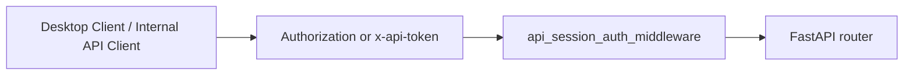

# 인증보안 상세 설계

> 목적: 현재 구현된 인증/보안 조치와 미구현 영역을 구분

## 현재 인증 방식

- 기본 방식: `API_SESSION_TOKEN`
- 전달 헤더:
  - `Authorization: Bearer <token>`
  - `x-api-token: <token>`
- 기본 클라이언트: `desktop/`

## 현재 보안 조치

- source guard
- evidence gate
- `project_filter` 강제
- import/workspace 범위 제한
- tool policy strict

## 아직 없는 것

- 조직/사용자 단위 RBAC
- OIDC / Keycloak 연동
- admin UI 권한 분리
- 감사 로그 강화

현재 문맥에서 웹 프런트엔드 전용 인증 경로는 더 이상 유지하지 않는다.
