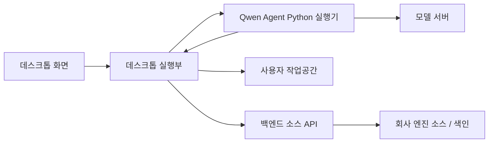

# 인터페이스 설계

## 1. 목적

이 문서는 PIXLLM 데스크톱 앱을 구성하는 화면, 데스크톱 실행부, 모델 실행기, 백엔드 소스 API 사이의 인터페이스를 정의한다.

구현 결과를 바탕으로 정리하되, 설계 문서에서는 내부 구현 나열이 아니라 기능 경계와 입출력 구조를 기준으로 설명한다. 최종 제품 목표는 사용자가 로컬 작업공간에서 하나의 질문 흐름을 사용하고, 필요한 경우 엔진 소스 참고 근거를 같은 흐름 안에서 함께 받는 것이다.

## 2. 인터페이스 경계



| 경계 | 방식 | 책임 |
| --- | --- | --- |
| 화면과 데스크톱 실행부 | 프로세스 간 요청/응답, 실행 로그 알림 | 설정, 작업공간, 세션, 질문 실행, 파일 조회를 중계한다. |
| 데스크톱 실행부와 모델 실행기 | 로컬 프로세스 실행, 표준 입출력, 로컬 HTTP | 모델 호출 루프를 실행하고 도구 호출을 데스크톱으로 되돌린다. |
| 데스크톱 실행부와 작업공간 | 로컬 파일 접근 | 사용자의 실제 코드 검색, 읽기, 수정, 변경 상태 조회를 수행한다. |
| 데스크톱 실행부와 백엔드 소스 API | HTTP JSON | 엔진 소스 개요, 검색, 읽기, 타입 관계, 사용처 조회를 수행한다. |
| 백엔드 소스 API와 엔진 소스 | 로컬 파일/색인 조회 | 회사 엔진 원본 소스와 색인 JSON을 읽어 구조화된 근거를 만든다. |
| 모델 실행기와 모델 서버 | OpenAI 호환 채팅 완료 API | 답변 생성과 도구 호출 결정을 수행한다. |

## 3. 화면-데스크톱 입출력

화면은 데스크톱 실행부에 사용자 조작을 전달하고, 데스크톱 실행부는 즉시 응답이 가능한 값과 오래 걸리는 질문 실행 로그를 분리해 반환한다.

| 기능 영역 | 화면이 전달하는 값 | 데스크톱이 반환하는 값 |
| --- | --- | --- |
| 앱 정보 | 없음 | 앱 이름, 버전, 빌드 정보, 플랫폼, 사용자 데이터 경로 |
| 설정 관리 | 백엔드 API 주소, 모델 서버 주소, 모델 이름, 작업공간, 엔진 질문 기본값, 최근 작업공간 | 저장된 설정 전체 |
| 작업공간 선택 | 사용자가 고른 폴더 | 선택 취소 여부와 작업공간 경로 |
| 작업공간 상태 | 작업공간 경로 | SVN 정보, 변경 상태, 차이, 파일 목록 |
| 파일 미리보기 | 작업공간 경로, 상대 파일 경로, 읽기 범위 | 파일 내용, 줄 범위, 크기, 수정 시각 |
| 세션 관리 | 작업공간 경로, 세션 식별자, 제목, 대화 메시지 | 세션 목록 또는 세션 본문 |
| 질문 실행 | 질문, 작업공간, 선택 파일, 모델 설정, 엔진 참고 선택, 세션 문맥 | 실행 요청 식별자 |
| 실행 취소 | 실행 요청 식별자 | 취소 처리 결과 |
| 실행 로그 구독 | 실행 요청 식별자 | 상태 변화, 도구 호출, 도구 결과, 답변, 오류 |

화면-데스크톱 경계에서는 작업공간 파일 내용을 직접 수정하지 않는다. 파일 수정은 질문 실행 중 모델 도구 호출이 발생했을 때 데스크톱 도구 실행 계층에서 처리한다.

## 4. 설정 구조

데스크톱 설정은 사용자별 JSON으로 저장한다.

```json
{
  "serverBaseUrl": "http://192.168.2.238:8000/api",
  "llmBaseUrl": "http://192.168.2.212:8000/v1",
  "workspacePath": "사용자 작업공간 경로",
  "selectedModel": "Qwen/Qwen3.6-27B",
  "engineQuestionDefault": true,
  "recentWorkspaces": []
}
```

| 값 | 의미 |
| --- | --- |
| `serverBaseUrl` | 백엔드 소스 API 기본 주소 |
| `llmBaseUrl` | Qwen Agent Python 실행기가 호출할 모델 서버 주소 |
| `workspacePath` | 로컬 작업공간 경로 |
| `selectedModel` | 질문 실행에 사용할 모델 이름 |
| `engineQuestionDefault` | 질문 입력 영역의 엔진 참고 기본 선택값 |
| `recentWorkspaces` | 최근 사용한 작업공간 목록 |

엔진 원본 소스 경로와 색인 경로는 데스크톱 설정에 저장하지 않는다. 이 값은 백엔드 실행 환경이 관리한다.

## 5. 질문 실행 입출력

질문 실행은 화면이 요청을 시작하고, 데스크톱 실행부가 실행 요청 식별자를 즉시 반환한 뒤, 실행 로그 알림으로 진행 상황을 계속 전달하는 비동기 실행 방식이다.

요청:

```json
{
  "prompt": "사용자 질문",
  "workspacePath": "사용자 작업공간 경로",
  "model": "Qwen/Qwen3.6-27B",
  "baseUrl": "http://192.168.2.212:8000/v1",
  "serverBaseUrl": "http://192.168.2.238:8000/api",
  "llmBaseUrl": "http://192.168.2.212:8000/v1",
  "engineQuestionOverride": false,
  "selectedFilePath": "선택 파일",
  "sessionId": "세션 식별자",
  "historyMessages": []
}
```

응답:

```json
{
  "requestId": "실행 요청 식별자"
}
```

| 값 | 설계 의미 |
| --- | --- |
| `prompt` | 사용자가 입력한 질문 또는 작업 요청 |
| `workspacePath` | 로컬 모드의 1차 근거가 되는 작업공간 |
| `selectedFilePath` | 화면에서 선택한 작업공간 파일 |
| `engineQuestionOverride` | 엔진 소스 참고 도구를 함께 열지 정하는 값 |
| `serverBaseUrl` | 엔진 소스 참고 도구가 사용할 백엔드 API 주소 |
| `llmBaseUrl` | 모델 실행기가 사용할 모델 서버 주소 |
| `historyMessages` | 화면이 넘기는 이전 대화 문맥 |

최종 목표에서 `engineQuestionOverride`는 별도 백엔드 직접 답변 경로를 선택하는 값이 아니라, 로컬 질문 실행 안에서 엔진 소스 참고 도구를 함께 열지 결정하는 값이다.

## 6. 실행 로그 구조

질문 실행 중 화면으로 전달되는 알림은 모두 같은 봉투를 사용한다.

```json
{
  "requestId": "실행 요청 식별자",
  "event": "tool_result",
  "payload": {}
}
```

| 이벤트 | 의미 | 주요 내용 |
| --- | --- | --- |
| `request_start` | 요청 실행 시작 | 세션, 작업공간, 선택 파일, 복원 여부 |
| `session_restored` | 이전 세션 상태 복원 | 세션, 작업공간 |
| `status` | 실행 상태 변화 | 단계, 메시지, 도구 이름 |
| `model` | 모델 중간 출력 | 생성 조각, 미리보기, 턴 |
| `assistant_message` | 모델 답변 메시지 | 답변, 원문 답변, 사용한 도구 수 |
| `tool_batch_start` | 도구 호출 묶음 시작 | 턴, 호출 수, 요약 |
| `tool_use` | 도구 호출 | 도구 식별자, 도구 이름, 입력 |
| `tool_result` | 도구 결과 | 성공 여부, 입력, 요약 관측, 오류 메시지 |
| `tool_batch_end` | 도구 호출 묶음 종료 | 턴, 호출 수, 요약 |
| `transition` | 실행 단계 전환 | 전환 이유, 턴, 세부 값 |
| `terminal` | 실행 종료 사유 | 종료 이유, 턴 |
| `token` | 최종 답변 조각 | 생성된 텍스트 조각 |
| `done` | 정상 완료 | 최종 답변, 실행 추적, 실행 기록, 사용량 요약 |
| `cancelled` | 취소됨 | 취소 메시지, 남아 있는 실행 추적 |
| `error` | 오류 발생 | 오류 메시지, 남아 있는 실행 추적 |

실행 로그는 화면 표시와 세션 저장에 모두 사용한다. 도구 결과는 모델 재입력용 요약과 화면 표시용 JSON을 함께 가진다.

## 7. 도구 호출 구조

Qwen Agent Python 실행기는 도구를 직접 실행하지 않는다. 모델이 도구 호출을 선택하면 실행기는 데스크톱 실행부의 로컬 도구 연결부로 요청을 보낸다.

요청:

```json
{
  "name": "grep",
  "arguments": {
    "query": "NXImageView",
    "limit": 20
  },
  "raw_params": ""
}
```

응답:

```json
{
  "ok": true,
  "content": "모델에 다시 넣을 도구 관측 요약"
}
```

| 값 | 의미 |
| --- | --- |
| `name` | 호출할 도구 이름 |
| `arguments` | 도구 입력값 |
| `raw_params` | 실행기가 받은 원본 인자 문자열 |
| `content` | 모델 재입력용 관측 요약 |

최종 목표에서 도구 호출 구조는 작업공간 도구와 엔진 소스 참고 도구가 같은 방식으로 사용한다.

## 8. 작업공간 도구 결과

작업공간 파일 읽기 결과는 camelCase 줄 범위를 사용한다.

```json
{
  "ok": true,
  "path": "상대 경로",
  "lineRange": "1-80",
  "content": "읽은 내용",
  "truncated": false,
  "size": 0,
  "mtimeMs": 0
}
```

작업공간 수정 결과:

```json
{
  "ok": true,
  "path": "상대 경로",
  "occurrences": 1,
  "replace_all": false,
  "bytes": 0,
  "size": 0,
  "mtimeMs": 0,
  "added": 1,
  "removed": 1,
  "diff": "줄 단위 차이",
  "diff_truncated": false
}
```

실패 결과:

```json
{
  "ok": false,
  "error": "ERROR_CODE",
  "message": "message"
}
```

## 9. 엔진 소스 조회 방식

백엔드 소스 API는 HTTP JSON으로 호출한다. 백엔드 API 기본 주소는 `http://192.168.2.238:8000/api`이고, 소스 API 접두 경로는 `/api/v1/source`다.

| 기능 | 요청 경로 | 입력 | 출력 |
| --- | --- | --- | --- |
| 엔진 개요 | `/v1/source/context` | 없음 | 루트, 파일 수, 메서드 수, 모듈 요약 |
| 파일 목록 | `/v1/source/ls` | `path`, `depth`, `limit` | 디렉터리와 파일 목록 |
| 파일 찾기 | `/v1/source/glob` | `pattern`, `limit` | 패턴에 맞는 파일 목록 |
| 통합 검색 | `/v1/source/search` | `query`, `limit`, `include_content`, `kind` | 선언 후보, 파일 후보, 소스 범위 |
| 소스 읽기 | `/v1/source/read` | `path`, `start_line`, `end_line` | 소스 내용 또는 색인 선언 |
| 타입 관계 | `/v1/source/type-graph` | `query`, `limit` | 타입, 멤버, 입출력 관계 |
| 사용처 | `/v1/source/usages` | `query`, `limit` | 실제 사용 위치와 주변 줄 |

백엔드 응답은 아래 봉투를 사용한다.

```json
{
  "ok": true,
  "data": {},
  "error": null
}
```

소스 파일 읽기 결과는 snake_case 줄 범위를 사용한다.

```json
{
  "ok": true,
  "source_id": "raw",
  "path": "Source/엔진/파일.h",
  "title": "엔진/파일.h",
  "kind": "source_file",
  "line_range": "30-72",
  "content": "줄 번호가 붙은 소스 내용"
}
```

코드 기준에는 엔진 질문을 백엔드가 바로 답하는 `/v1/source/answer` 경로도 있다. 최종 목표에서는 이 경로를 사용자 질문의 별도 답변 인터페이스로 두지 않고, 위 조회 방식을 엔진 참고 도구 내부에서 사용한다.

## 10. 초기 문서에서 바뀐 점

초기 `API 인터페이스 설계`는 채팅, 대화, 모델, 검색, 프롬프트, 지식, 파일, 배치 작업 API까지 넓게 다뤘다.

이 문서는 데스크톱 실행에 필요한 기능 경계와 입출력 구조, Qwen Agent Python 실행기 도구 호출 구조, 백엔드 소스 조회 방식으로 수정했다.

| 초기 문서 내용 | 이 문서에서의 수정 |
| --- | --- |
| 백엔드 HTTP API가 제품 기능 대부분을 담당 | 화면과 데스크톱 실행부의 기능 경계가 중심 |
| 대화 이력 API | 사용자별 데스크톱 세션 저장이 담당 |
| 파일 업로드/지식 API | 본 실행 흐름에 포함하지 않음 |
| 배치 작업 API | 본 문서 범위에 포함하지 않음 |
| 백엔드 소스 API | 엔진 참고 도구의 조회 방식으로 정리 |
