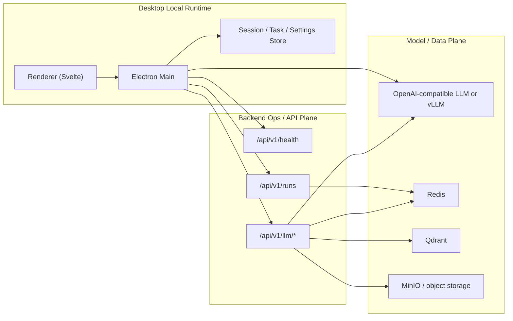

# 인프라 상세 설계

> 목적: 현재 PIXLLM 인프라를 실제 배치와 실행 책임 기준으로 설명

## 1. 현재 인프라 계층

현재 코드 기준 인프라는 아래 세 층으로 보는 것이 맞습니다.

- Desktop Local Runtime
- Backend Ops / API Plane
- Model / Data Plane

`remote worker plane`, `bridge registry`, `plugin execution plane`은 현재 기본 인프라 계층이 아닙니다.

## 2. 현재 자산 매핑

| 자산 | 현재 역할 |
|---|---|
| `desktop/` | 로컬 실행면, session 저장, renderer/main bridge |
| `backend/` | health, runs, approvals, llm proxy 등 운영 API |
| `redis` | run / execution metadata 저장 지원 |
| `qdrant` | 검색/벡터 저장 |
| `minio` | object storage 계열 |
| 외부 LLM 또는 vLLM | 모델 호출 대상 |

## 3. 로컬 저장 책임

현재 desktop 쪽 로컬 저장은 아래 역할을 가집니다.

- session JSON 저장
- settings 저장
- task runtime 문서 저장
- terminal capture 저장

즉 현재 "세션 재개와 로컬 실행 흔적"은 서버보다 데스크톱이 더 많이 쥐고 있습니다.

## 4. backend 저장 책임

현재 backend는 아래 운영 책임을 가집니다.

- health endpoint 제공
- run / approval / artifact 조회 및 변경
- llm proxy 제공
- 검색/문서/스토리지 서비스로의 gateway 역할

하지만 로컬 채팅 루프 전체를 backend가 오케스트레이션하는 구조는 아닙니다.

## 5. 현재 배포 원칙

- 데스크톱은 로컬에서 session과 tool loop를 직접 돌립니다.
- backend는 운영 표면과 보조 API 역할을 합니다.
- 모델 호출은 direct openai-compatible 또는 backend proxy 둘 다 가능해야 합니다.
- 문서/벡터/오브젝트 저장소는 backend 쪽 support plane으로 남습니다.

## 6. 현재 없는 인프라 전제

현재 문서에서 제거해야 할 잘못된 전제는 아래입니다.

- 항상 존재하는 remote worker
- bridge registry
- control plane이 모든 turn을 직접 지휘한다는 가정
- plugin / MCP registry가 기본 인프라라는 설명

## 7. 다음 정리 우선순위

현재 코드와 가장 잘 맞는 다음 인프라 정리는 아래입니다.

1. desktop local runtime과 backend runs의 역할 경계 문서화
2. direct LLM 호출과 backend proxy 호출의 운영 가이드 분리
3. local trace / backend run / storage artifact의 연결 지점 명확화
4. 필요가 생기기 전까지 remote/team 인프라를 핵심 구조로 문서화하지 않기

현재 PIXLLM 인프라는 `desktop local runtime + backend ops plane + model/data plane`으로 설명하는 것이 정확합니다.
