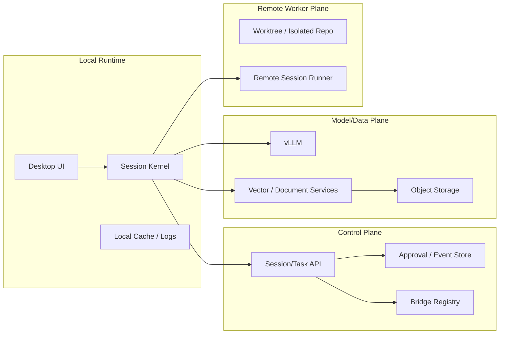

# 인프라 상세 설계

> 목적: PIXLLM 인프라를 `데스크톱 + 백엔드 컨테이너`에서 `로컬 실행면 + control plane + model/data plane + remote worker` 구조로 재정의

## 1. 인프라 계층

- Local Runtime
  - desktop renderer
  - desktop main/session kernel
  - local cache, local logs, local artifact temp
- Control Plane
  - session/task metadata API
  - approval/event store
  - bridge registry
  - telemetry ingest
- Model/Data Plane
  - vLLM
  - embeddings/vector store
  - document/reference/object storage
- Remote Worker Plane
  - isolated worktree
  - remote session runner
  - bridge-connected execution node

## 2. 현재 자산의 재배치

기존 자산은 아래처럼 해석합니다.

- `desktop/` -> Local Runtime
- `backend/` -> Control Plane + Model/Data gateway
- `qdrant`, `minio`, `redis`, `neo4j` -> Model/Data 또는 metadata support service
- `vLLM` -> 그대로 Model Plane

즉 기존 자산을 버리는 것이 아니라, 설명 체계를 바꾸는 것입니다.

## 3. 저장 책임

| 저장소 | 책임 |
|---|---|
| Local cache | 임시 artifact, UI 캐시, 세션 재개 보조 |
| Redis 계열 | 세션/태스크 상태 캐시, 큐, lease |
| Object storage | 로그, diff, 리포트, 대형 artifact |
| Vector/doc store | 모델 보조 검색 |
| Control DB 또는 metadata store | session, task, approval, bridge metadata |

## 4. 배포 원칙

- 로컬 실행은 오프라인 또는 준오프라인으로도 기본 동작해야 합니다.
- control plane은 세션 상태와 원격 실행을 안정적으로 중재해야 합니다.
- model plane은 교체 가능하지만 인터페이스는 안정적이어야 합니다.
- remote worker는 필요할 때만 수평 확장합니다.

## 5. 웹 프런트엔드에 대한 결론

- 별도 웹 프런트엔드는 주 제품 표면이 아닙니다.
- frontend는 desktop renderer 의미로만 유지합니다.
- 인프라 설명에서도 UI는 desktop app이 기준입니다.

## 6. 유지되는 부분

- 기존 vLLM 서빙
- 기존 임베딩/벡터 저장소
- 기존 object storage 계열

변경되는 것은 이들을 감싸는 오케스트레이션과 실행 인프라 개념입니다.
