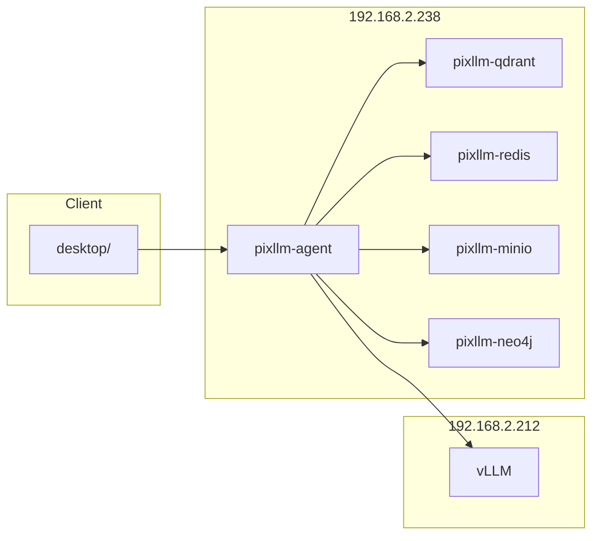

# 인프라 상세 설계

> 목적: 현재 실제 배포 구성을 현재 상태 기준으로 정리

## 컨테이너 구성

현재 Docker Compose로 관리하는 서비스:

- `pixllm-agent`
- `pixllm-qdrant`
- `pixllm-redis`
- `pixllm-minio`
- `pixllm-neo4j`

웹 프런트엔드 컨테이너는 제거되었다. 현재 UI는 컨테이너가 아니라 `desktop/` 애플리케이션이다.

## 운영 메모

- `backend/docker-compose.yml`은 백엔드/데이터 서비스만 관리한다.
- `backend/scripts/deploy_stack.sh`의 `--app-only`는 이제 `agent-api`만 대상으로 한다.
- 데스크톱 UI는 별도 빌드/배포 경로를 사용한다.
