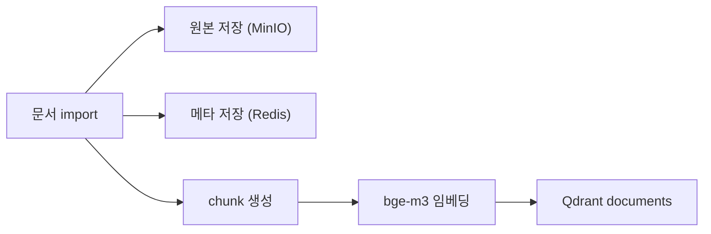

# 임베딩 상세 설계

> 목적: 현재 PIXLLM이 문서와 코드를 어떻게 적재하고, 어떤 범위까지 임베딩하는지 코드 기준으로 정리

## 1. 현재 기본 정책

현재 구현 기준의 핵심은 아래 두 가지입니다.

- 문서는 임베딩한다
- 코드는 현재 구현 기준에서 기본적으로 임베딩하지 않는다

즉 현재 RAG의 기본 검색 구조는 다음과 같습니다.

- 문서 질문: Qdrant `documents` 벡터 검색
- 코드 질문: import된 코드 트리에 대한 도구 검색(`grep/read/glob`)

확장 방향 메모:

- 안정 코퍼스(공식 문서 / 공식 예제 / 공개 헤더 / 엔진 소스)는 hybrid index/embedding 경로를 검토할 수 있다
- 로컬 workspace 코드는 계속 tool-first + lightweight index 경로가 더 적합하다

## 2. 현재 문서 임베딩 경로

문서 import 시 현재 경로:

1. 문서를 import한다
2. 원본은 MinIO에 저장한다
3. 문서 메타와 revision 정보는 Redis에 저장한다
4. 문서를 section/chunk 단위로 나눈다
5. `BAAI/bge-m3`로 임베딩한다
6. Qdrant `documents` 컬렉션에 저장한다

현재 기본 설정:

- `EMBEDDING_MODEL=BAAI/bge-m3`
- `EMBEDDING_DEVICE=cuda`
- `EMBEDDING_USE_FP16=true`
- `EMBEDDING_BATCH_SIZE=64`
- `RAG_DEFAULT_COLLECTION=documents`

## 3. 현재 코드 import 경로

코드 import 시 현재 경로:

1. 코드를 import한다
2. 원본은 MinIO에 저장한다
3. 메타데이터는 Redis에 저장한다
4. 실제 검색용 파일 트리는 `/workspace_host/pixoneer_source/<project>/...` 아래에 복원한다
5. 채팅 시 이 복원 트리를 대상으로 코드 도구 검색을 수행한다

중요한 점:

- 코드 import는 기본적으로 metadata-only registration입니다.
- 코드 import는 기본 경로에서 vector upsert를 하지 않습니다.
- 따라서 `code_snippets` 같은 코드 벡터 컬렉션은 현재 핵심 운영 경로가 아닙니다.
- 즉 현재 구현은 안정 코퍼스와 로컬 workspace를 구분하지 않고 모두 비임베딩 경로로 처리합니다.

### 3.1 문서 import vs 코드 import 비교

| 항목 | 문서 import | 코드 import (현재 구현) |
|---|---|---|
| 원본 저장 | MinIO | MinIO |
| 메타 저장 | Redis | Redis |
| 임베딩 | 있음 | 기본 없음 |
| 검색 저장소 | Qdrant `documents` | 복원된 파일 트리 |
| 주 검색 방식 | 벡터 검색 | 도구 검색 |

## 4. 현재 검색 저장소

### 4.1 Qdrant

현재 핵심 컬렉션:

- `documents`

이 컬렉션이 현재 문서 RAG의 기준입니다.

### 4.2 Redis

현재 저장하는 대표 항목:

- 파일 메타
- 문서 revision 메타
- import job 상태
- 대화 이력

### 4.3 MinIO

현재 저장하는 대표 항목:

- 문서 원본
- 코드 원본

즉 "원본은 MinIO, 검색용 벡터는 Qdrant, 운영 메타는 Redis"로 나뉩니다.

## 5. 현재 리랭커 사용

현재 리랭커는 별도 필수 경로가 아니라, runtime override에 따라 선택적으로 적용합니다.

현재 코드 기준:

- 기본 수동 체크박스는 프런트에서 제거됨
- intent / runtime profile에 따라 켜질 수 있음
- 문서 중심 질문에서 더 유용한 경향

현재 기본 계열:

- `bge-reranker-v2-m3`

## 6. 현재 import 소스

현재 import는 아래 소스를 지원합니다.

- local folder
- SVN
- TFS

현재 중요 정책:

- 문서 import와 코드 import가 분리됨
- 문서는 임베딩 대상
- 코드는 현재 구현 기준으로 기본 비임베딩 대상

## 7. 앞으로 확장 가능한 영역

현재 코드 기준으로 다음은 확장 과제입니다.

- 안정 코퍼스용 hybrid index / embedding 재도입 여부 검토
- 로컬 workspace code용 lightweight index 전략 정리
- 프로젝트별 문서/코드 적재량 시각화
- import 누락 경로 탐지
- 문서 임베딩 품질 평가 자동화
- reranker 효과 정량 검증

즉 현재 임베딩 설계의 본질은
"문서는 Qdrant에 넣고, 코드는 실제 파일 트리에서 읽는다"입니다.

향후 방향까지 포함하면
"안정 코퍼스는 hybrid 가능성을 열어두고, 로컬 workspace는 실제 파일 트리와 도구 검색을 우선한다"가 더 정확합니다.
