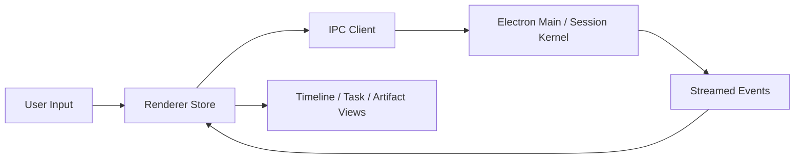

# 프론트엔드 상세 설계

> 목적: 별도 웹 앱이 아니라 `desktop renderer`를 프론트엔드로 정의

## 1. 범위

이 문서에서 프론트엔드는 독립 웹 서비스가 아니라 `desktop/renderer` 계층입니다.

즉 제품 표면은 하나입니다.

- Electron main
- Electron renderer

## 2. 프론트엔드 책임

- session timeline 렌더링
- task 상태 시각화
- artifact viewer 제공
- approval UX 제공
- team/bridge 상태 표시
- 사용자 입력과 IPC 요청 관리

## 3. 권장 구조

```text
desktop/src/renderer/
  app/
  features/
    sessions/
    timeline/
    tasks/
    artifacts/
    approvals/
    team/
    bridge/
  stores/
  ipc/
  components/
```

## 4. 데이터 흐름



## 5. 상태 분리

프론트엔드는 아래 상태를 분리해서 관리합니다.

- session state
- turn stream state
- task state
- artifact cache
- approval queue
- bridge/team status

## 6. 렌더링 원칙

- 메시지와 이벤트를 섞되, tool/task 이벤트를 숨기지 않습니다.
- 긴 artifact는 lazy load 합니다.
- diff, 로그, 테스트 리포트는 전용 뷰로 봅니다.
- 최종 답변보다 실행 과정의 가시성을 우선합니다.

## 7. 비목표

- 별도 웹 SPA 재도입
- 단순 마케팅용 웹 콘솔
- 서버 렌더링 전제 구조

프론트엔드는 이제 `채팅 UI`가 아니라 `세션 실행 상태를 렌더링하는 desktop renderer`로 설명하는 것이 맞습니다.
