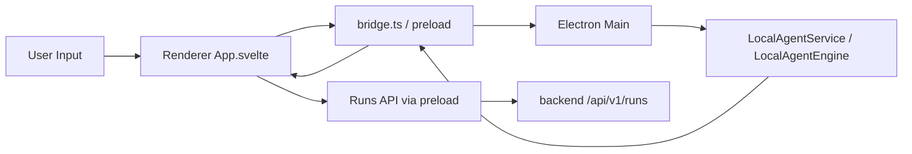

# 프론트엔드 상세 설계

> 목적: 현재 PIXLLM 프론트엔드를 실제 renderer 코드 기준으로 설명

## 1. 범위

현재 프론트엔드는 별도 웹 서비스가 아니라 Electron renderer입니다.

현재 실제 구조는 아래에 가깝습니다.

```text
desktop/src/renderer/
  App.svelte
  app.css
  main.ts
  lib/
    api.ts
    bridge.ts
    store.ts
```

즉 과거 문서의 `features/team`, `features/bridge` 같은 디렉터리 구조는 현재 구현이 아니라 목표 구조에 가깝습니다.

## 2. 현재 프론트엔드 책임

현재 renderer의 책임은 아래입니다.

- settings 로드/저장
- workspace 선택과 session 목록 표시
- session 생성/재개/저장
- agent stream 이벤트 구독
- conversation과 status timeline 렌더링
- backend runs 목록 조회
- run detail의 approvals / tasks / artifacts 렌더링
- approve / reject 액션 트리거

## 3. 데이터 흐름



현재 프론트엔드는 두 종류의 데이터를 받습니다.

- 로컬 agent stream 이벤트
- backend run 조회 결과

## 4. 현재 상태 관리 특성

현재 상태 관리는 중앙 거대 store보다 `App.svelte` 중심의 로컬 상태와 보조 유틸에 가깝습니다.

주요 상태 범주:

- settings
- conversation
- session metadata
- stream progress
- runs list
- selected run detail
- approvals / artifacts / tasks

## 5. 현재 구조의 장점과 한계

장점:

- 기능이 한곳에 모여 있어 현재 동작을 추적하기 쉽습니다.
- preload bridge와 API helper가 분리돼 있습니다.
- local session 화면과 backend run inspector가 이미 연결돼 있습니다.

한계:

- `App.svelte`가 너무 많은 책임을 집니다.
- session UI와 runs UI가 파일 수준에서 분리돼 있지 않습니다.
- timeline row, artifact panel, approval panel의 재사용 단위가 약합니다.

## 6. 현재 문서에서 제거해야 할 전제

현재 코드 기준으로 기본 전제가 아닌 것:

- 별도 web SPA
- team/bridge 상태 표시
- feature folder가 이미 완성돼 있다는 가정
- remote execution 전용 frontend lane
- MCP/open-world UI surface

## 7. 다음 리팩터링 방향

현재 코드와 가장 맞는 프론트엔드 리팩터링 방향은 아래입니다.

1. `App.svelte`를 session shell, timeline, composer, run inspector로 분리
2. stream event mapping을 별도 presenter 계층으로 정리
3. approvals / artifacts / tasks 탭을 재사용 가능한 panel로 분리
4. session persistence와 run refresh 로직을 hook/store 수준으로 이동

현재 PIXLLM 프론트엔드는 `desktop renderer의 단일 앱`으로 설명하는 것이 맞고, 다중 표면/bridge 중심 문서는 현재 코드와 맞지 않습니다.
