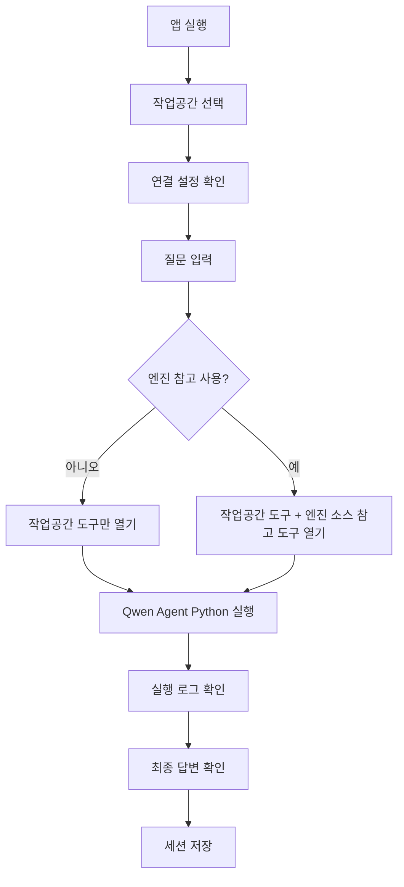

# 화면 설계

## 1. 목적

화면은 사용자가 로컬 작업공간을 고르고, 하나의 질문 입력 흐름에서 작업공간 분석과 수정을 요청하며, 필요한 경우 엔진 소스 참고 근거까지 함께 확인할 수 있는 데스크톱 작업대다.

최종 목표에서 화면은 질문 모드를 나누지 않는다. 사용자는 로컬 모드 하나로 질문하고, `엔진 관련 질문` 선택은 같은 질문 실행 안에서 엔진 소스 참고 도구를 함께 열지 정하는 화면 상태로 사용한다.

코드 기준 화면에는 작업공간을 비우면 백엔드 직접 답변 경로를 쓰는 표시와 버튼이 남아 있다. 최종 화면 설계에서는 이를 질문 모드로 두지 않고, 작업공간 선택을 기본 흐름으로 둔다. 소스 탐색 화면은 유지하되 질문 실행을 대신하지 않는 읽기 전용 보조 화면으로 제한한다.

## 2. 화면 영역

| 영역 | 역할 |
| --- | --- |
| 작업공간 영역 | 작업공간 선택, 최근 작업공간, 작업공간 상태, 작업공간별 세션 표시 |
| 연결 설정 | 백엔드 API 주소, 모델 서버 주소, 모델 이름 저장 |
| 대화 영역 | 사용자 질문과 모델 답변 표시 |
| 실행 로그 | 상태 변화, 도구 호출, 도구 결과, 오류, 취소 표시 |
| 질문 입력 영역 | 질문 입력, 전송, 중지, 엔진 참고 선택 |
| 소스 탐색 화면 | 백엔드 엔진 소스 검색, 읽기, 모듈 탐색 |
| 수정 차이 보기 | 파일 수정 결과를 줄 단위로 표시 |

소스 탐색 화면은 질문 실행을 대신하는 별도 모드가 아니라, 엔진 소스를 사용자가 직접 찾아보는 읽기 전용 화면이다.

## 3. 사용자 흐름

질문 실행의 중심은 항상 작업공간이다. 엔진 소스는 API 의미, 사용 예시, 타입 관계를 확인하기 위한 보조 근거로 붙는다.

## 4. 작업공간과 세션

| 기능 | 설명 |
| --- | --- |
| 작업공간 선택 | 사용자가 로컬 작업공간을 고른다. |
| 최근 작업공간 | 이전에 사용한 작업공간으로 빠르게 이동한다. |
| 작업공간 상태 | SVN 상태, 변경 파일 수, 차이 파일 수를 표시한다. |
| 파일 목록 | 질문 전에 작업공간 파일을 훑어보고 선택할 수 있게 한다. |
| 세션 구분 | 작업공간별로 대화 세션을 나눈다. |
| 세션 제목 | 첫 질문을 바탕으로 자동 생성한다. |
| 세션 저장 시점 | 질문 전후와 답변 완료 시점에 저장한다. |

최종 목표에서는 질문 실행 전에 작업공간을 선택하는 흐름을 기본으로 한다. 작업공간이 없으면 질문 실행보다 작업공간 선택을 먼저 안내한다.

## 5. 연결 설정

연결 설정 패널은 아래 값을 표시하고 저장한다.

| 설정 | 화면 입력 |
| --- | --- |
| 백엔드 API 주소 | `Server API URL` |
| 모델 서버 주소 | `LLM Base URL` |
| 모델 이름 | `Chat Model` |

백엔드 API 주소는 엔진 소스 조회에 사용한다. 모델 서버 주소와 모델 이름은 Qwen Agent Python 실행기의 모델 호출에 사용한다.

화면에는 엔진 소스 경로 입력이나 색인 다시 만들기 버튼이 없다. 엔진 소스 루트와 색인 경로는 백엔드 실행 환경에서 관리한다.

## 6. 질문 입력

입력 영역은 하나의 질문 입력창과 실행 제어만 가진다.

| 조작 요소 | 동작 |
| --- | --- |
| 질문 입력창 | 사용자의 설명, 분석, 수정 요청을 작성한다. |
| 보내기 버튼 | 질문 실행을 시작한다. |
| 중지 버튼 | 실행 중인 요청을 취소한다. |
| `엔진 관련 질문` 선택 | 같은 로컬 질문 실행 안에서 엔진 소스 참고 도구를 함께 열지 정한다. |

`엔진 관련 질문` 값은 기본 선택값으로 저장된다. 체크되어 있으면 모델은 작업공간 도구와 엔진 참고 도구를 함께 사용할 수 있고, 해제되어 있으면 작업공간 도구 중심으로 실행한다.

## 7. 소스 탐색 화면

소스 탐색 화면은 백엔드 소스 API를 통해 엔진 소스를 읽기 전용으로 확인하는 보조 화면이다.

| 요소 | 동작 |
| --- | --- |
| 검색 입력 | 엔진 소스 검색어 입력 |
| 검색 | 입력한 검색어로 엔진 소스 검색 |
| 찾아보기 | 검색어를 비우고 엔진 모듈 목록을 다시 불러옴 |
| 결과 목록 | 검색 결과나 모듈 항목 표시 |
| 읽기 영역 | 선택한 엔진 소스의 경로, 제목, 종류, 내용 표시 |
| 새로고침 | 엔진 소스 개요 다시 불러오기 |

소스 탐색 화면은 엔진 소스를 수정하지 않는다. 질문 답변을 생성하지도 않는다. 사용자가 엔진 소스 내용을 직접 확인하고 싶을 때만 사용한다.

## 8. 실행 로그 표시

표시 대상:

- 요청 시작
- 세션 복원
- 모델 생성 상태
- 작업공간 도구 호출과 결과
- 엔진 소스 참고 도구 호출과 결과
- 실행 단계 변화
- 최종 답변
- 오류와 취소
- 파일 수정 차이

실행 로그 한 항목은 아래 화면 값을 가진다.

| 값 | 설명 |
| --- | --- |
| 제목 | 도구 이름 또는 실행 단계 |
| 보조 설명 | 입력 요약, 줄 범위, 오류 문구 |
| 배지 | 작업공간, 엔진 참고, 모델, 상태 값 중 하나 |
| 상세 | 입력과 관측 결과 |
| 차이 | 파일 수정이 있으면 줄 단위 차이 |

실행 로그는 사용자가 답변 근거를 확인하는 영역이다. 엔진 소스 참고가 사용되면 작업공간 도구와 같은 실행 로그 안에 표시한다.

## 9. 수정 차이 표시

| 표시 요소 | 설명 |
| --- | --- |
| 파일 경로 | 수정된 작업공간 파일 |
| 삭제 줄 | 수정 전 내용에서 빠진 줄 |
| 추가 줄 | 새로 들어간 줄 |
| 줄 번호 | 변경 위치 |
| 요약 | 추가/삭제 줄 수 |

수정 차이는 작업공간 파일에 대해서만 표시한다. 엔진 소스는 참고 근거이므로 수정 차이 대상이 아니다.

## 10. 초기 문서에서 바뀐 점

초기 `프론트엔드 상세 설계`는 SvelteKit 웹 라우팅, 페이지 구조, 백엔드 API 클라이언트 중심이었다.

이 문서는 Electron 데스크톱 작업대 화면으로 수정했다.

| 초기 문서 내용 | 이 문서에서의 수정 |
| --- | --- |
| 웹 페이지와 라우팅 중심 | 작업공간, 대화, 실행 로그를 한 화면에서 다루는 데스크톱 중심 |
| 채팅 응답 표시 중심 | 도구 호출, 엔진 참고 근거, 수정 차이까지 표시 |
| 소스 탐색 화면을 별도 질문 기능처럼 설명 | 읽기 전용 보조 화면으로 정리 |
| 여러 질문 모드 구분 | 로컬 모드 하나와 엔진 참고 선택으로 정리 |
| 웹 배포 흐름 포함 | 본 문서는 데스크톱 실행 화면만 설명 |
