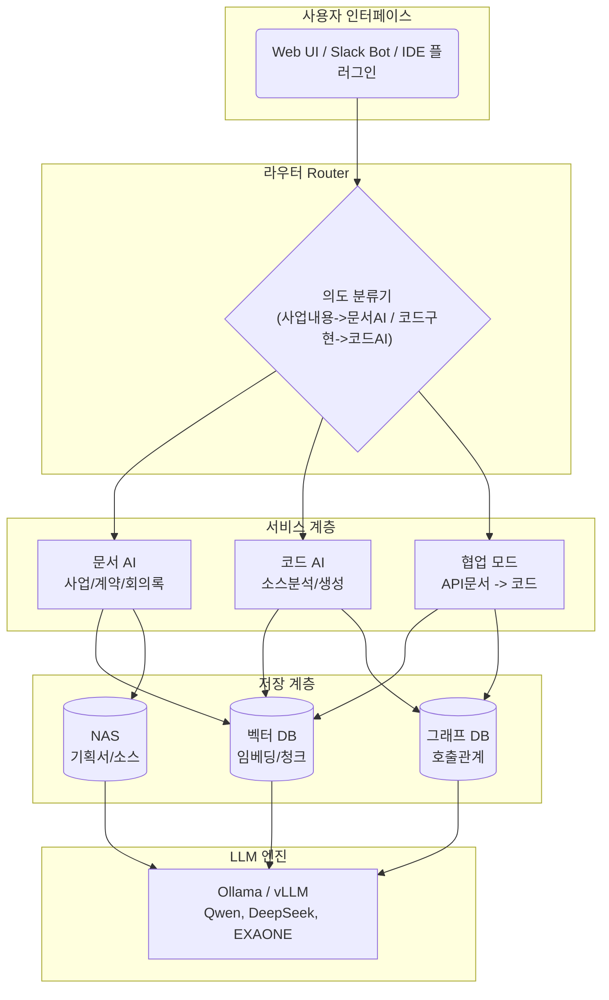
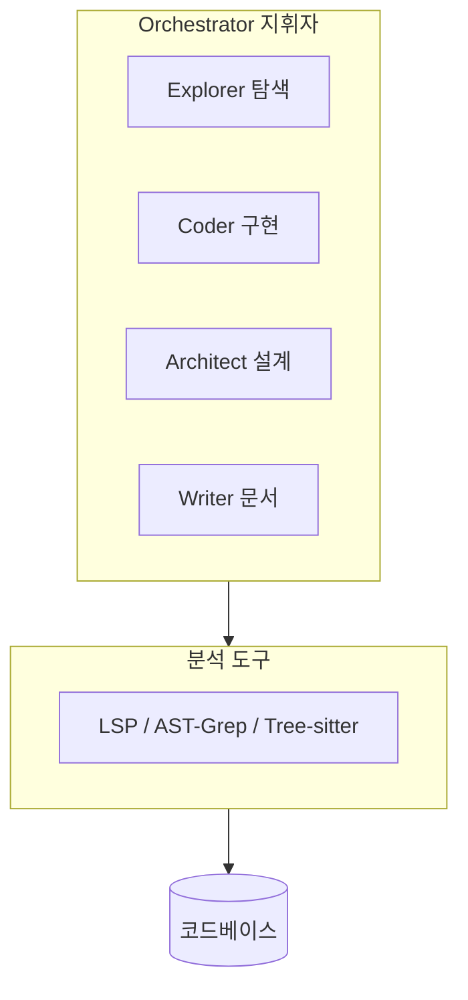
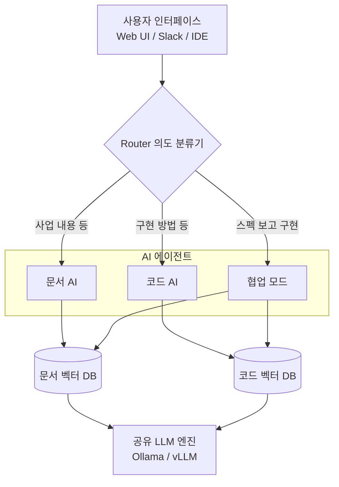
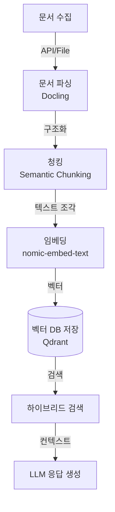
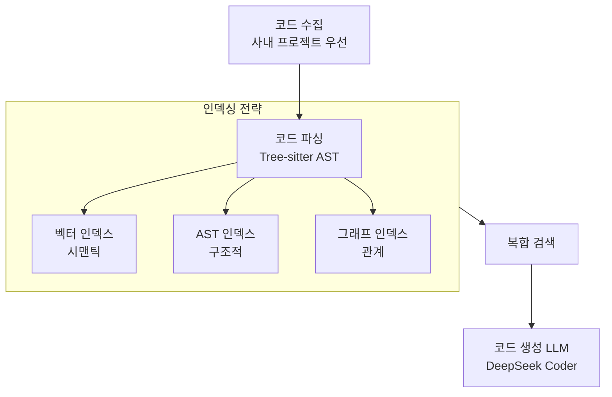
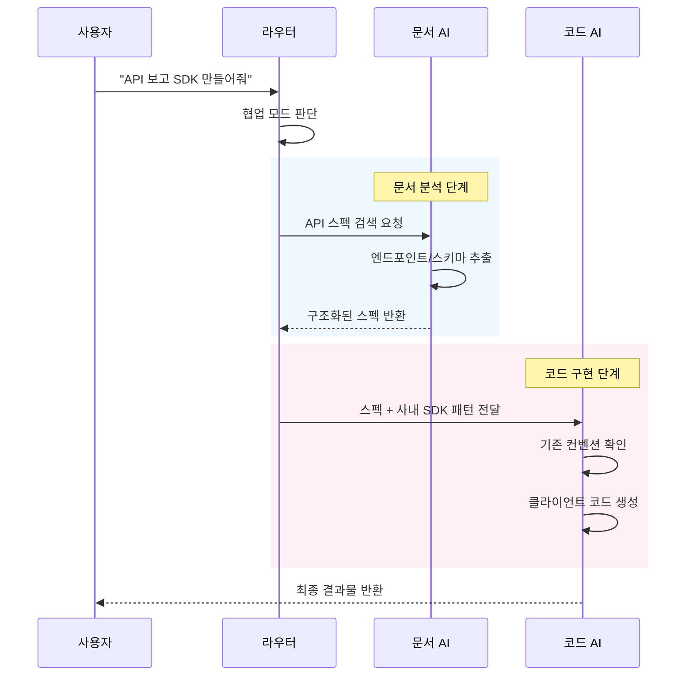
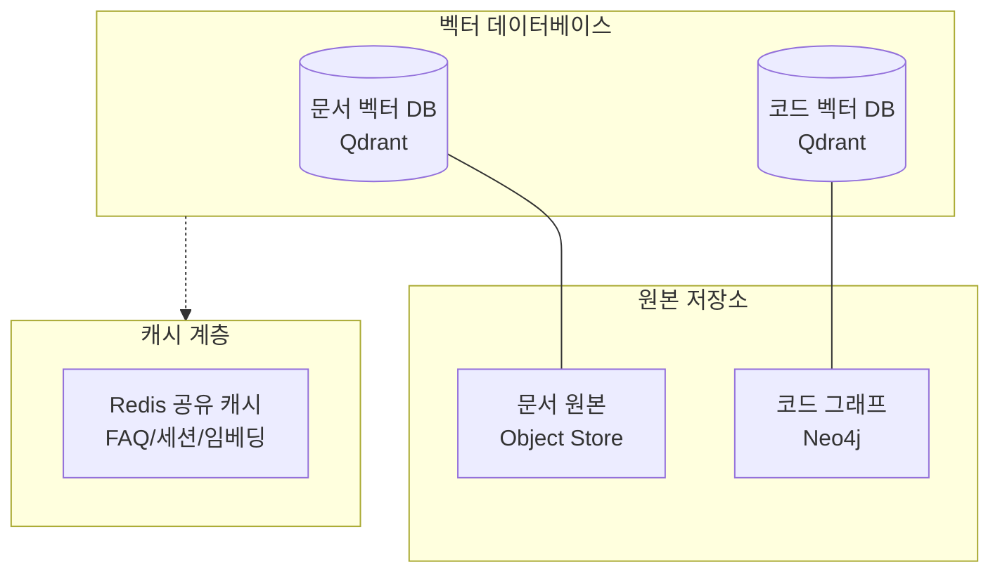

# 기업용 로컬 AI 시스템 구축 가이드 (2025-2026)

회사 문서 및 소스코드를 활용한 로컬 LLM 기반 AI 시스템 구축을 위한 종합 레퍼런스입니다.

> [!WARNING]
> 본 문서는 기술 조사/비교 중심 레퍼런스입니다.
> 현재 PIXLLM 운영 동작은 `docs/README.md`와 `03-guides/환경설정_가이드.md`를 기준으로 확인하세요.

---

## 목차

1. [개요](#1-개요)
2. [로컬 LLM 모델 카탈로그](#2-로컬-llm-모델-카탈로그)
3. [서비스 구축용 LLM 실행 엔진](#3-서비스-구축용-llm-실행-엔진)
4. [RAG 프레임워크](#4-rag-프레임워크)
5. [문서 파싱 엔진](#5-문서-파싱-엔진)
6. [벡터 데이터베이스](#6-벡터-데이터베이스)
7. [임베딩 모델](#7-임베딩-모델)
8. [올인원 솔루션 아키텍처 분석](#8-올인원-솔루션-아키텍처-분석)
9. [코드 검색 도구 아키텍처](#9-코드-검색-도구-아키텍처)
10. [기업용 지식베이스 플랫폼 아키텍처 분석](#10-기업용-지식베이스-플랫폼-아키텍처-분석)
11. [AI 코딩 도구의 코드베이스 파싱 전략](#11-ai-코딩-도구의-코드베이스-파싱-전략)
12. [대규모 환경 전략](#12-대규모-환경-전략)
13. [보안 및 거버넌스](#13-보안-및-거버넌스)
14. [참고 자료 및 문서](#14-참고-자료-및-문서)
15. [부록: 오픈소스 프로젝트 전체 목록](#부록-오픈소스-프로젝트-전체-목록)

---

## 1. 개요

### 로컬 AI의 이점

| 이점 | 설명 |
|------|------|
| **데이터 보안** | 회사 기밀 문서가 외부로 유출되지 않음 |
| **비용 절감** | API 호출 비용 없음, 초기 투자 후 무제한 사용 |
| **오프라인 운영** | 인터넷 연결 없이 사용 가능 |
| **커스터마이징** | 회사 도메인 파인튜닝 가능 |
| **규정 준수** | GDPR, 금융 규제 등 컴플라이언스 충족 |

### 시스템 구성 개요



### 데이터 흐름 요약

| 단계 | 설명 | 도구 예시 |
|------|------|----------|
| **1. 수집** | NAS에서 문서/코드 가져오기 | Confluence API, GitLab API |
| **2. 파싱** | 문서 구조화, AST 추출 | Docling, Tree-sitter |
| **3. 청킹** | 의미 단위로 분할 | 시맨틱 청킹 (256-512 토큰) |
| **4. 임베딩** | 벡터로 변환 | nomic-embed-text, BGE-m3 |
| **5. 저장** | 벡터 DB에 인덱싱 | Qdrant, Milvus |
| **6. 질의** | 사용자 요청 라우팅 | LangGraph, CrewAI |
| **7. 검색** | 유사도 기반 문서 검색 | 하이브리드 검색 |
| **8. 생성** | LLM으로 응답 생성 | Qwen, EXAONE |

---


## 2. 로컬 LLM 모델 카탈로그

### 2.1 범용 모델 (General Purpose)

| 모델 | 파라미터 | VRAM (Q4) | 특징 | 다운로드 (HF / Ollama) |
|------|---------|-----------|------|------------------------|
| **Llama 3.3** | 70B | 40GB | 최신 안정판, 지시 이행 우수 | [Link](https://huggingface.co/meta-llama/Llama-3.3-70B-Instruct) / `ollama run llama3.3` |
| **Llama 3.1** | 70B/405B | 40/230GB | 128K 컨텍스트 | [Link](https://huggingface.co/meta-llama/Llama-3.1-405B-Instruct) / `ollama run llama3.1:70b` |
| **Qwen 2.5** | 72B | 42GB | 한국어 우수 | [Link](https://huggingface.co/Qwen/Qwen2.5-72B-Instruct) / `ollama run qwen2.5:72b` |
| **DeepSeek-V3** | 671B (37B act) | 386GB+ | 671B MoE | [Link](https://huggingface.co/deepseek-ai/DeepSeek-V3) / `ollama run deepseek-v3` |
| **DeepSeek-R1** | 671B | 386GB+ | 추론 특화 | [Link](https://huggingface.co/deepseek-ai/DeepSeek-R1) / `ollama run deepseek-r1` |
| **Mistral Large 2** | 123B | 80GB+ | 프로덕션급 성능 | [Link](https://huggingface.co/mistralai/Mistral-Large-Instruct-2411) / `ollama run mistral-large` |
| **Mixtral 8x22B** | 141B (39B act) | 24GB | 64K 컨텍스트 | [Link](https://huggingface.co/mistralai/Mixtral-8x22B-Instruct-v0.1) / `ollama run mixtral:8x22b` |
| **Command R+** | 104B | 60GB | RAG 특화 | [Link](https://huggingface.co/CohereForAI/c4ai-command-r-plus) / `ollama run command-r-plus` |
| **Falcon 180B** | 180B | 100GB | 완전 오픈 | [Link](https://huggingface.co/tiiuae/falcon-180b-chat) / `ollama run falcon:180b` |

### 2.2 코딩 특화 모델

| 모델 | 파라미터 | VRAM (Q4) | 특징 | 다운로드 (HF / Ollama) |
|------|---------|----------|------|------------------------|
| **DeepSeek Coder V2** | 236B (16B act) | 12/130GB | HumanEval SOTA | [Link](https://huggingface.co/deepseek-ai/DeepSeek-Coder-V2-Instruct) / `ollama run deepseek-coder-v2` |
| **Qwen 2.5 Coder** | 32B | 20GB | 코드 생성/수정/추론 | [Link](https://huggingface.co/Qwen/Qwen2.5-Coder-32B-Instruct) / `ollama run qwen2.5-coder:32b` |
| **CodeLlama** | 70B | 40GB | Python 특화 | [Link](https://huggingface.co/codellama/CodeLlama-70b-Instruct-hf) / `ollama run codellama:70b` |
| **StarCoder2** | 15B | 10GB | 619개 언어 | [Link](https://huggingface.co/bigcode/starcoder2-15b-instruct-v0.1) / `ollama run starcoder2:15b` |
| **WizardCoder** | 33B | 20GB | CodeLlama 파인튜닝 | [Link](https://huggingface.co/WizardLM/WizardCoder-33B-V1.1) / `ollama run wizardcoder` |
| **Codestral** | 22B | 14GB | Mistral, 80개 언어 | [Link](https://huggingface.co/mistralai/Codestral-22B-v0.1) / `ollama run codestral` |
| **Granite Code** | 34B | 20GB | IBM, 엔터프라이즈 | [Link](https://huggingface.co/ibm-granite/granite-34b-code-instruct) / `ollama run granite-code` |

### 2.3 한국어/다국어 특화 모델

| 모델 | 개발사 | 파라미터 | 한국어 성능 | 다운로드 (HF / Ollama) |
|------|--------|---------|------------|------------------------|
| **HyperCLOVA X SEED** | 네이버 | - | 우수 | [Link](https://huggingface.co/naver-hyperclovax) (SEED 시리즈) |
| **A.X K1** | SKT | 519B | 최고 (MoE) | [Link](https://huggingface.co/skt/A.X-K1) |
| **EXAONE 3.5** | LG AI | 32B | 최고 (한국어 특화) | [Link](https://huggingface.co/LGAI-EXAONE/EXAONE-3.5-32B-Instruct) / `ollama run exaone3.5` |
| **Qwen 2.5** | Alibaba | 72B | 우수 (100+ 언어) | [Link](https://huggingface.co/Qwen/Qwen2.5-72B-Instruct) / `ollama run qwen2.5` |
| **Solar Pro** | Upstage | 22B | 우수 | [Link](https://huggingface.co/upstage/solar-pro-preview-instruct) |

> **참고**: A.X K1은 대규모 MoE 모델로 멀티 GPU가 필요합니다.

### 2.4 추론/수학 특화 모델

| 모델 | 파라미터 | 특징 | 다운로드 (HF / Ollama) |
|------|---------|------|------------------------|
| **DeepSeek-R1** | 다양 | OpenAI o1 수준 추론 | [Link](https://huggingface.co/deepseek-ai/DeepSeek-R1) / `ollama run deepseek-r1` |
| **Qwen-QwQ** | 32B | 추론 과정 설명 | [Link](https://huggingface.co/Qwen/QwQ-32B-Preview) / `ollama run qwq` |
| **Mathstral** | 7B | 수학 특화 | [Link](https://huggingface.co/mistralai/mathstral-7B-v0.1) / `ollama run mathstral` |
| **Qwen 2.5 Math** | 72B | 수학 SOTA | [Link](https://huggingface.co/Qwen/Qwen2.5-Math-72B-Instruct) / `ollama run qwen2.5-math` |

### 2.5 비전/멀티모달 모델

| 모델 | 파라미터 | 지원 | 다운로드 (HF / Ollama) |
|------|---------|------|------------------------|
| **LLaVA 1.6** | 34B | 이미지+텍스트 | [Link](https://huggingface.co/liuhaotian/llava-v1.6-34b) / `ollama run llava` |
| **Qwen2-VL** | 7B/72B | 이미지+텍스트 | [Link](https://huggingface.co/Qwen/Qwen2-VL-72B-Instruct) / `ollama run qwen2-vl` |
| **InternVL 2.5** | 78B | 이미지+텍스트 | [Link](https://huggingface.co/OpenGVLab/InternVL2_5-78B) |
| **CogVLM 2** | 19B | 이미지+텍스트 | [Link](https://huggingface.co/THUDM/cogvlm2-llama3-chat-19B) |
| **Pixtral** | 12B | Mistral 비전 | [Link](https://huggingface.co/mistralai/Pixtral-12B-2409) / `ollama run pixtral` |

### 2.6 모델 선택 가이드

| 용도 | 권장 모델 | 최소 VRAM |
|------|----------|----------|
| **범용 (최고 품질)** | Llama 3.3 70B, Qwen 2.5 72B | 40GB |
| **범용 (균형)** | Qwen 2.5 32B | 24GB |
| **한국어 최적** | EXAONE 3.5, Qwen 2.5 | 24GB+ |
| **코딩** | DeepSeek Coder V2, Qwen 2.5 Coder | 20GB+ |
| **추론/수학** | DeepSeek-R1, Qwen-QwQ, Qwen 2.5 Math | 20GB+ |
| **엔터프라이즈** | DeepSeek-V3, Llama 3.3 | 멀티 GPU |

### 2.7 주요 모델 벤치마크 비교

> **📌 출처**: [Open LLM Leaderboard](https://huggingface.co/spaces/open-llm-leaderboard), [LLM-Stats](https://llm-stats.com), 공식 모델 페이지 (2025-2026)

#### 범용 모델 벤치마크

| 모델 | MMLU | MMLU-Pro | GSM8K | 비고 |
|------|------|----------|-------|------|
| **DeepSeek-V3** | 88.5% | - | 89.1% | 671B MoE, GPT-4o급 |
| **Llama 3.1 405B** | 87.3% | - | 89.0% | Dense 모델 |
| **Qwen 2.5 72B** | 86.2% | - | 88.2% | 범용 SOTA |
| **Llama 3.3 70B** | 82.3% | - | 86.4% | 가성비 최고 |

#### 코딩 모델 벤치마크 (HumanEval)

| 모델 | HumanEval | MBPP | LiveCodeBench | 비고 |
|------|-----------|------|---------------|------|
| **Qwen 2.5 Coder 32B** | 91.0% | - | - | 🏆 SOTA |
| **DeepSeek Coder V2 236B** | 90.2% | 75.4% | - | 대규모 코딩 |
| **Codestral 22B** | 86.6% | - | - | Mistral, 80개 언어 |
| **StarCoder2 15B** | 86.4% | - | - | 600+ 언어 |
| **Qwen 3 Coder 480B** | - | - | 70.7 | 에이전틱 코딩 |
| **Devstral 24B** | - | - | - | 에이전틱 특화 |
| **CodeLlama 70B** | 67.8% | 62.4% | - | Python 특화 |

#### 한국어 모델 벤치마크

| 모델 | KoBEST | Open Ko-LLM | 비고 |
|------|--------|-------------|------|
| **HyperCLOVA X Think** | 최고 | - | 6T 토큰 학습 |
| **A.X K1** | 최고 | - | 519B MoE |
| **EXAONE 3.5 32B** | 우수 | 상위권 | 한국어 특화 |
| **Qwen 2.5 72B** | 우수 | 상위권 | 다국어 |
| **Solar Pro 2** | 우수 | 상위권 | 31B |

> **💡 참고**: 벤치마크는 참고용이며, 실제 성능은 도메인과 사용 방식에 따라 다를 수 있습니다. 양자화(Q4/Q8)는 일부 성능 저하가 있을 수 있습니다.

### 2.8 코딩 성능 비교 (기준: Claude Opus 4.5)

사용자가 요청하신 **Claude Opus 4.5**의 코딩 성능을 기준점(Anchor)으로 하여, 현존하는 오픈소스 모델 중 **유사하거나 약간 낮은 성능**을 보이는 모델들을 정리했습니다.

> **기준**: [SWE-bench Leaderboard](https://www.swebench.com/#leaderboard) / [LiveCodeBench](https://livecodebench.github.io/leaderboard.html) / [EvalPlus](https://evalplus.github.io/leaderboard.html) (실시간 순위 확인)

#### 🏆 기준 모델 vs 오픈소스 Top-Tier

| 모델 | 코딩 성능 (추산) | SWE-bench | 라이선스 | 비고 |
|------|------------------|-----------|----------|------|
| **Claude Opus 4.5** | **100% (기준)** | **80.9%** | 상용 | **압도적 벤치마크 기준** |
| **DeepSeek-V3** | ~90% 수준 | 50%대 | MIT | 오픈소스 중 가장 근접한 추론/코딩 성능 |
| **Qwen 2.5 Coder 32B** | ~85% 수준 | 40%대 | Apache 2.0 | **32B 사이즈에서 기적적인 코딩 성능** (가성비 甲) |
| **Qwen 2.5 72B** | ~80% 수준 | 40%대 | Apache 2.0 | 범용적으로 우수하나 코딩 전용 모델보다는 낮음 |
| **Llama 3.3 70B** | ~75% 수준 | 30%대 | Llama | 안정적이나 최신 코딩 트렌드 대비 약간 낮음 |

#### 💻 개발자 추천: "무엇을 써야 하나요?"

1.  **최고의 성능을 원한다면**: [**DeepSeek-V3**](https://huggingface.co/deepseek-ai/DeepSeek-V3) (671B MoE)
    *   Opus 4.5와 가장 유사한 논리/추론 능력을 보입니다. 단, 실행에 고사양 GPU(H100/A100)가 필요합니다.
2.  **단일 GPU(24GB)에서 최고의 코딩을 원한다면**: [**Qwen 2.5 Coder 32B**](https://huggingface.co/Qwen/Qwen2.5-Coder-32B-Instruct)
    *   **강력 추천**: 24GB VRAM 한 장으로 실행 가능하며, 실제 코딩 작업(변수명, 함수 로직, 리팩토링)에서 70B급 성능을 냅니다.
    *   다운로드: [HuggingFace Link](https://huggingface.co/Qwen/Qwen2.5-Coder-32B-Instruct)
3.  **범용성과 안정성**: [**Llama 3.3 70B**](https://huggingface.co/meta-llama/Llama-3.3-70B-Instruct)
    *   코딩 외에 일반 업무 지시사항도 잘 따르는 올라운더입니다. 40GB+ VRAM(2x 3090/4090) 필요.


---

## 3. 서비스 구축용 LLM 실행 엔진

단순한 채팅 앱이 아닌, **실제 AI 서비스를 구축(Serving)**할 때 백엔드로 사용할 수 있는 고성능 추론 엔진입니다.

### 3.1 엔진 아키텍처 및 특징 비교

| 엔진 | 유형 | 주 용도 | API 표준 | 특징 |
|------|------|--------|----------|------|
| **vLLM** | 서빙 프레임워크 | **대규모 프로덕션** | OpenAI 호환 | PagedAttention, 높은 처리량(Throughput), 분산 추론 |
| **TensorRT-LLM** | 라이브러리/서버 | **엔터프라이즈** | Triton 서버 | NVIDIA GPU 전용 최적화, FP8 지원, 최고 속도 |
| **llama.cpp** | 라이브러리/서버 | **엣지/CPU 혼용** | 자체/OpenAI | 순수 C++, 최소 의존성, 애플 실리콘/CPU 최적화 |
| **Ollama** | 래퍼(Wrapper) | **개발/프로토타입** | 자체 API | 간편한 배포, 모델 관리 용이, Go 언어 기반 |
| **LocalAI** | API 게이트웨이 | **통합 백엔드** | OpenAI 완전 호환 | 오디오/이미지 생성 등 멀티모달 통합 지원 |
| **ExLlamaV2** | 라이브러리 | **단일 GPU 고속** | Python 바인딩 | 소비자용 GPU(3090/4090)에서 가장 빠른 토큰 생성 속도 |


### 3.2 상세 기술 문서
*   **vLLM**: [문서](https://docs.vllm.ai) / [GitHub](https://github.com/vllm-project/vllm)
*   **TensorRT-LLM**: [GitHub](https://github.com/NVIDIA/TensorRT-LLM)
*   **llama.cpp**: [GitHub](https://github.com/ggerganov/llama.cpp)
*   **Ollama**: [API 문서](https://github.com/ollama/ollama/blob/main/docs/api.md)

---

## 4. RAG 프레임워크

### 4.1 프레임워크 비교

| 프레임워크 | GitHub Stars | 주요 강점 | 적합 용도 |
|------------|-------------|----------|----------|
| **LlamaIndex** | 40K+ | 문서 인덱싱, 검색 정확도 | 문서 중심 RAG |
| **LangChain** | 126K+ | 범용 오케스트레이션, 에이전트 | 복잡한 워크플로우 |
| **Haystack** | 18K+ | 프로덕션 파이프라인 | 엔터프라이즈 |
| **DSPy** | 32K+ | 프롬프트 최적화, 최소 오버헤드 | 성능 최적화 |
| **LLMWare** | 8K+ | 완전 로컬, CPU 가능 | 보안 중시 |
| **RAGFlow** | 73K+ | 문서 파싱 내장, Web UI | 올인원 |
| **Mem0** | 25K+ | 장기 메모리 | 대화형 AI |

### 4.2 상세 정보

#### LlamaIndex
- **GitHub**: https://github.com/run-llama/llama_index
- **문서**: https://docs.llamaindex.ai
- **특징**: 다양한 인덱스 타입 (벡터, 키워드, 트리, 그래프), 2025년 검색 정확도 35% 향상

#### LangChain
- **GitHub**: https://github.com/langchain-ai/langchain
- **문서**: https://python.langchain.com
- **특징**: LangGraph (상태 기반 워크플로우), 풍부한 통합

#### RAGFlow
- **GitHub**: https://github.com/infiniflow/ragflow
- **문서**: https://ragflow.io/docs
- **특징**: DeepDoc 문서 파싱 내장, Web UI, 엔터프라이즈 버전 제공

#### Haystack
- **GitHub**: https://github.com/deepset-ai/haystack
- **문서**: https://haystack.deepset.ai
- **특징**: 파이프라인 기반, 프로덕션 중심

### 4.3 권장 조합

| 시나리오 | 권장 |
|----------|------|
| 빠른 프로토타입 | RAGFlow (올인원) |
| 문서 검색 품질 최우선 | LlamaIndex |
| 복잡한 에이전트/워크플로우 | LangChain + LangGraph |
| 프로덕션 대규모 | LlamaIndex(인덱싱) + LangChain(오케스트레이션) |

---

## 5. 문서 파싱 엔진

대량의 복잡한 문서(PDF 표, 차트, 레이아웃)를 정확히 추출하는 도구입니다.

### 5.1 파싱 엔진 비교

| 엔진 | GitHub Stars | 표 추출 정확도 | 속도 | 특징 |
|------|-------------|--------------|------|------|
| **Docling** | 52K+ | 97.9% | 매우 빠름 | IBM, 비전 기반, TableFormer |
| **RAGFlow DeepDoc** | - | 95%+ | 빠름 | 위치 정보 보존 |
| **Unstructured** | 10K+ | 85% | 빠름 | 다양한 포맷 |
| **LlamaParse** | - | 90% | 보통 | API 서비스 (로컬 아님) |
| **Marker** | 18K+ | 90% | 빠름 | PDF→Markdown 특화 |
| **PyMuPDF/MuPDF** | - | 70% | 매우 빠름 | 기본적 추출 |
| **Apache Tika** | - | 75% | 보통 | Java, 다양한 포맷 |
| **Tesseract OCR** | 65K+ | - | 느림 | OCR 특화 |

### 5.2 상세 정보

#### Docling (IBM)
- **GitHub**: https://github.com/docling-project/docling
- **문서**: https://docling-project.github.io/docling
- **특징**:
  - 비전 모델 기반 레이아웃 분석
  - TableFormer로 표 구조화
  - 기존 OCR 대비 30배 빠름
  - LangChain/LlamaIndex 통합
  - Granite-Docling (258M VLM) - 원샷 문서 파싱

#### Marker
- **GitHub**: https://github.com/VikParuchuri/marker
- **특징**: PDF/EPUB → Markdown 변환 특화, GPU 가속

#### Unstructured
- **GitHub**: https://github.com/Unstructured-IO/unstructured
- **문서**: https://docs.unstructured.io
- **특징**: 다양한 파일 포맷 지원, API 서비스도 제공

---

## 6. 벡터 데이터베이스

### 6.1 벡터 DB 비교

| DB | GitHub Stars | 최적 규모 | 특징 | 라이선스 |
|----|-------------|----------|------|----------|
| **Milvus** | 35K+ | 10억+ 벡터 | 분산, GPU 가속, 엔터프라이즈 | Apache 2.0 |
| **Qdrant** | 22K+ | ~1억 벡터 | Rust 기반, 고성능 필터링 | Apache 2.0 |
| **Weaviate** | 13K+ | ~1억 벡터 | GraphQL, 멀티모달 | BSD-3 |
| **Chroma** | 18K+ | ~1000만 벡터 | 개발 친화적, 빠른 시작 | Apache 2.0 |
| **pgvector** | 14K+ | ~1000만 벡터 | PostgreSQL 확장 | PostgreSQL |
| **FAISS** | 33K+ | 인메모리 | Facebook, 초저지연 | MIT |
| **LanceDB** | 5K+ | 다양 | 서버리스, 멀티모달 | Apache 2.0 |
| **Pinecone** | - | 무제한 | 관리형 서비스 (로컬 아님) | 상용 |

### 6.2 상세 정보

#### Milvus
- **GitHub**: https://github.com/milvus-io/milvus
- **문서**: https://milvus.io/docs
- **특징**: 클라우드 네이티브, GPU 가속, 다양한 인덱스 (HNSW, IVF, DiskANN)

#### Qdrant
- **GitHub**: https://github.com/qdrant/qdrant
- **문서**: https://qdrant.tech/documentation
- **특징**: Rust 성능, 강력한 필터링, 멀티테넌시

#### Chroma
- **GitHub**: https://github.com/chroma-core/chroma
- **문서**: https://docs.trychroma.com
- **특징**: 5줄로 시작, Python 네이티브, 개발자 경험 최고

### 6.3 선택 가이드

| 문서 규모 | 권장 DB |
|----------|---------|
| ~100만 | Chroma (가장 쉬움) |
| 1억 이상 | Qdrant (고성능) |
| 10억 이상 (엔터프라이즈) | Milvus (분산 처리) |

### 6.4 데이터 적재 (Ingestion) 파이프라인

"기존 문서를 어떻게 벡터 DB에 넣나요?"에 대한 기술적 프로세스입니다.

#### [1단계] 문서 파싱 (Parsing)
사람이 읽는 문서(PDF, PPTX, 코드 파일)를 **텍스트**로 추출하는 단계입니다.
*   **일반 문서**: `Docling`이나 `Unstructured`를 사용하여 레이아웃(표, 이미지 위치)을 분석해 텍스트만 깨끗하게 발라냅니다.
*   **코드**: `Tree-sitter`를 사용하여 코드를 단순 텍스트가 아닌 **함수/클래스 단위의 AST(Abstract Syntax Tree)**로 구조화하여 추출합니다.

#### [2단계] 청킹 (Chunking)
추출된 긴 텍스트를 LLM이 한 번에 읽기 좋은 크기로 **자르는** 단계입니다.
*   **Fixed-size**: 512자나 1024자 단위로 단순하게 자릅니다. (가장 기초적)
*   **Semantic**: 문맥의 의미가 바뀌는 지점을 AI가 판단하여 자릅니다. (정확도 ↑)
*   **Code Chunking**: 함수 하나가 잘리지 않도록, 클래스 범위 내에서 논리적으로 자릅니다.

#### [3단계] 임베딩 (Embedding)
잘라낸 텍스트 조각을 **벡터(숫자 배열)**로 변환합니다.
*   이때 `bge-m3`나 `text-embedding-3-small` 같은 **임베딩 모델**을 사용합니다.
*   예: "로그인 함수" -> `[0.12, -0.59, 0.21, ...]`

#### [4단계] 인덱싱 (Indexing / Upsert)
변환된 벡터와 원본 텍스트를 **벡터 DB**에 저장합니다.
*   이후 검색 시, 질문 벡터와 가장 가까운 문서를 **코사인 유사도(Cosine Similarity)** 등으로 0.1초 만에 찾아냅니다.
| 100만~1000만 | Qdrant (성능+기능 균형) |
| 1000만+ | Milvus (엔터프라이즈 스케일) |
| PostgreSQL 사용 중 | pgvector |
| 초저지연 필요 | FAISS |

---

## 7. 임베딩 모델

### 7.1 로컬 임베딩 모델

| 모델 | 차원 | 컨텍스트 | MTEB 평균 | 용도 |
|------|-----|---------|-----------|------|
| **nomic-embed-text-v1.5** | 768 | 8192 | 62.28 | 장문서, 가변 차원 지원 |
| **nomic-embed-v2-moe** | 768 | 8192 | SOTA | 다국어, 최신 |
| **BGE-large-en-v1.5** | 1024 | 512 | 64.23 | 영문 고정확도 |
| **BGE-base-en-v1.5** | 768 | 512 | 63.55 | 영문 균형 |
| **BGE-m3** | 1024 | 8192 | 63.0 | 다국어, 장문서 |
| **bge-multilingual-gemma2** | 1024 | 8192 | 74.1 | 다국어, 최고 성능 |
| **mxbai-embed-large** | 1024 | 512 | 64.7 | Mixedbread |
| **GTE-large** | 1024 | 512 | 63.1 | Alibaba |
| **jina-embeddings-v3** | 1024 | 8192 | 65.5 | 장문서 |

> **참고**: MTEB 평균 점수는 Classification, Clustering, Retrieval 등 여러 태스크의 평균값입니다. 특정 태스크에서는 점수가 더 높거나 낮을 수 있습니다.

### 7.2 코드 임베딩 모델

| 모델 | 특징 | 다운로드 (HF / Ollama) |
|------|------|------------------------|
| **CodeBERT** | Microsoft, 코드+자연어 | [Link](https://huggingface.co/microsoft/codebert-base) |
| **StarEncoder** | BigCode | [Link](https://huggingface.co/bigcode/starencoder) |
| **Voyage Code 3** | 코드 특화 (API) | [🌐 API Only](https://www.voyageai.com/) |
| **CodeSage** | Salesforce | [Link](https://huggingface.co/Salesforce/codesage-small-v2) |

### 7.3 Ollama 지원 임베딩

> **📌 가장 쉬운 방법**: Ollama를 사용하면 별도 설정 없이 바로 사용 가능

| 모델 | 차원 | 명령어 |
|------|-----|--------|
| nomic-embed-text | 768 | `ollama pull nomic-embed-text` |
| mxbai-embed-large | 1024 | `ollama pull mxbai-embed-large` |
| all-minilm | 384 | `ollama pull all-minilm` |
| snowflake-arctic-embed | 1024 | `ollama pull snowflake-arctic-embed` |
| bge-m3 | 1024 | `ollama pull bge-m3` |

### 7.4 임베딩 모델 다운로드 링크

> **참고**: 임베딩 모델은 LLM과 별개로 다운로드해야 합니다. Ollama 또는 HuggingFace에서 받을 수 있습니다.

#### HuggingFace 다운로드 (Python 사용 시)

| 모델 | HuggingFace 링크 | 용도 |
|------|-----------------|------|
| **nomic-embed-text-v1.5** | [nomic-ai/nomic-embed-text-v1.5](https://huggingface.co/nomic-ai/nomic-embed-text-v1.5) | 범용, 장문서 |
| **BGE-large-en-v1.5** | [BAAI/bge-large-en-v1.5](https://huggingface.co/BAAI/bge-large-en-v1.5) | 영문 고정확도 |
| **BGE-m3** | [BAAI/bge-m3](https://huggingface.co/BAAI/bge-m3) | 다국어, 장문서 |
| **bge-multilingual-gemma2** | [BAAI/bge-multilingual-gemma2](https://huggingface.co/BAAI/bge-multilingual-gemma2) | 다국어 SOTA |
| **E5-large-v2** | [intfloat/e5-large-v2](https://huggingface.co/intfloat/e5-large-v2) | 범용 |
| **all-MiniLM-L6-v2** | [sentence-transformers/all-MiniLM-L6-v2](https://huggingface.co/sentence-transformers/all-MiniLM-L6-v2) | 초경량 |
| **mxbai-embed-large** | [mixedbread-ai/mxbai-embed-large-v1](https://huggingface.co/mixedbread-ai/mxbai-embed-large-v1) | 고성능 |
| **jina-embeddings-v3** | [jinaai/jina-embeddings-v3](https://huggingface.co/jinaai/jina-embeddings-v3) | 장문서 |

#### Python에서 직접 사용 예시

```python
# 방법 1: sentence-transformers (권장)
from sentence_transformers import SentenceTransformer
model = SentenceTransformer('BAAI/bge-m3')  # 자동 다운로드
embeddings = model.encode(["문장 1", "문장 2"])

# 방법 2: Ollama 사용
import ollama
response = ollama.embeddings(model='nomic-embed-text', prompt='Hello World')
```

---

## 8. 올인원 솔루션 아키텍처 분석

Google NotebookLM의 오픈소스/로컬 대안 기술 스택 및 내부 구조 분석입니다.

### 8.1 솔루션 아키텍처 요약

| 솔루션 | GitHub Stars | 기술 스택 (Backend/Frontend) | 주요 아키텍처 특징 |
|--------|-------------|----------------------------|-------------------|
| **Open WebUI** | 123K+ | FastAPI / Svelte(React) | RESTful API, 확장 가능한 플러그인 시스템, Ollama 네이티브 바인딩 |
| **RAGFlow** | 73K+ | Python / React | DeepDoc(Vision 기반 파서), Infinity(AI 네이티브 DB), Elasticsearch 통합 |
| **AnythingLLM** | 54K+ | Node.js(Express) / React | Electron(데스크톱) + Docker(서버) 하이브리드, 벡터 DB 내장(LanceDB) |
| **PrivateGPT** | 55K+ | Python(FastAPI) / Gradio | LlamaIndex 추상화 계층, 모듈식 RAG 파이프라인 |
| **Khoj** | 32K+ | Python / React | Emacs/Obsidian 플러그인 프로토콜, 로컬 파일 시스템 인덱싱 데몬 |
| **LibreChat** | 25K+ | Node.js / React | MongoDB 데이터 구조, 모듈식 AI 프로바이더 어댑터 패턴 |

### 8.2 상세 아키텍처 및 데이터 흐름

#### Open WebUI
*   **Backend**: Python FastAPI 기반의 비동기 API 서버.
*   **Frontend**: SvelteKit을 사용하여 반응성 높은 SPA(Single Page Application) 구현.
*   **Database**: SQLite(기본) 또는 PostgreSQL(프로덕션)을 통한 대화 이력 및 사용자 데이터 관리.
*   **RAG Pipeline**:
    *   `sentence-transformers`를 로컬 메모리에 로드하여 임베딩 수행.
    *   ChromaDB/FAISS를 통해 벡터 인덱싱.
    *   Ollama API와 직접 통신하여 추론 지연 시간 최소화.
*   **Plugin System**: Python 스크립트 기반의 'Tools' 및 'Functions'를 샌드박스 환경에서 실행하여 외부 API 연동.

#### RAGFlow
*   **Core Engine**: 복잡한 문서(PDF, 표, 이미지 포함)를 처리하기 위한 비전 중심 파이프라인.
*   **DeepDoc**: OCR에 의존하지 않고 YOLOv8 등 비전 모델을 사용하여 문서 레이아웃(제목, 본문, 캡션, 표)을 객체 탐지 방식으로 파싱.
*   **Retrieval**:
    *   Elasticsearch/OpenSearch를 사용한 키워드 검색(BM25).
    *   Infinity 데이터베이스를 사용한 고속 벡터 검색.
    *   Rerankers(XGBoost/LightGBM)를 사용한 정교한 순위 재조정(Reranking).
*   **Workflow**: DAG(Directed Acyclic Graph) 기반의 데이터 처리 파이프라인 시각화 및 실행 엔진.

#### AnythingLLM
*   **Architecture**: 데스크톱(Electron)과 서버(Docker) 환경을 단일 코드베이스로 지원.
*   **Vector DB Abstraction**: LanceDB를 기본 내장하여 별도 DB 설치 없이 실행 가능하며, Pinecone/Chroma 등으로 교체 가능한 추상화 계층 보유.
*   **Scraping Engine**: Puppeteer 기반의 웹 스크래퍼가 내장되어 웹사이트 콘텐츠를 실시간으로 벡터화.
*   **Agent Flow**: Node.js 런타임을 활용한 순차적 에이전트 실행 및 툴 체이닝.

#### PrivateGPT
*   **Framework**: LlamaIndex를 기반으로 구축되어, 데이터 인제스트(Ingest)와 쿼리(Query) 파이프라인이 분리됨.
*   **Ingestion**: `Unstructured` 라이브러리를 통해 다양한 파일 포맷을 텍스트로 변환 후 청킹 및 임베딩.
*   **Inference**: llama.cpp-python 바인딩을 통해 GGUF 모델을 CPU/GPU 가속 모드로 직접 로드하여 실행.
*   **API**: OpenAI 완환 API 엔드포인트를 제공하여 다른 클라이언트 도구와 연동 가능.

#### LibreChat
*   **Tech Stack**: MERN(MongoDB, Express, React, Node.js) 스택 기반.
*   **Data Model**: MongoDB를 사용하여 유연한 대화 스키마(메시지 트리 구조) 저장. 이를 통해 대화의 분기(Branching) 및 편집 기능 구현.
*   **Auth**: Passport.js 및 JWT 기반의 견고한 인증 미들웨어.
*   **Integrations**: 모듈식 어댑터 패턴을 사용하여 OpenAI, Anthropic, Google 등 다양한 공급자를 표준화된 인터페이스로 통합.

```text
⚠️ 제한적인 작업
─────────────────
• 전체 프로젝트 컨텍스트 분석
• 파일 직접 수정 (복사/붙여넣기 필요)
• 실시간 코드 변경 반영

❌ 불가능한 작업
─────────────
• IDE 통합 (에디터 내 인라인 완성)
• 터미널 직접 실행
• Git commit/push
• 실시간 디버깅
```


---

## 9. 코드 검색 도구 아키텍처

코드 검색 도구는 코드를 단순 텍스트가 아닌 **"프로그래밍 언어의 구조(함수, 클래스, 변수 등)"**로 이해하고 검색하는 전문 도구입니다.

### 9.1 검색 아키텍처 비교

| 기술 | 인덱싱 방식 | 검색 속도 | 활용 도구 |
|------|-----------|----------|----------|
| **Trigram Index** | 3글자 단위 분할 인덱싱 | 매우 빠름 | Zoekt (Google 스타일) |
| **Suffix Array** | 접미사 배열 메모리 로드 | 실시간 | Livegrep (Stripe) |
| **SCIP** | 시맨틱 그래프 프로토콜 | 정밀함 | Sourcegraph |
| **Tree-sitter** | AST(추상 구문 트리) 파싱 | 구조 인식 | Aider, Cursor, Claude Code |

### 9.2 주요 도구 기술 분석

#### Tree-sitter
*   **Core**: C로 작성된 증분(Incremental) 파서 생성기.
*   **Mechanism**: 소스 코드를 구문 트리(Syntax Tree)로 파싱하여 에러가 있는 코드에서도 복원력(Robustness)을 유지.
*   **Integration**: AI 도구들이 코드를 "함수 단위"로 자르거나, "클래스 범위"를 식별할 때 사용하는 기반 라이브러리.

#### Sourcegraph (SCIP)
*   **Protocol**: LSIF(Language Server Index Format)를 개선한 SCIP를 사용하여 코드의 정의(Definition)와 참조(Reference)를 그래프 형태로 인덱싱.
*   **Search Engine**: Zoekt를 백엔드로 사용하여 수십억 줄의 코드에서도 정규표현식 검색을 밀리초 단위로 수행.

#### Zoekt
*   **Structure**: Go 언어로 작성된 고성능 코드 검색 엔진.
*   **Algorithm**: Trigram 인덱스를 사용하여 부분 문자열 매칭 속도를 극대화.

---

## 10. 기업용 지식베이스 플랫폼 아키텍처 분석

기업용 지식베이스 플랫폼의 내부 아키텍처 및 데이터 처리 파이프라인 분석입니다.

### 10.1 플랫폼 아키텍처 요약

| 플랫폼 | 기술 스택 (Backend/Frontend) | 워크플로우 엔진 타입 | 엔터프라이즈 기능 |
|--------|----------------------------|-------------------|------------------|
| **Dify** | Python(Flask) / Next.js | DAG 기반 (YAML/JSON) | SSO, RBAC, 감사 로그, 샌드박스 실행 |
| **Langflow** | Python(FastAPI) / React | Visual Graph → Python Code | LangChain 컴포넌트 직접 제어 |
| **Flowise** | Node.js / React | Visual Graph → LangChain.js | 경량화, 빠른 JS 런타임 실행 |
| **Onyx AI** | Python / Next.js | 검색 중심 파이프라인 | 40+ SaaS 커넥터 동기화, 하이브리드 검색 |
| **n8n** | Node.js / Vue.js | 이벤트 기반 워크플로우 | 400+ 통합 노드, 자체 실행 엔진 |

### 10.2 상세 아키텍처 분석

#### Dify
*   **Backend Architecture**: 'Backend-as-a-Service' 모델을 지향하며, 플러그인 가능한 모델 런타임과 도구 실행 환경 제공.
*   **Workflow Engine**: 사용자가 정의한 비주얼 그래프를 위상 정렬(Topological Sort)하여 순차적/병렬적으로 실행. 분기(Branching)와 반복(Loop) 로직 처리.
*   **Code Sandbox**: Python/Node.js 코드를 실행할 때 보안을 위해 gVisor 또는 AWS Firecracker 기반의 격리된 샌드박스 컨테이너에서 실행.
*   **RAG Pipeline**: 문서 업로드 시 'Unstructured' 로더를 통해 텍스트 추출 → 청킹 → 임베딩 → 벡터 DB 저장을 비동기 작업(Celery)으로 처리.

#### Langflow
*   **Compilation**: 비주얼 그래프를 LangChain의 `Runnable` 객체나 Python 코드로 컴파일(Transpile)하는 구조.
*   **Component System**: 각 노드가 독립적인 Python 클래스로 정의되어 있으며, 사용자가 커스텀 컴포넌트를 코드로 직접 작성하여 확장 가능.
*   **State Management**: 웹소켓을 통해 실행 상태와 중간 결과값을 스트리밍으로 클라이언트에 전달.

#### Flowise
*   **Runtime**: Node.js 환경에서 LangChain.js 라이브러리를 직접 호출하여 그래프를 실행.
*   **Storage**: 워크플로우 정의와 채팅 기록을 SQLite(기본) 또는 PostgreSQL/MySQL에 저장.
*   **Embeddings**: 문서 처리 시 별도의 벡터 스토어(Pinecone, Chroma 등)와 직접 통신하여 데이터 upsert 수행.

#### Onyx AI (구 Danswer)
*   **Connector Framework**: Slack, Jira, GitHub 등의 소스에서 데이터를 주기적으로 풀링(Pulling)하여 동기화하는 커넥터 아키텍처.
*   **Search Layer**: 키워드 검색(BM25)과 벡터 검색(Dense Retrieval)을 결합한 하이브리드 검색을 수행하고, Cross-Encoder를 통해 최종 순위를 재조정(Reranking).
*   **Access Control**: 원본 데이터 소스(예: Google Drive)의 권한(ACL)을 미러링하여, 사용자가 권한이 있는 문서만 검색되도록 필터링.

#### n8n
*   **Event Loop**: Node.js 이벤트 루프를 기반으로 트리거(Webhook, Schedule) 발생 시 워크플로우 인스턴스 생성.
*   **Execution Mode**: 각 노드가 독립된 프로세스 또는 함수로 실행되며, 데이터는 JSON 객체 형태로 노드 간에 전달.
*   **Hybrid AI**: 기존의 정형 데이터 처리 워크플로우 내에 LangChain 기반의 AI 에이전트 노드를 내장하여 로직 혼합 가능.

---

## 11. AI 코딩 도구의 코드베이스 파싱 전략

Claude Code, Cursor, Aider 등 AI 코딩 도구들이 대규모 코드베이스를 효율적으로 처리하는 방식입니다.

### 11.1 주요 접근 방식 비교

| 도구 | 접근법 | 인덱싱 방식 | 컨텍스트 효율 | GPU 필요 |
|------|--------|-----------|--------------|---------|
| **Claude Code** | 에이전틱 검색 | 없음 (동적 탐색) | 200K 토큰 윈도우 | X |
| **Cursor** | RAG 임베딩 | 사전 벡터 인덱싱 | 14.7% 활용 | O |
| **Aider** | Graph + PageRank | Tree-sitter AST | 4.3-6.5% (최고 효율) | X |
| **Cody** | 하이브리드 | SCIP 시맨틱 인덱싱 | 대규모 레포 지원 | O |
| **Cline** | 3단계 검색 | ripgrep + fzf + Tree-sitter | 중간 | X |
| **Augment Code** | 시맨틱 분석 | 실시간 인덱싱 | 400K+ 파일 | O |

### 11.2 접근법 상세

#### Claude Code (에이전틱 검색)

사전 인덱싱 없이 실시간 탐색:

| 단계 | 동작 |
|------|------|
| 1 | 사용자 질문 수신 |
| 2 | grep/ripgrep으로 패턴 검색 |
| 3 | 파일 구조 탐색 (glob) |
| 4 | 관련 파일만 선택적 로드 |
| 5 | import/dependency 추적 |
| 6 | 200K 토큰 컨텍스트 윈도우에 조합 |

**장점**: 임베딩 불필요, 항상 최신 코드, GPU 불필요
**단점**: 매번 탐색 오버헤드, 대규모에서 누락 가능

**보완책 (MCP 연동)**:
- Claude Context: Merkle Tree 증분 인덱싱 + AST 청킹
- Code Index MCP: 시맨틱 검색 서버

#### Cursor (RAG 임베딩)

사전 인덱싱으로 시맨틱 검색:

| 단계 | 동작 |
|------|------|
| 1 | 코드베이스 전체 스캔 |
| 2 | 파일을 청크로 분할 |
| 3 | 각 청크 임베딩 생성 |
| 4 | 벡터 DB에 저장 |
| 5 | 질문 시 유사도 검색 |
| 6 | 관련 청크만 컨텍스트에 포함 |

**추가 기능**: Git 히스토리 인덱싱, .gitignore 존중

#### Aider (Graph + PageRank) - 가장 효율적

Tree-sitter AST + 그래프 알고리즘:

| 단계 | 동작 |
|------|------|
| 1 | Tree-sitter로 AST 파싱 (165+ 언어) |
| 2 | 정의(definition)/참조(reference) 추출 |
| 3 | 의존성 그래프 생성 (파일=노드, 참조=엣지) |
| 4 | PageRank로 중요도 순위 계산 |
| 5 | 토큰 예산 내 Binary Search 최적화 |
| 6 | 디스크 캐싱 (수정시간 기반) |

**성능**: 8.5-13K 토큰 (다른 도구의 1/5~1/10)
**장점**: GPU 불필요, 오프라인, 구조적 관계 기반

### 11.3 핵심 기술: Tree-sitter

대부분의 현대 AI 코딩 도구가 사용하는 파서:

| 특징 | 설명 |
|------|------|
| **AST 생성** | 코드를 추상 구문 트리로 파싱 |
| **언어 지원** | 165+ 프로그래밍 언어 |
| **증분 파싱** | 변경된 부분만 재파싱 |
| **정확한 위치** | 라인/컬럼 정보 보존 |

**활용**: AST 파싱 → 함수/클래스 단위 청킹 → 시맨틱 경계 보존

### 11.4 코드 인덱싱 최적화 기법

| 기법 | 설명 | 사용 도구 |
|------|------|----------|
| **증분 인덱싱** | 변경 파일만 재인덱싱 (Merkle Tree) | Claude Context, CocoIndex |
| **AST 청킹** | 구문 단위 분할 (함수, 클래스) | Roo Code, Code Context |
| **PageRank** | 그래프 중심성으로 중요도 판단 | Aider |
| **하이브리드 검색** | 시맨틱 + 어휘 검색 결합 | Cursor, Sourcegraph |
| **토큰 최적화** | Binary Search로 예산 내 선택 | Aider |
| **캐싱** | 파싱 결과 디스크 저장 | 대부분 |

### 11.5 코드 임베딩 모델

| 모델 | 특징 | 용도 |
|------|------|------|
| **CodeBERT** | Microsoft, 코드+자연어 | 범용 |
| **UniXcoder** | 크로스언어 이해 | 다국어 코드 |
| **StarEncoder** | BigCode | 대규모 코드 |
| **GraphCodeBERT** | 데이터 플로우 인식 | 복잡한 로직 |
| **CodeT5+** | Salesforce | 생성+이해 |

### 11.6 오픈소스 코드 인덱싱 프로젝트

| 프로젝트 | 특징 | GitHub |
|----------|------|--------|
| **Claude Context** | MCP, Merkle Tree, AST 청킹 | zilliztech/claude-context |
| **Code Index MCP** | MCP 서버, 시맨틱 검색 | johnhuang316/code-index-mcp |
| **Code-Graph-RAG** | Tree-sitter + 지식그래프 | vitali87/code-graph-rag |
| **CocoIndex** | 실시간 인덱싱, Tree-sitter | cocoindex.io |
| **RepoMapper** | Aider 방식 MCP | pdavis68/RepoMapper |

### 11.7 상황별 권장 방식

| 상황 | 권장 방식 | 이유 |
|------|----------|------|
| 빠른 시작, 소규모 | Claude Code | 설정 불필요 |
| IDE 통합, 중규모 | Cursor | GUI + 인덱싱 |
| 토큰 효율 최우선 | Aider | 최소 토큰 사용 |
| 초대규모 엔터프라이즈 | Sourcegraph + Cody | 무제한 레포 |
| 커스텀 구축 | Tree-sitter + 벡터DB | 완전한 제어 |

### 11.8 에이전트 오케스트레이션 (oh-my-codex 등)

oh-my-codex, oh-my-claudecode 같은 도구들이 대규모 프로젝트에서 적절한 위치를 찾고 에이전트를 선택하는 원리입니다.

#### 핵심 아키텍처



#### 에이전트 선택 원리

| 단계 | 동작 | 방식 |
|------|------|------|
| 1. 의도 분류 | 사용자 요청 분석 | LLM 기반 분류 또는 키워드 매칭 |
| 2. 컨텍스트 수집 | 관련 파일/코드 탐색 | Explorer 에이전트 + grep |
| 3. 전문가 선택 | 작업 유형에 맞는 에이전트 선택 | 라우터 로직 |
| 4. 작업 분배 | 병렬 또는 순차 실행 | Coordinator 패턴 |
| 5. 결과 통합 | 에이전트 출력 병합 | Orchestrator |

#### 라우터 아키텍처 패턴

| 패턴 | 설명 | 적합 상황 |
|------|------|----------|
| **Coordinator-Worker** | 중앙 조정자가 작업 분배 | 복잡한 멀티스텝 작업 |
| **Graph-Based** | 상태 그래프로 흐름 제어 | 조건부 분기 필요 시 |
| **Handoff** | 순차적 에이전트 전환 | 파이프라인 작업 |
| **Parallel Fan-out** | 동시 에이전트 실행 | 독립적 하위 작업 |

#### 모델/에이전트 선택 기준

| 작업 유형 | 선택 모델 | 이유 |
|----------|----------|------|
| 빠른 탐색/grep | 소형 (Haiku급) | 속도, 비용 |
| 코드 구현 | 중형 (Sonnet급) | 균형 |
| 아키텍처 분석 | 대형 (Opus급) | 추론 능력 |
| 문서화 | 소형~중형 | 창작보다 정리 |

#### 코드베이스 탐색 전략

| 계층 | 도구 | 역할 |
|------|------|------|
| 1. 빠른 검색 | ripgrep, glob | 키워드/패턴 매칭 |
| 2. 구조 분석 | Tree-sitter AST | 함수/클래스 식별 |
| 3. 심볼 탐색 | LSP (Language Server) | 정의/참조 추적 |
| 4. 리팩토링 | AST-Grep | 안전한 코드 변환 |
| 5. 컨텍스트 | AGENTS.md, README | 프로젝트 규칙 주입 |

#### 주요 오케스트레이션 프레임워크

| 프레임워크 | 유형 | 특징 |
|------------|------|------|
| **LangGraph** | 코드 우선 | 그래프 기반, 최소 토큰, 빠름 |
| **CrewAI** | 코드 우선 | 역할 기반 에이전트 협업 |
| **AutoGen** | 코드 우선 | MS, 대화형 에이전트 |
| **OpenAI Agents SDK** | 코드 우선 | 핸드오프, 가드레일 |
| **n8n** | 노코드 | 시각적 워크플로우 |
| **Flowise** | 노코드 | LangChain 기반 GUI |

#### 성능 지표 (2025 벤치마크)

| 지표 | 단일 에이전트 | 오케스트레이션 |
|------|-------------|--------------|
| 작업 완료율 | 65-75% | 80-90% |
| 지연 시간 | 기준 | 30-40% 감소 |
| 도구 선택 정확도 | - | 90%+ (Claude 3.5) |

#### 관련 오픈소스 프로젝트

| 프로젝트 | 특징 | GitHub |
|----------|------|--------|
| oh-my-codex | 멀티에이전트 오케스트레이션 | 내부/커스텀 배포 |
| oh-my-claudecode | Claude Code용 멀티에이전트 | (내장 플러그인) |
| CrewAI | 역할 기반 AI 에이전트 팀 | crewAIInc/crewAI |
| LangGraph | 그래프 기반 에이전트 워크플로우 | langchain-ai/langgraph |
| AutoGen | MS 대화형 에이전트 | microsoft/autogen |
| Semantic Kernel | MS 엔터프라이즈 AI | microsoft/semantic-kernel |

### 11.9 기업 AI 구현 시나리오: 문서 AI + 코드 AI 오케스트레이션

#### 전체 아키텍처



#### Router (의도 분류기) 구현 방식

| 방식 | 설명 | 장점 | 단점 |
|------|------|------|------|
| **키워드 기반** | 특정 단어로 분류 ("코드", "구현" → 코드 AI) | 빠름, 단순 | 애매한 경우 실패 |
| **LLM 분류** | 작은 모델이 의도 판단 | 정확도 높음 | 지연 추가 |
| **임베딩 유사도** | 질문을 카테고리 벡터와 비교 | 빠름 + 정확 | 초기 설정 필요 |
| **하이브리드** | 키워드 → 임베딩 → LLM (단계적) | 최적 균형 | 복잡도 증가 |

**실제 분류 예시:**

| 질문 | 라우팅 | 이유 |
|------|--------|------|
| "A 프로젝트 사업 내용 알려줘" | 문서 AI | 사업 기획서/제안서 |
| "B 고객사 계약 조건은?" | 문서 AI | 계약서/MOU |
| "PlanetView 사용법 알려줘" | 코드 AI | 코드 검색 |
| "API 문서 보고 클라이언트 구현해줘" | 협업 | 문서 참조 + 코드 생성 |
| "이 버그 왜 생겼어?" | 코드 AI | 코드 분석 |
| "지난 주 회의록 요약해줘" | 문서 AI | 회의록 |
| "DB 스키마 기반으로 모델 만들어줘" | 협업 | 스키마 문서 + 코드 생성 |

#### 케이스 1: 문서 AI (사업/정책 질의응답)



**문서 AI 에이전트 역할:**

| 에이전트 | 역할 | 모델 크기 |
|----------|------|----------|
| Retriever | 관련 문서 검색 | - (벡터 검색) |
| Summarizer | 긴 문서 요약 | 소형 |
| QA Agent | 질문에 답변 생성 | 중형 |
| Fact Checker | 출처 확인/인용 | 소형 |

#### 케이스 2: 코드 AI (코드 검색/구현 지원)

**핵심 전략: 기존 사내 프로젝트 우선 참조**

외부 코드(Stack Overflow, 공개 GitHub 등)보다 **기존 사내 프로젝트(수백 개)**를 우선 참조하는 것이 효과적:

| 사내 코드 참조 장점 | 설명 |
|---------------------|------|
| 코딩 컨벤션 일관성 | 회사 고유의 네이밍, 구조, 스타일 자동 학습 |
| 내부 프레임워크 활용 | 자체 개발한 공통 모듈/라이브러리 재사용 |
| 검증된 패턴 | 이미 프로덕션에서 동작하는 코드 패턴 |
| 보안 정책 준수 | 회사 보안 가이드라인에 맞는 코드 |
| 도메인 지식 반영 | 업무 도메인에 특화된 로직 패턴 |



**사내 코드 활용 예시:**

```
사용자: "PlanetView 어떻게 사용해?"

[AI 동작]
1. 기존 사내 프로젝트에서 "PlanetView" 관련 코드 검색
2. PlanetView, PlanetViewController 등 기존 패턴 분석
3. 회사 코딩 컨벤션 (네이밍, 에러 처리 방식) 파악
4. PlanetView 초기화 및 데이터 바인딩 예제 코드 생성

→ 외부 코드 복붙보다 품질/일관성 우수
```

**코드 AI 에이전트 역할:**

| 에이전트 | 역할 | 모델 크기 |
|----------|------|----------|
| Explorer | 사내 코드베이스 탐색 (grep, glob) | 소형 |
| Analyzer | 사내 코드 구조/패턴 분석 | 중형 |
| Implementer | 사내 패턴 기반 새 코드 작성 | 중~대형 |
| Reviewer | 사내 컨벤션 기준 코드 리뷰 | 중형 |
| Debugger | 버그 원인 분석 | 대형 |

#### 케이스 3: 협업 모드 (문서 참조 + 코드 구현)

```
사용자: "API 스펙 문서 보고 클라이언트 SDK 만들어줘"



#### 데이터 흐름 및 저장소 구조



#### 권장 기술 스택

| 컴포넌트 | 문서 AI | 코드 AI | 공통 |
|----------|---------|---------|------|
| **LLM** | Qwen 2.5 14B | DeepSeek Coder 16B | - |
| **임베딩** | nomic-embed-text | CodeBERT / BGE-Code | - |
| **벡터 DB** | Qdrant | Qdrant | Qdrant 클러스터 |
| **파싱** | Docling | Tree-sitter | - |
| **그래프 DB** | - | Neo4j | - |
| **오케스트레이션** | - | - | LangGraph / CrewAI |
| **LLM 엔진** | - | - | vLLM / Ollama |
| **캐시** | - | - | Redis |
| **UI** | - | - | Open WebUI / 커스텀 |

#### 프로토콜 표준

| 프로토콜 | 용도 | 제공 |
|----------|------|------|
| **MCP** (Model Context Protocol) | 에이전트-도구 연결 표준화 | Anthropic |
| **A2A** (Agent-to-Agent) | 에이전트 간 협업 | Google |
| **ACP** (Agent Communication Protocol) | 엔터프라이즈 거버넌스 | IBM |

---

## 12. 대규모 환경 전략

수백 개의 프로젝트와 문서를 처리하기 위한 전략입니다.

### 12.1 규모별 권장 스택

| 규모 | 문서 수 | LLM 엔진 | 벡터 DB | RAG 프레임워크 |
|------|--------|---------|---------|---------------|
| 소규모 | ~1,000 | Ollama | Chroma | LlamaIndex |
| 중규모 | 1,000~10,000 | Ollama/vLLM | Qdrant | LlamaIndex + LangChain |
| 대규모 | 10,000~100,000 | vLLM 클러스터 | Milvus | RAGFlow 또는 커스텀 |
| 엔터프라이즈 | 100,000+ | vLLM + TensorRT | Milvus 클러스터 | 커스텀 파이프라인 |

### 12.2 청킹 전략 (2025 벤치마크)

| 전략 | 정확도 향상 | 최적 크기 | 용도 |
|------|-----------|----------|------|
| **시맨틱 청킹** | +70% | 256-512 토큰 | 기술 문서 |
| **재귀 청킹** | +50% | 512-1024 토큰 | 범용 |
| **페이지 단위** | +40% | 페이지 전체 | 금융/법률 |
| **Parent-Child** | +60% | 계층적 | 컨텍스트 보존 |

### 12.3 고급 기술

| 기술 | 효과 | 도구 |
|------|------|------|
| **GraphRAG** | 최대 99% 정밀도 | LlamaIndex PropertyGraph, Neo4j |
| **하이브리드 검색** | 키워드+시맨틱 결합 | Qdrant, Milvus |
| **리랭킹** | 검색 정확도 향상 | Cohere Rerank, BGE Reranker |
| **HyDE** | 가상 문서 생성 후 검색 | LlamaIndex |

### 12.4 분산 처리

| 도구 | 용도 |
|------|------|
| **Ray** | 분산 문서 처리 |
| **Celery** | 작업 큐 |
| **Apache Kafka** | 이벤트 스트리밍 |
| **Kubernetes** | 컨테이너 오케스트레이션 |

---


## 13. 보안 및 거버넌스

로컬 AI 시스템의 엔터프라이즈 배포에 필수적인 보안 고려사항입니다.

### 13.1 네트워크 보안

| 보안 레이어 | 권장 구성 | 설명 |
|------------|----------|------|
| **네트워크 격리** | VPC/VLAN | AI 인프라를 별도 네트워크로 분리 |
| **방화벽** | 화이트리스트 기반 | 필요한 포트만 허용 (예: 11434 for Ollama) |
| **API 게이트웨이** | Kong, Nginx | 레이트 리미팅, 요청 검증 |
| **TLS/SSL** | 인증서 필수 | 모든 API 통신 암호화 |

### 13.2 인증 및 인가

| 요소 | 권장 방식 | 도구 예시 |
|------|----------|----------|
| **SSO** | OIDC/SAML | Keycloak, Okta, Azure AD |
| **API 키 관리** | 자동 로테이션 | HashiCorp Vault |
| **RBAC** | 역할 기반 접근 | 사용자별 모델/문서 접근 제어 |
| **MFA** | 필수 적용 | TOTP, FIDO2 |

### 13.3 데이터 보호

| 영역 | 방법 | 설명 |
|------|------|------|
| **전송 중 암호화** | TLS 1.3 | API 통신, 내부 서비스 간 통신 |
| **저장 시 암호화** | AES-256 | 벡터 DB, 문서 저장소, 캐시 |
| **키 관리** | HSM/KMS | 암호화 키 분리 보관 |
| **데이터 분류** | 등급별 처리 | 대외비, 사내, 공개 등급별 정책 |

### 13.4 프롬프트 인젝션 방어

| 방어 기법 | 설명 |
|----------|------|
| **입력 검증** | 특수 문자, 시스템 명령어 필터링 |
| **프롬프트 샌드박싱** | 사용자 입력과 시스템 프롬프트 분리 |
| **출력 필터링** | 민감 정보 패턴 감지 및 마스킹 |
| **컨텍스트 제한** | 문서 접근 범위 제한 |
| **가드레일** | LLM Guard, Guardrails AI 활용 |

### 13.5 감사 및 모니터링

| 항목 | 도구 | 설명 |
|------|------|------|
| **요청 로깅** | ELK Stack, Loki | 모든 API 요청/응답 기록 |
| **사용 추적** | Prometheus + Grafana | 사용량, 비용, 성능 모니터링 |
| **이상 탐지** | 알림 시스템 | 비정상 패턴 감지 (대량 요청 등) |
| **감사 보고서** | 정기 생성 | 규정 준수 증빙 |

### 13.6 규정 준수

| 규정 | 고려사항 |
|------|---------|
| **GDPR** | 데이터 최소화, 삭제 권리, 처리 기록 |
| **개인정보보호법** | 동의 관리, 접근 권한 |
| **금융 규제** | 데이터 보존, 접근 로그 |
| **의료 (HIPAA)** | PHI 암호화, 접근 제어 |

### 13.7 보안 체크리스트

- [ ] 네트워크 격리 및 방화벽 구성
- [ ] TLS 인증서 적용
- [ ] SSO/RBAC 구현
- [ ] API 키 로테이션 정책
- [ ] 프롬프트 검증 로직 추가
- [ ] 민감 정보 마스킹
- [ ] 감사 로그 활성화
- [ ] 정기 보안 점검 일정

---

## 14. 참고 자료 및 문서

### 15.1 공식 문서

#### LLM 모델
| 모델 | 문서/허브 |
|------|----------|
| Llama | https://llama.meta.com |
| Qwen | https://qwen.readthedocs.io |
| DeepSeek | https://github.com/deepseek-ai |
| Mistral | https://docs.mistral.ai |
| EXAONE | https://huggingface.co/LGAI-EXAONE |

#### 프레임워크
| 프레임워크 | 문서 |
|------------|------|
| LlamaIndex | https://docs.llamaindex.ai |
| LangChain | https://python.langchain.com/docs |
| Haystack | https://docs.haystack.deepset.ai |
| RAGFlow | https://ragflow.io/docs |
| Docling | https://docling-project.github.io/docling |

#### 벡터 DB
| DB | 문서 |
|----|------|
| Milvus | https://milvus.io/docs |
| Qdrant | https://qdrant.tech/documentation |
| Chroma | https://docs.trychroma.com |
| Weaviate | https://weaviate.io/developers/weaviate |


### 14.2 벤치마크/리더보드

| 벤치마크 | URL |
|----------|-----|
| Open LLM Leaderboard | https://huggingface.co/spaces/open-llm-leaderboard/open_llm_leaderboard |
| LMSYS Chatbot Arena | https://chat.lmsys.org/?leaderboard |
| SWE-bench Leaderboard | https://www.swebench.com/#leaderboard |
| LiveCodeBench | https://livecodebench.github.io/leaderboard.html |
| EvalPlus Leaderboard | https://evalplus.github.io/leaderboard.html |
| MMLU-Pro Leaderboard | https://huggingface.co/spaces/TIGER-Lab/MMLU-Pro |
| GPQA Leaderboard | https://github.com/idavidrein/gpqa |
| Big Code Models Leaderboard | https://huggingface.co/spaces/bigcode/bigcode-models-leaderboard |
| Open Ko-LLM Leaderboard | https://huggingface.co/spaces/upstage/open-ko-llm-leaderboard |

### 14.3 GitHub Awesome 리스트

| 주제 | URL |
|------|-----|
| Awesome LLM | https://github.com/Hannibal046/Awesome-LLM |
| Awesome Local LLMs | https://github.com/janhq/awesome-local-llms |
| Awesome RAG | https://github.com/frutik/Awesome-RAG |
| Awesome Vector Search | https://github.com/currentslab/awesome-vector-search |
| Awesome LangChain | https://github.com/kyrolabs/awesome-langchain |
| Awesome Korean NLP | https://github.com/datanada/Awesome-Korean-NLP |


---

## 부록: 오픈소스 프로젝트 전체 목록

### LLM 런타임/엔진
- Ollama: https://github.com/ollama/ollama
- llama.cpp: https://github.com/ggerganov/llama.cpp
- vLLM: https://github.com/vllm-project/vllm
- LocalAI: https://github.com/mudler/LocalAI
- ExLlamaV2: https://github.com/turboderp/exllamav2
- MLC LLM: https://github.com/mlc-ai/mlc-llm
- TensorRT-LLM: https://github.com/NVIDIA/TensorRT-LLM

### RAG 프레임워크
- LlamaIndex: https://github.com/run-llama/llama_index
- LangChain: https://github.com/langchain-ai/langchain
- Haystack: https://github.com/deepset-ai/haystack
- RAGFlow: https://github.com/infiniflow/ragflow
- DSPy: https://github.com/stanfordnlp/dspy
- LLMWare: https://github.com/llmware-ai/llmware
- txtai: https://github.com/neuml/txtai
- Mem0: https://github.com/mem0ai/mem0

### 문서 파싱
- Docling: https://github.com/docling-project/docling
- Unstructured: https://github.com/Unstructured-IO/unstructured
- Marker: https://github.com/VikParuchuri/marker
- PyMuPDF: https://github.com/pymupdf/PyMuPDF

### 벡터 DB
- Milvus: https://github.com/milvus-io/milvus
- Qdrant: https://github.com/qdrant/qdrant
- Chroma: https://github.com/chroma-core/chroma
- Weaviate: https://github.com/weaviate/weaviate
- pgvector: https://github.com/pgvector/pgvector
- LanceDB: https://github.com/lancedb/lancedb
- FAISS: https://github.com/facebookresearch/faiss

### 올인원/UI
- AnythingLLM: https://github.com/Mintplex-Labs/anything-llm
- GPT4All: https://github.com/nomic-ai/gpt4all
- PrivateGPT: https://github.com/zylon-ai/private-gpt
- Open Notebook: https://github.com/lfnovo/open-notebook
- SurfSense: https://github.com/Decentralised-AI/SurfSense
- Khoj: https://github.com/khoj-ai/khoj
- Quivr: https://github.com/QuivrHQ/quivr
- LibreChat: https://github.com/danny-avila/LibreChat
- Open WebUI: https://github.com/open-webui/open-webui

### 지식베이스/검색
- Onyx AI: https://github.com/onyx-dot-app/onyx
- Casibase: https://github.com/casibase/casibase
- Dify: https://github.com/langgenius/dify
- Flowise: https://github.com/FlowiseAI/Flowise
- Langflow: https://github.com/langflow-ai/langflow

### 코드 검색
- Sourcegraph: https://github.com/sourcegraph/sourcegraph
- Zoekt: https://github.com/sourcegraph/zoekt
- Bloop: https://github.com/BloopAI/bloop
- OpenGrok: https://github.com/oracle/opengrok

### 코드 인덱싱/MCP
- Claude Context: https://github.com/zilliztech/claude-context
- Code Index MCP: https://github.com/johnhuang316/code-index-mcp
- Code-Graph-RAG: https://github.com/vitali87/code-graph-rag
- RepoMapper: https://github.com/pdavis68/RepoMapper
- CocoIndex: https://cocoindex.io
- Tree-sitter: https://github.com/tree-sitter/tree-sitter
- AST-Grep: https://github.com/ast-grep/ast-grep

### 에이전트 오케스트레이션
- LangGraph: https://github.com/langchain-ai/langgraph
- CrewAI: https://github.com/crewAIInc/crewAI
- AutoGen: https://github.com/microsoft/autogen
- Semantic Kernel: https://github.com/microsoft/semantic-kernel
- OpenAI Agents SDK: https://github.com/openai/openai-agents-python
- Google ADK: https://github.com/google/adk-python
- Pydantic AI: https://github.com/pydantic/pydantic-ai
- oh-my-codex: (내부/커스텀 배포)

### AI 코딩 어시스턴트
- Aider: https://github.com/Aider-AI/aider
- Continue: https://github.com/continuedev/continue
- Cline: https://github.com/cline/cline
- Roo Code: https://github.com/RooVetGit/Roo-Code
- Tabby: https://github.com/TabbyML/tabby
- OpenHands: https://github.com/All-Hands-AI/OpenHands

---

*문서 작성일: 2026-02-05*
*참고: 기술 변화가 빠르므로 정기적인 업데이트 권장*
